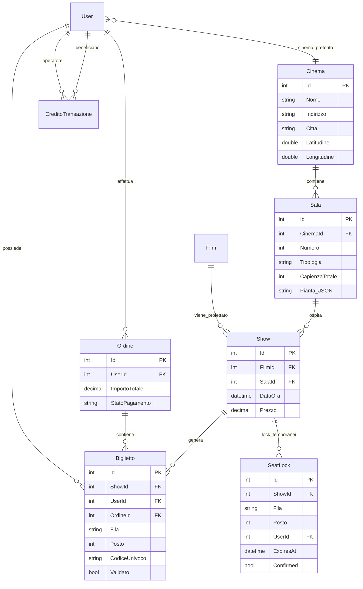

# Piano di Lavoro - Iterazione 4

Autore: Antigravity (Claude Opus 4.6 Thinking)
Data: 2026-04-12
Branch target suggerito: `dev_iteration_4`

---

## Stato Avanzamento Fasi

| Fase | Stato | Data | Note |
| --- | --- | --- | --- |
| FASE 1 - Modello Dati: Sale, Show, Biglietti, Credito | Da fare | - | - |
| FASE 2 - Migration, Seed e aggiornamento DbContext | Da fare | - | - |
| FASE 3 - CRUD Sale (backend + pagina admin) | Da fare | - | - |
| FASE 4 - Refactoring Proiezioni → Show (backend) | Da fare | - | - |
| FASE 5 - Gestione admin Show (frontend proiezioni.html) | Da fare | - | - |
| FASE 6 - Riprogettazione programmazione.html | Da fare | - | - |
| FASE 7 - Scheda film (scheda-film.html) | Da fare | - | - |
| FASE 8 - Acquisto biglietti (acquista.html) | Da fare | - | - |
| FASE 9 - Pagamento (Stripe + credito piattaforma) | Da fare | - | - |
| FASE 10 - Biglietto elettronico (PDF + email) | Da fare | - | - |
| FASE 11 - Validazione biglietti (pagina operatore) | Da fare | - | - |
| FASE 12 - Ricarica credito piattaforma | Da fare | - | - |
| FASE 13 - Pagina cinemas utente (my-cinemas.html) | Da fare | - | - |
| FASE 14 - Test, hardening e documentazione | Da fare | - | - |

---

## 1) Obiettivo Iterazione

Evolvere CineBase da piattaforma con proiezioni semplici (cinema→film→data/ora) a un sistema completo di gestione cinematografica multi-sala con:

- **Gestione sale**: ogni cinema ha N sale numerate, ognuna con tipologia (ISENSE, XL, 3D, 2D, ecc.) e piantina posti
- **Show (ex proiezioni)**: legati a film + sala + data/ora, con validazione sovrapposizioni temporali
- **Programmazione rinnovata**: pagina ispirata a UCI Cinemas con tag In Evidenza/In Uscita, filtri per categoria e ricerca, selezione cinema preferito
- **Scheda film**: pagina dettaglio con descrizione, cast, regista, e navigazione show per data/sala
- **Acquisto biglietti**: selezione posti su piantina sala, lock temporaneo per evitare race condition
- **Pagamento**: Stripe per carta di credito + credito piattaforma, con possibilità di pagamento misto
- **Biglietto elettronico**: PDF con QR code e barcode, invio via email
- **Validazione biglietti**: pagina operatore con scanner QR e verifica manuale
- **Gestione credito**: ricarica credito utente da parte di PowerUser/Admin

## 1.1 Contesto attuale (da `status.md` e `changelog.md`)

- Iterazione 3 completata; backend stabile con **103/103** test verdi
- RBAC backend/frontend verificato e funzionante
- Auth JWT con access/refresh token funzionante
- Programmazione attuale mostra card basate su proiezioni (1 card = 1 proiezione = 1 cinema + 1 film + 1 data/ora)
- Modello attuale: `Proiezione(CinemaId, FilmId, Data, Ora)` — ogni cinema è trattato come sala singola
- Entità `Prenotazione` attuale ha solo `NumeroPosti` e `Note`, senza selezione specifica dei posti

## 1.2 Architettura repository

```text
repo-root/
├── backend/FilmAPI/          (API .NET 9 - porta 5000)
├── frontend/CineBase.Web/    (MPA statico - porta 5001)
├── tests/backend/            (xUnit + integration)
└── docs/
```

---

## 2) Design Tecnico - Modello Dati

### 2.1 Nuove entità

#### Sala

```text
Sala(
  Id int PK,
  CinemaId int FK → Cinema,
  Numero int required,        // progressivo univoco nel cinema
  Tipologia string required max 50,  // "ISENSE", "XL", "3D", "2D", "IMAX", "LUXE"
  CapienzaTotale int required,
  Pianta string? (JSON)       // JSON della piantina: righe, posti per riga, posti disabili ecc.
)
Unique: (CinemaId, Numero)
Navigation: Cinema, ICollection<Show>
```

> [!NOTE]
> Il campo `Pianta` è un JSON serializzato che descrive la disposizione dei posti. Esempio:
> ```json
> {
>   "righe": [
>     { "fila": "A", "settore": "PLATEA", "posti": [1,2,3,4,5,6,7,8,9,10] },
>     { "fila": "B", "settore": "PLATEA", "posti": [1,2,3,4,5,6,7,8,9,10,11,12] },
>     { "fila": "C", "settore": "GALLERIA", "posti": [1,2,3,4,5,6,7,8] }
>   ]
> }
> ```

#### Show (ex Proiezione)

```text
Show(
  Id int PK,
  FilmId int FK → Film,
  SalaId int FK → Sala,
  DataOra DateTime required,   // data e ora di inizio unificati
  Prezzo decimal required default 8.50
)
Unique: (SalaId, DataOra)
Navigation: Film, Sala, ICollection<Biglietto>
```

> [!IMPORTANT]
> L'entità `Show` sostituisce la vecchia `Proiezione`. Il vincolo unique `(SalaId, DataOra)` garantisce
> che nella stessa sala non ci siano due show che iniziano esattamente allo stesso istante.
> La validazione di sovrapposizione temporale (inizio show >= fine show precedente) viene fatta nel service.

#### Biglietto

```text
Biglietto(
  Id int PK,
  ShowId int FK → Show,
  UserId int FK → User,
  OrdineId int FK → Ordine,
  Fila string required max 10,    // es: "A", "B", "C"
  Posto int required,              // numero posto nella fila
  Settore string? max 50,         // "PLATEA", "GALLERIA"
  Prezzo decimal required,
  Supplemento decimal default 0,
  CodiceUnivoco string required unique max 50,  // codice barcode/QR
  Validato bool default false,
  DataValidazione DateTime?,
  ValidatoDaUserId int? FK → User,   // operatore che ha validato
  CinemaValidazioneId int? FK → Cinema  // cinema dove è stato validato
)
Navigation: Show, User, Ordine
```

#### Ordine

```text
Ordine(
  Id int PK,
  UserId int FK → User,
  DataOrdine DateTime required,
  ImportoTotale decimal required,
  ImportoCreditoUsato decimal default 0,
  ImportoCartaUsato decimal default 0,
  StripePaymentIntentId string? max 500,
  StatoPagamento string required max 50,  // "Pendente", "Completato", "Fallito", "Rimborsato"
  EmailInviata bool default false
)
Navigation: User, ICollection<Biglietto>
```

#### CreditoTransazione

```text
CreditoTransazione(
  Id int PK,
  UserId int FK → User,          // utente il cui credito viene modificato
  OperatoreId int FK → User,     // chi ha effettuato l'operazione
  Importo decimal required,      // positivo = ricarica, negativo = spesa
  Tipo string required max 50,   // "Ricarica", "Acquisto", "Rimborso"
  DataOperazione DateTime required,
  Note string? max 500
)
Navigation: User, Operatore(User)
```

#### SeatLock (tabella per gestione race condition posti)

```text
SeatLock(
  Id int PK,
  ShowId int FK → Show,
  Fila string required max 10,
  Posto int required,
  UserId int FK → User,
  LockedAt DateTime required,
  ExpiresAt DateTime required,    // default: LockedAt + 10 minuti
  Confirmed bool default false    // true quando il biglietto è stato emesso
)
Unique: (ShowId, Fila, Posto, ExpiresAt) — gestito via service
Navigation: Show, User
```

> [!IMPORTANT]
> **Strategia anti-race-condition per i posti:**
> 1. Quando un utente seleziona un posto, viene creato un `SeatLock` con `ExpiresAt = now + 10 min`
> 2. Un posto è considerato "occupato" se esiste un `SeatLock` non scaduto OPPURE un `Biglietto` emesso
> 3. Se l'utente NON completa l'acquisto entro 10 min, il lock scade automaticamente
> 4. Alla conferma d'acquisto, il lock viene marcato `Confirmed = true` e viene creato il `Biglietto`
> 5. Un job periodico (o query con filtro `ExpiresAt < DateTime.UtcNow AND !Confirmed`) pulisce i lock scaduti
> 6. L'operazione di lock usa una transazione DB con `IsolationLevel.Serializable` per evitare lock concorrenti sullo stesso posto

### 2.2 Modifiche entità esistenti

#### Film (modifiche)

```text
+ Descrizione string? max 2000     // sinossi del film
+ Cast string? max 1000            // elenco nomi separati da virgola
+ DataRilascio DateTime?           // data di uscita nelle sale (diversa da DataProduzione)
```

#### Cinema (modifiche)

```text
+ Latitudine double?               // per ordinamento per distanza
+ Longitudine double?              // per ordinamento per distanza
Navigation aggiunta: ICollection<Sala> Sale
```

#### User (modifiche)

```text
+ CreditoPiattaforma decimal default 0    // saldo credito
+ CinemaPreferito int? FK → Cinema        // cinema selezionato dall'utente
Navigation aggiunta: ICollection<Ordine>, ICollection<Biglietto>
```

### 2.3 Entità da rimuovere/deprecare

- `Proiezione` → viene sostituita da `Show`. Una migration trasformerà i dati esistenti.
- `Prenotazione` → viene sostituita dal sistema `Ordine` + `Biglietto`. I dati delle prenotazioni virtuali possono essere conservati o rimossi.

### 2.4 Relazioni e vincoli

```text
Cinema 1-N Sala (Cascade)
Sala 1-N Show (Restrict)
Film 1-N Show (Restrict)
Show 1-N Biglietto (Restrict)
Show 1-N SeatLock (Cascade)
User 1-N Ordine (Cascade)
Ordine 1-N Biglietto (Cascade)
User 1-N Biglietto (Restrict)
User 1-N CreditoTransazione [come beneficiario] (Restrict)
User 1-N CreditoTransazione [come operatore] (Restrict)
User → Cinema (CinemaPreferito, nullable, SetNull)
```

---

## 3) Matrice Permessi API (aggiornata)

### 3.1 Nuovi endpoint

| Endpoint | Anonimo | User | PowerUser | Admin |
| --- | --- | --- | --- | --- |
| **Sale** | | | | |
| `GET /cinemas/{id}/sale` | SI | SI | SI | SI |
| `GET /sale/{id}` | SI | SI | SI | SI |
| `POST /cinemas/{id}/sale` | - | - | - | SI |
| `PUT /sale/{id}` | - | - | - | SI |
| `DELETE /sale/{id}` | - | - | - | SI |
| `PUT /sale/{id}/pianta` | - | - | - | SI |
| **Show** | | | | |
| `GET /show` | SI | SI | SI | SI |
| `GET /show/{id}` | SI | SI | SI | SI |
| `GET /show/cinema/{cinemaId}` | SI | SI | SI | SI |
| `GET /show/film/{filmId}` | SI | SI | SI | SI |
| `POST /show` | - | - | SI | SI |
| `PUT /show/{id}` | - | - | SI | SI |
| `DELETE /show/{id}` | - | - | SI | SI |
| **Posti e Acquisto** | | | | |
| `GET /show/{id}/posti` | - | SI | SI | SI |
| `POST /show/{id}/lock-posti` | - | SI | SI | SI |
| `DELETE /seat-locks/{id}` | - | SI (proprio) | SI | SI |
| `POST /ordini` | - | SI | SI | SI |
| `GET /ordini` | - | SI (propri) | - | SI (tutti) |
| `GET /ordini/{id}` | - | SI (proprio) | - | SI |
| `GET /ordini/{id}/biglietti` | - | SI (propri) | - | SI |
| **Biglietti** | | | | |
| `GET /biglietti/{codice}` | - | - | SI | SI |
| `POST /biglietti/{codice}/valida` | - | - | SI | SI |
| **Credito** | | | | |
| `GET /credito/saldo` | - | SI | SI | SI |
| `POST /credito/ricarica` | - | - | SI | SI |
| `GET /credito/transazioni` | - | SI (proprie) | - | SI |
| **Pagamento** | | | | |
| `POST /pagamento/create-intent` | - | SI | SI | SI |
| `POST /pagamento/conferma` | - | SI | SI | SI |
| **Profilo** (aggiornamenti) | | | | |
| `PUT /profilo/cinema-preferito` | - | SI | SI | SI |
| **Programmazione** (nuovi) | | | | |
| `GET /programmazione/film` | SI | SI | SI | SI |
| `GET /programmazione/film/{id}/show` | SI | SI | SI | SI |

### 3.2 Matrice permessi pagine frontend (aggiornata)

| Pagina | Anonimo | User | PowerUser | Admin |
| --- | --- | --- | --- | --- |
| `programmazione.html` (riprogettata) | SI | SI | SI | SI |
| `scheda-film.html` (nuova) | SI | SI | SI | SI |
| `my-cinemas.html` (nuova) | SI | SI | SI | SI |
| `acquista.html` (nuova) | - | SI | SI | SI |
| `pagamento.html` (nuova) | - | SI | SI | SI |
| `sale.html` (nuova, admin) | - | - | - | SI |
| `ricarica-credito.html` (nuova) | - | - | SI | SI |
| `valida-biglietto.html` (nuova) | - | - | SI | SI |
| Pagine esistenti | Invariate | Invariate | Invariate | Invariate |

---

## 4) Fasi di Implementazione

### FASE 1 - Modello Dati: Sale, Show, Biglietti, Credito

**Obiettivo**: creare tutte le nuove entità e aggiornare quelle esistenti senza toccare endpoint o frontend.

**Attività**:

1. Creare file modello:
   - `Model/Sala.cs`
   - `Model/Show.cs`
   - `Model/Biglietto.cs`
   - `Model/Ordine.cs`
   - `Model/CreditoTransazione.cs`
   - `Model/SeatLock.cs`
2. Aggiornare `Model/Film.cs`: aggiungere `Descrizione`, `Cast`, `DataRilascio`, e navigation `ICollection<Show> Shows`
3. Aggiornare `Model/Cinema.cs`: aggiungere `Latitudine`, `Longitudine`, e navigation `ICollection<Sala> Sale`
4. Aggiornare `Model/User.cs`: aggiungere `CreditoPiattaforma`, `CinemaPreferito`, e navigation `ICollection<Ordine>`, `ICollection<Biglietto>`
5. Aggiornare `Data/FilmDbContext.cs`:
   - Nuovi `DbSet`: `Sale`, `Show`, `Biglietti`, `Ordini`, `CreditoTransazioni`, `SeatLocks`
   - Configurare relazioni, indici unique e delete behaviors come da sezione 2.4
   - Configurare l'indice unique di Sala `(CinemaId, Numero)`
   - Configurare l'indice unique di Show `(SalaId, DataOra)`
   - Configurare l'indice unique di Biglietto `CodiceUnivoco`

**Verifica fase**:
- Compilazione OK
- Test esistenti ancora verdi (103/103)

**Checklist fase**:
- [ ] Nuove entità create (Sala, Show, Biglietto, Ordine, CreditoTransazione, SeatLock)
- [ ] Film aggiornato con Descrizione, Cast, DataRilascio
- [ ] Cinema aggiornato con Latitudine, Longitudine, Sale
- [ ] User aggiornato con CreditoPiattaforma, CinemaPreferito
- [ ] DbContext aggiornato con nuovi DbSet, relazioni e indici
- [ ] Compilazione OK, test regressione verdi

---

### FASE 2 - Migration, Seed e aggiornamento DbContext

**Obiettivo**: applicare la migration e fornire dati seed per sale e show di esempio.

**Attività**:

1. Creare migration: `dotnet ef migrations add AddSaleShowBigliettiCredito`
2. Aggiornare `Data/DataSeeder.cs`:
   - Per ogni cinema esistente, creare 4-6 sale di diverse tipologie (2D, 3D, XL, ISENSE)
   - Ogni sala avrà una piantina JSON di default con configurazione platea
   - Creare show di esempio per i prossimi 14 giorni associati ai film e sale esistenti
3. Gestire migrazione dati da `Proiezione` a `Show`:
   - Se ci sono proiezioni esistenti, creare per ciascuna una Sala di default (tipo "2D", numero 1) nel cinema e uno Show corrispondente
   - Mantenere la tabella Proiezione per ora (deprecata) — rimuoverla in fase successiva
4. Applicare migration

**Verifica fase**:
- Migration applicata senza errori
- Sale e show seed verificati nel DB
- Test baseline ancora verdi

**Checklist fase**:
- [ ] Migration creata e applicata
- [ ] Seed sale con piantine JSON di default
- [ ] Seed show per prossimi 14 giorni
- [ ] Migrazione dati da Proiezione a Show completata
- [ ] Test regressione verdi

---

### FASE 3 - CRUD Sale (backend + pagina admin)

**Obiettivo**: implementare gestione completa delle sale per ogni cinema, inclusa la configurazione della piantina posti.

**Attività backend**:

1. Creare DTO:
   - `SalaDTO` (Id, CinemaId, NomeCinema, Numero, Tipologia, CapienzaTotale, Pianta)
   - `SalaCreateDTO` (Numero, Tipologia, CapienzaTotale, Pianta)
   - `SalaUpdateDTO` (Numero, Tipologia, CapienzaTotale)
   - `PiantaUpdateDTO` (PiantaJson)
2. Creare `Services/ISalaService.cs` + `Services/SalaService.cs`:
   - `GetByCinemaIdAsync(cinemaId)` — lista sale di un cinema
   - `GetByIdAsync(id)` — dettaglio sala con pianta
   - `CreateAsync(cinemaId, dto)` — con validazione unicità numero nel cinema
   - `UpdateAsync(id, dto)` — aggiornamento dati sala
   - `DeleteAsync(id)` — con check show associati
   - `UpdatePiantaAsync(id, piantaJson)` — aggiornamento pianta separato
3. Creare `Endpoints/SaleEndpoints.cs`:
   - `GET /cinemas/{id}/sale` → AllowAnonymous
   - `GET /sale/{id}` → AllowAnonymous
   - `POST /cinemas/{id}/sale` → AdminOnly
   - `PUT /sale/{id}` → AdminOnly
   - `DELETE /sale/{id}` → AdminOnly
   - `PUT /sale/{id}/pianta` → AdminOnly

**Attività frontend**:

4. Creare `sale.html` (pagina admin) con:
   - Selettore cinema (dropdown)
   - Tabella sale del cinema selezionato (numero, tipologia, capienza)
   - Modal per creazione/modifica sala
   - Editor piantina visuale: griglia interattiva dove l'admin può definire righe (file), numero posti per fila, e settori (PLATEA/GALLERIA)
   - Anteprima piantina con i posti visualizzati come nella pagina di acquisto
5. Creare `js/pages/sale.js` con logica CRUD e editor pianta
6. Aggiornare `route-guard.js`: aggiungere `/sale.html` con ruoli `['admin']`
7. Aggiornare `navbar-admin.html`: aggiungere link "Sale"

**Verifica fase**:
- CRUD sale funzionante da admin
- Piantina configurabile e visualizzabile
- Validazione unicità numero sala nel cinema

**Checklist fase**:
- [ ] DTO sale creati
- [ ] Service ISalaService/SalaService implementati con validazioni
- [ ] Endpoint sale mappati con policy corrette
- [ ] `sale.html` creata con editor piantina
- [ ] Route guard e navbar aggiornati
- [ ] Test integrazione per CRUD sale

---

### FASE 4 - Refactoring Proiezioni → Show (backend)

**Obiettivo**: sostituire completamente l'entità `Proiezione` con `Show` nel backend.

**Attività**:

1. Creare DTO:
   - `ShowDTO` (Id, FilmId, TitoloFilm, SalaId, NumeroSala, TipologiaSala, CinemaId, NomeCinema, CittaCinema, DataOra, Prezzo)
   - `ShowCreateDTO` (FilmId, SalaId, DataOra, Prezzo)
   - `ShowUpdateDTO` (FilmId, SalaId, DataOra, Prezzo)
   - `ShowPagedResultDTO` (Items, Page, PageSize, TotalCount, TotalPages)
2. Creare `Services/IShowService.cs` + `Services/ShowService.cs`:
   - `GetAllAsync()` / `GetPagedAsync()` con search/filtri
   - `GetByIdAsync(id)`
   - `GetByCinemaIdAsync(cinemaId, data?)` — show per cinema e data opzionale
   - `GetByFilmIdAsync(filmId, cinemaId?)` — show per film, opzionalmente filtrati per cinema
   - `CreateAsync(dto)` con **validazione sovrapposizione temporale**:
     - La nuova `DataOra` non deve cadere all'interno di uno show precedente nella stessa sala (precedente.DataOra + precedente.Film.Durata > nuovo.DataOra → errore)
   - `UpdateAsync(id, dto)`
   - `DeleteAsync(id)`
3. Creare `Endpoints/ShowEndpoints.cs`:
   - `GET /show` → AllowAnonymous, con paginazione/search
   - `GET /show/{id}` → AllowAnonymous
   - `GET /show/cinema/{cinemaId}` → AllowAnonymous, con filtro data opzionale
   - `GET /show/film/{filmId}` → AllowAnonymous, con filtro cinemaId opzionale
   - `POST /show` → PowerUserOrAdmin
   - `PUT /show/{id}` → PowerUserOrAdmin
   - `DELETE /show/{id}` → PowerUserOrAdmin
4. Aggiornare `Program.cs`: registrare DI e mappare ShowEndpoints
5. **Mantenere temporaneamente gli endpoint di Proiezione** per retrocompatibilità (deprecati)
6. Aggiornare `PrenotazioneService` e `PrenotazioniEndpoints` per funzionare sia con Proiezione che con Show durante la transizione

> [!IMPORTANT]
> **Validazione sovrapposizione temporale**: quando si crea/aggiorna uno show nella sala S alla DataOra T,
> il service deve verificare che non esista un altro show nella stessa sala la cui finestra temporale
> `[DataOra, DataOra + Film.Durata minuti]` si sovrapponga con `[T, T + nuovoFilm.Durata minuti]`.

**Verifica fase**:
- CRUD show funzionante con validazione sovrapposizioni
- Endpoint proiezioni ancora funzionanti (retro-compatibilità)
- Test integrazione per show

**Checklist fase**:
- [ ] DTO show creati
- [ ] Service IShowService/ShowService implementati
- [ ] Validazione sovrapposizione temporale implementata
- [ ] Endpoint show mappati con policy corrette
- [ ] Retro-compatibilità endpoint proiezioni mantenuta
- [ ] Test integrazione per CRUD show e validazione sovrapposizioni

---

### FASE 5 - Gestione admin Show (frontend proiezioni.html → show)

**Obiettivo**: aggiornare la pagina admin delle proiezioni per gestire show multi-sala.

**Attività**:

1. Rinominare concettualmente la pagina `proiezioni.html` in gestione show:
   - Aggiornare titolo e labels
   - Aggiornare il form di creazione show con: selettore Film, selettore Cinema, selettore Sala (dipendente dal cinema), data, ora, prezzo
   - Cascading dropdown: la selezione del cinema filtra le sale disponibili
2. Aggiornare `proiezioni.js`:
   - Chiamare API `GET /show` invece di `GET /proiezioni`
   - Tabella con colonne: ID, Film, Cinema, Sala (numero + tipo), Data, Ora, Prezzo, Stato
   - Form di creazione/modifica usa API `POST/PUT /show`
   - Feedback visuale per errori di sovrapposizione temporale
3. Aggiornare `api.js`: aggiungere metodi `getShow`, `createShow`, `updateShow`, `deleteShow`, `getShowByCinema`, `getShowByFilm`, `getSaleByCinema`
4. Aggiornare `dashboard.html`: tabella show recenti al posto di proiezioni
5. Aggiornare `FilmDTO`: aggiungere campi `Descrizione`, `Cast`, `DataRilascio` anche nei DTO create/update
6. Aggiornare `films.html`: aggiungere campi Descrizione (textarea), Cast (input testo), Data di Rilascio nel form

**Verifica fase**:
- Pagina admin gestisce show correttamente
- Cascading dropdown cinema→sale funzionante
- Errori di sovrapposizione mostrati all'utente

**Checklist fase**:
- [ ] `proiezioni.html` aggiornata per gestione show
- [ ] Cascading dropdown cinema→sale implementato
- [ ] `api.js` aggiornato con metodi show e sale
- [ ] Dashboard aggiornata con show recenti
- [ ] Film DTO e pagina admin aggiornati con Descrizione, Cast, DataRilascio
- [ ] Feedback errori sovrapposizione temporale

---

### FASE 6 - Riprogettazione programmazione.html

**Obiettivo**: riprogettare la pagina pubblica di programmazione ispirandosi al layout di UCI Cinemas, con Film come unità base (non più proiezione), tag, ricerca e selezione cinema.

**Attività**:

1. Creare endpoint backend `GET /programmazione/film`:
   - Ritorna l'elenco dei film con show attivi/futuri
   - Per ogni film: info base + categorie + flag `inEvidenza` (più show nei prossimi 7 gg) + flag `inUscita` (show solo tra 7-14 gg) + flag `presenteNelCinemaSelezionato` (bool, basato su query param `cinemaId`)
   - `ProgrammazioneFilmDTO` con campi derivati
2. Creare modale selezione cinema:
   - Lista cinema ordinata per distanza se disponibile geolocalizzazione browser, altrimenti ordinata per nome
   - Se l'utente è loggato, il cinema preferito viene pre-selezionato dal profilo e salvato via `PUT /profilo/cinema-preferito`
   - Se l'utente non è loggato, il cinema viene salvato in `localStorage`
   - Coerenza: quando l'utente logga, se ha un cinema nel profilo lo usa; se non l'ha e ce l'ha nel localStorage, lo salva nel profilo
3. Riprogettare `programmazione.html`:
   - **Header**: barra con cinema selezionato (nome + città) e bottone "Cambia cinema" che apre il modale
   - **Tag tabs**: "In Evidenza", "In Uscita", "Tutti i Film" — cliccabili per filtrare
   - **Filtro per categoria**: dropdown o pill buttons con le categorie
   - **Barra di ricerca**: input testo per cercare film per titolo
   - **Griglia card film**: 1 card per film (non per proiezione!), con:
     - Immagine copertina
     - Titolo
     - Durata
     - Badge categorie
     - Icona/badge che indica se il film è nel cinema selezionato ✓ o non disponibile ✗
     - Click → naviga a `scheda-film.html?id=<filmId>`
4. Riprogettare `programmazione.js`:
   - Chiama `GET /programmazione/film?cinemaId=<id>` al load e al cambio cinema
   - Gestione filtri tab + categoria + ricerca lato client
   - Rendering card film con indicazione disponibilità cinema

**Verifica fase**:
- Pagina mostra 1 card per film, non per proiezione
- Tag In Evidenza/In Uscita funzionanti
- Ricerca per titolo funzionante
- Selezione cinema con persistenza (localStorage / profilo)
- Indicazione disponibilità film nel cinema selezionato

**Checklist fase**:
- [ ] Endpoint `GET /programmazione/film` implementato
- [ ] Modale selezione cinema implementato (con geolocalizzazione opzionale)
- [ ] Persistenza cinema: localStorage per anonimi, profilo per loggati
- [ ] Tab "In Evidenza", "In Uscita", "Tutti i Film"
- [ ] Filtro per categoria
- [ ] Barra di ricerca per titolo
- [ ] Card film con indicazione disponibilità nel cinema selezionato
- [ ] Click card → scheda-film.html

---

### FASE 7 - Scheda film (scheda-film.html)

**Obiettivo**: creare la pagina di dettaglio film per l'utente finale con navigazione show per data e sala.

**Attività**:

1. Creare `scheda-film.html`:
   - **Sezione hero**: immagine copertina grande (sinistra) + info film (destra):
     - Titolo, Durata (min), Data di rilascio, Genere (badge categorie)
     - Descrizione (testo max 2000 caratteri con "Leggi tutto")
     - Regista (nome cognome)
     - Cast (elenco nomi)
     - Pulsante "Vai agli show" (scrollto alla sezione show)
   - **Sezione show** (visibile dopo click "Vai agli show" o scroll):
     - **Barra date scorrevole orizzontale**: "Oggi", "Lun 13 Apr", "Mar 14 Apr", ecc.
       - Freccia sinistra e destra per scorrere
       - La data selezionata è evidenziata
     - **Contenuto per data selezionata**:
       - Nome cinema selezionato + città (grande) + indirizzo (piccolo)
       - Per ogni tipologia di sala presente quel giorno:
         - Nome tipologia (es: "ISENSE", "XL", "3D", "2D")
         - Elenco bottoni orizzontali con orario di inizio (es: 16:00, 18:30, 21:00)
         - Click su bottone orario:
           - Se loggato → naviga a `acquista.html?showId=<showId>`
           - Se non loggato → redirect a `login.html?redirect=<url acquista>`
2. Creare `js/pages/scheda-film.js`:
   - Carica `GET /films/{id}` per dati film
   - Carica `GET /programmazione/film/{id}/show?cinemaId=<id>` per show del film nel cinema selezionato
   - Gestione barra date con calcolo prossimi 14 giorni
   - Raggruppamento show per data → tipologia sala → lista orari
3. Aggiornare `route-guard.js`: aggiungere `scheda-film.html` come pagina pubblica
4. Aggiornare `template-loader.js`: aggiungere ai landing paths

**Verifica fase**:
- Scheda film mostra tutti i dettagli
- Barra date scorrevole funzionante
- Raggruppamento show per tipologia sala corretto
- Click su orario: redirect corretto (auth-aware)

**Checklist fase**:
- [ ] `scheda-film.html` creata con layout hero + sezione show
- [ ] `scheda-film.js` con caricamento dati e gestione interazioni
- [ ] Barra date scorrevole con frecce
- [ ] Raggruppamento show per tipologia sala
- [ ] Click orario auth-aware (login redirect per anonimi)
- [ ] Route guard e template loader aggiornati

---

### FASE 8 - Acquisto biglietti (acquista.html)

**Obiettivo**: implementare la pagina di selezione posti con piantina sala interattiva e lock temporaneo dei posti.

**Attività backend**:

1. Creare `Services/ISeatService.cs` + `Services/SeatService.cs`:
   - `GetPostiDisponibiliAsync(showId)` — ritorna mappa posti con stato (disponibile/occupato/locked)
   - `LockPostoAsync(showId, fila, posto, userId)` — crea SeatLock con expire 10 min, transazione serializable
   - `UnlockPostoAsync(lockId, userId)` — rimuove lock se l'utente è il proprietario
   - `GetUserLocksAsync(showId, userId)` — lista lock attivi dell'utente per lo show
   - `CleanExpiredLocksAsync()` — rimuove lock scaduti (chiamato periodicamente)
2. Creare endpoint:
   - `GET /show/{id}/posti` → Authenticated — ritorna piantina con stati posti
   - `POST /show/{id}/lock-posti` → Authenticated — body `{ fila, posto }`, ritorna lock con timer
   - `DELETE /seat-locks/{id}` → Authenticated (ownership)
3. Creare DTO:
   - `PostoStatoDTO` (Fila, Posto, Settore, Stato: "disponibile"/"occupato"/"locked"/"mio_lock")
   - `PiantinaShowDTO` (ShowId, Sale info, List<PostoStatoDTO>)
   - `LockPostoRequestDTO` (Fila, Posto)
   - `SeatLockDTO` (Id, Fila, Posto, ExpiresAt)

**Attività frontend**:

4. Creare `acquista.html`:
   - **Card riepilogo** (sidebar o top):
     - Titolo film, Tipo sala, Orario inizio, Data per esteso, Nome cinema
     - Numero biglietti selezionati (aggiornato dinamicamente)
     - Totale prezzo (aggiornato dinamicamente)
     - Timer countdown dal primo posto selezionato (10 min)
   - **Piantina sala** (centro):
     - Rendering della piantina JSON della sala
     - Ogni posto è un piccolo bottone
     - Colori: blu = disponibile, rosso = occupato, verde = selezionato dall'utente, grigio = locked da altro utente
     - Legenda colori
     - "Schermo" in alto per orientamento
     - Indicazione fila e numero posto
   - **Lista posti selezionati** (sotto la card):
     - Per ogni posto: "Fila X, Posto Y" con pulsante rimuovi
   - **Pulsante "Continua"** (max 10 posti):
     - Disabilitato se 0 posti selezionati
     - Click → naviga a `pagamento.html?ordineId=<id>` (crea ordine pendente nel backend)
5. Creare `js/pages/acquista.js`:
   - Carica info show + piantina sala
   - Gestisce lock/unlock posti via API con feedback real-time
   - Timer countdown di 10 min dal primo lock
   - Al click "Continua": crea ordine pendente via `POST /ordini` con lista posti

**Verifica fase**:
- Piantina sala renderizzata correttamente dalla configurazione JSON
- Posti occupati visualizzati in rosso
- Lock posto funzionante con timer
- Max 10 posti selezionabili
- Posti bloccati da altri utenti mostrati in grigio

**Checklist fase**:
- [ ] Service ISeatService/SeatService implementati con lock transazionale
- [ ] Endpoint posti/lock mappati
- [ ] `acquista.html` con piantina interattiva
- [ ] Rendering piantina dalla configurazione JSON della sala
- [ ] Lock/unlock posti con feedback real-time
- [ ] Timer countdown 10 minuti
- [ ] Max 10 posti per acquisto
- [ ] Pulsante "Continua" crea ordine pendente

---

### FASE 9 - Pagamento (Stripe + credito piattaforma)

**Obiettivo**: implementare pagamento con carta di credito (Stripe) e/o credito piattaforma, con supporto per pagamento misto.

**Attività backend**:

1. Installare package: `Stripe.net`
2. Aggiungere variabili environment:
   ```env
   STRIPE_SECRET_KEY=sk_test_...
   STRIPE_PUBLISHABLE_KEY=pk_test_...
   STRIPE_WEBHOOK_SECRET=whsec_...
   ```
3. Creare `Services/IPagamentoService.cs` + `Services/PagamentoService.cs`:
   - `CreatePaymentIntentAsync(ordineId, importoCarta)` — crea Stripe PaymentIntent per l'importo da pagare con carta
   - `ConfermaOrdineAsync(ordineId, userId, usaCredito, importoCredito)`:
     - Calcola totale ordine
     - Se `usaCredito`: verifica e scala credito utente, registra `CreditoTransazione` con tipo "Acquisto"
     - Se importo rimanente > 0: verifica PaymentIntent Stripe completato
     - Marca ordine come "Completato"
     - Conferma SeatLock (Confirmed = true)
     - Genera e salva Biglietti con `CodiceUnivoco` (GUID breve, es: `CB-XXXX-YYYY`)
     - Restituisce lista biglietti creati
4. Creare `Endpoints/PagamentoEndpoints.cs`:
   - `POST /pagamento/create-intent` → Authenticated — body `{ ordineId, importo }`
   - `POST /pagamento/conferma` → Authenticated — body `{ ordineId, usaCredito, importoCredito, stripePaymentIntentId? }`
5. Creare `Services/IOrdineService.cs` + `Services/OrdineService.cs`:
   - `CreateAsync(userId, showId, posti[])` — crea ordine pendente
   - `GetByIdAsync(id)` con verifica ownership
   - `GetByUserIdAsync(userId)` — lista ordini dell'utente
   - `CancellaAsync(id)` — annulla ordine pendente e rilascia lock

**Attività frontend**:

6. Creare `pagamento.html`:
   - **Riepilogo ordine**: titolo film, cinema, data, sala, posti selezionati, totale
   - **Sezione credito piattaforma** (se l'utente ha credito > 0):
     - Mostra saldo disponibile
     - Toggle "Usa credito piattaforma"
     - Input importo credito da usare (max = min(saldo, totale))
     - Calcolo in tempo reale del residuo da pagare con carta
   - **Sezione carta di credito** (se residuo > 0):
     - Stripe Elements (card number, expiry, CVC)
     - Pulsante "Paga €XX.XX"
   - **Tre scenari possibili**:
     1. Tutto con credito → bottone "Conferma acquisto" (no Stripe)
     2. Tutto con carta → Stripe payment flow
     3. Mix → scala credito + Stripe per il residuo
   - **Feedback**:
     - Loading durante il pagamento
     - Successo → redirect a pagina esito con recap
     - Errore → messaggio e possibilità di riprovare
7. Creare `js/pages/pagamento.js` con logica Stripe Elements e gestione credito

**Verifica fase**:
- Pagamento solo con carta funzionante (Stripe test mode)
- Pagamento solo con credito funzionante
- Pagamento misto (credito + carta) funzionante
- Ordine marcato come completato
- Biglietti generati con codice univoco

**Checklist fase**:
- [ ] Package `Stripe.net` installato
- [ ] Variabili environment Stripe configurate
- [ ] Service IPagamentoService/PagamentoService implementati
- [ ] Service IOrdineService/OrdineService implementati
- [ ] Endpoint pagamento e ordini mappati
- [ ] `pagamento.html` con UI credito + Stripe Elements
- [ ] Pagamento misto (credito + carta) funzionante
- [ ] Biglietti generati con CodiceUnivoco
- [ ] Test integrazione per flusso ordine→pagamento→biglietti

---

### FASE 10 - Biglietto elettronico (PDF + email)

**Obiettivo**: generare biglietti PDF con QR code e barcode, e inviarli via email all'utente.

**Attività backend**:

1. Installare packages:
   - `QRCoder` — generazione QR code
   - `QuestPDF` — generazione PDF
   - `MailKit` — invio email SMTP
2. Aggiungere variabili environment:
   ```env
   SMTP_HOST=smtp.gmail.com
   SMTP_PORT=587
   SMTP_USER=noreply@cinebase.it
   SMTP_PASSWORD=...
   SMTP_FROM_NAME=CineBase
   SMTP_FROM_EMAIL=noreply@cinebase.it
   ```
3. Creare `Services/IBigliettoService.cs` + `Services/BigliettoService.cs`:
   - `GeneraBigliettoPdfAsync(bigliettoId)` — genera PDF con:
     - Titolo film
     - Data e ora
     - Sala: numero e tipologia, Settore, Fila, Posto
     - Tipo Evento: CINEMA
     - Nome Cinema + Indirizzo
     - Prezzo + Supplemento + Prezzo Totale
     - **Barcode** del codice univoco (Code 128)
     - **QR code** con URL di validazione: `https://<host>/valida-biglietto.html?codice=<CodiceUnivoco>`
     - Codice univoco in testo
   - `GeneraBigliettiOrdinePdfAsync(ordineId)` — genera PDF multi-pagina (1 pagina per biglietto)
4. Creare `Services/IEmailService.cs` + `Services/EmailService.cs`:
   - `InviaConfermaOrdineAsync(ordineId)` — invia email con:
     - Riepilogo ordine nel corpo email
     - PDF biglietti in allegato
5. Aggiornare `PagamentoService.ConfermaOrdineAsync`: dopo completamento, invocare generazione PDF + invio email
6. Creare endpoint:
   - `GET /ordini/{id}/pdf` → Authenticated (ownership) — download PDF biglietti

**Verifica fase**:
- PDF generato con tutti i campi richiesti
- QR code leggibile e puntante all'URL di validazione
- Barcode Code 128 generato
- Email inviata con allegato PDF
- Multi-pagina (1 pagina per biglietto in un ordine)

**Checklist fase**:
- [ ] Packages QRCoder, QuestPDF, MailKit installati
- [ ] Variabili environment SMTP configurate
- [ ] Service IBigliettoService/BigliettoService con generazione PDF
- [ ] PDF contiene QR, barcode, tutti i dati del biglietto
- [ ] Service IEmailService/EmailService con invio email + allegato
- [ ] Invio email automatico dopo conferma ordine
- [ ] Endpoint download PDF ordine

---

### FASE 11 - Validazione biglietti (pagina operatore)

**Obiettivo**: creare pagina per operatori cinema (PowerUser/Admin) per validare biglietti elettronici.

**Attività backend**:

1. Creare `Services/IValidazioneService.cs` + `Services/ValidazioneService.cs`:
   - `GetBigliettoByCodiceAsync(codice)` — ritorna dettagli biglietto + stato validazione
   - `ValidaBigliettoAsync(codice, operatoreId, cinemaId)`:
     - Verifica che il biglietto esista e non sia già validato
     - Verifica che il cinema di validazione corrisponda al cinema dello show
     - Marca `Validato = true`, `DataValidazione = now`, `ValidatoDaUserId`, `CinemaValidazioneId`
     - Ritorna esito
2. Creare endpoint:
   - `GET /biglietti/{codice}` → PowerUserOrAdmin — dettagli biglietto per validazione
   - `POST /biglietti/{codice}/valida` → PowerUserOrAdmin — body `{ cinemaId }`
3. Creare DTO:
   - `BigliettoValidazioneDTO` (Codice, TitoloFilm, DataShow, OraShow, Sala, Fila, Posto, Prezzo, NomeUtente, Validato, DataValidazione)

**Attività frontend**:

4. Creare `valida-biglietto.html`:
   - **Selettore cinema** (se l'operatore lavora in più cinema, oppure pre-impostato dal profilo)
   - **Input manuale**: campo testo per inserire codice biglietto + bottone "Cerca"
   - **Scanner QR**: pulsante che attiva la fotocamera del dispositivo per leggere QR code
     - Usa libreria JS `html5-qrcode` o `jsQR` per scansione
     - Il QR contiene l'URL con il codice, che viene estratto e usato per la validazione
   - **Validazione da URL**: se la pagina è aperta con `?codice=<CodiceUnivoco>`, esegue automaticamente la ricerca
   - **Risultato validazione**: card con dettagli biglietto e pulsante "Valida" o stato "Già validato"
   - **Feedback visuale**: verde per successo, rosso per errore, arancione per già validato
5. Creare `js/pages/valida-biglietto.js`

> [!NOTE]
> **Scenario tipico**: l'addetto del cinema usa uno smartphone/tablet, fa login come PowerUser,
> seleziona il cinema dove sta lavorando, e usa la fotocamera per scansionare il QR code mostrato
> dall'utente sullo schermo del telefono o sul biglietto stampato. Il QR code punta a
> `https://<host>/valida-biglietto.html?codice=CB-XXXX-YYYY`, che pre-compila il codice e
> permette la validazione con un tap.

**Verifica fase**:
- Validazione manuale (codice inserito a mano) funzionante
- Validazione via URL (QR code) funzionante
- Scanner fotocamera funzionante su dispositivo mobile
- Verifica cinema corrispondente
- Biglietto già validato gestito correttamente

**Checklist fase**:
- [ ] Service IValidazioneService/ValidazioneService implementati
- [ ] Endpoint validazione mappati
- [ ] `valida-biglietto.html` con input manuale + scanner QR
- [ ] Scanner QR via fotocamera funzionante
- [ ] Validazione da URL (parametro `codice`) funzionante
- [ ] Verifica corrispondenza cinema
- [ ] Feedback visuale per stati (successo/errore/già validato)
- [ ] Route guard: solo PowerUser/Admin

---

### FASE 12 - Ricarica credito piattaforma

**Obiettivo**: implementare pagina per operatori PowerUser/Admin per ricaricare il credito di un utente.

**Attività backend**:

1. Creare `Services/ICreditoService.cs` + `Services/CreditoService.cs`:
   - `GetSaldoAsync(userId)` → saldo corrente
   - `GetTransazioniAsync(userId)` → storico transazioni
   - `RicaricaAsync(userId, importo, operatoreId, note?)`:
     - Verifica che l'utente esista
     - Aggiorna `User.CreditoPiattaforma += importo`
     - Crea `CreditoTransazione` con tipo "Ricarica", operatoreId, dataOperazione
     - Ritorna nuovo saldo
2. Creare endpoint:
   - `GET /credito/saldo` → Authenticated — saldo dell'utente corrente
   - `POST /credito/ricarica` → PowerUserOrAdmin — body `{ email, importo, note? }`
   - `GET /credito/transazioni` → Authenticated (proprie) / Admin (tutte per utente specifico)
3. Creare DTO:
   - `CreditoSaldoDTO` (Saldo, UltimaTransazione)
   - `RicaricaCreditoDTO` (Email, Importo, Note)
   - `CreditoTransazioneDTO` (Id, Importo, Tipo, DataOperazione, NomeOperatore, Note)

**Attività frontend**:

4. Creare `ricarica-credito.html`:
   - Form con:
     - Input email utente (ricerca con validazione esistenza utente)
     - Input importo (con validazione > 0)
     - Input note opzionali
     - Pulsante "Ricarica"
   - Feedback: mostra il nuovo saldo dopo la ricarica
   - Storico ricariche effettuate dall'operatore corrente (tabella)
5. Creare `js/pages/ricarica-credito.js`
6. Aggiornare `profilo.html`: mostrare saldo credito piattaforma nella sezione dati personali

**Verifica fase**:
- Ricarica credito funzionante
- Transazione registrata con dati operatore
- Saldo aggiornato correttamente
- Saldo visibile nel profilo utente

**Checklist fase**:
- [ ] Service ICreditoService/CreditoService implementati
- [ ] Endpoint credito mappati con policy corrette
- [ ] `ricarica-credito.html` con form ricarica + storico
- [ ] Profilo utente mostra saldo credito
- [ ] Transazione registra operatore
- [ ] Route guard: solo PowerUser/Admin

---

### FASE 13 - Pagina cinemas utente (my-cinemas.html)

**Obiettivo**: creare pagina pubblica che elenca i cinema gestiti dalla piattaforma, ispirata al layout di UCI Cinemas, con programmazione giornaliera.

**Attività**:

1. Creare `my-cinemas.html`:
   - **Vista lista cinema** (default, senza query param):
     - Griglia/elenco card cinema con:
       - Nome cinema
       - Città e indirizzo
       - Badge tipologie sale presenti (XL, 2D, 3D, ecc.)
       - Click → naviga a `my-cinemas.html?cinemaId=<id>`
   - **Vista programmazione cinema** (con `?cinemaId=<id>`):
     - Header: nome cinema, città, indirizzo
     - **Barra date scorrevole** (identica a scheda-film): "Oggi", "Lun 13 Apr", ecc.
     - **Per ogni film in programmazione quel giorno**:
       - Card orizzontale con:
         - Immagine copertina (sinistra, compatta)
         - Titolo + parte descrizione (centro)
         - Per ogni tipologia sala con show quel giorno:
           - Nome tipologia
           - Bottoni orari di inizio (cliccabili)
           - Click su bottone orario:
             - Se loggato → `acquista.html?showId=<id>`
             - Se non loggato → `login.html?redirect=acquista.html?showId=<id>`
2. Creare `js/pages/my-cinemas.js`:
   - Vista lista: `GET /cinemas` + per ogni cinema `GET /cinemas/{id}/sale` per estrarre tipologie
   - Vista cinema: `GET /show/cinema/{cinemaId}?data=<data>` per show del giorno
   - Raggruppamento: per film → per tipologia sala → orari
3. Aggiornare `route-guard.js`: aggiungere `my-cinemas.html` come pagina pubblica
4. Aggiornare `template-loader.js` e navbar landing con link "Cinema"

**Verifica fase**:
- Lista cinema con badge tipologie sale
- Programmazione cinema per data funzionante
- Barra date scorrevole
- Bottoni orario auth-aware
- Raggruppamento film → tipologia sala → orari

**Checklist fase**:
- [ ] `my-cinemas.html` con vista lista + vista programmazione
- [ ] Barra date scorrevole (componente riusato da scheda-film)
- [ ] Raggruppamento show per film→tipologia→orari
- [ ] Link bottoni orario auth-aware
- [ ] Route guard e navbar aggiornati
- [ ] Layout responsive mobile/desktop

---

### FASE 14 - Test, hardening e documentazione

**Obiettivo**: chiudere iterazione con qualità verificata, test completi e documentazione aggiornata.

**Attività**:

1. **Test backend** — nuove suite:
   - `SalaIntegrationTests` (SA1-SA6): CRUD sale, unicità numero, delete con show associati
   - `ShowIntegrationTests` (SH1-SH8): CRUD show, validazione sovrapposizione, filtri per cinema/film
   - `SeatLockIntegrationTests` (SL1-SL5): lock/unlock, expiry, lock concorrente
   - `OrdineIntegrationTests` (OR1-OR5): creazione, conferma, annullamento
   - `BigliettoIntegrationTests` (BI1-BI4): generazione codice, validazione
   - `CreditoIntegrationTests` (CR1-CR4): ricarica, saldo, transazioni
   - `PagamentoIntegrationTests` (PA1-PA3): flusso pagamento (mock Stripe in test)
2. **Aggiornare test esistenti**:
   - Adattare test proiezioni per nuova struttura show
   - Adattare test prenotazioni se necessario
3. **Verifica manuale end-to-end per ruoli**:
   - **Admin**: gestisce sale, show, ricarica credito, valida biglietti
   - **PowerUser**: gestisce show, ricarica credito, valida biglietti
   - **User**: programmazione → scheda film → seleziona show → acquista biglietti → pagamento → riceve email
   - **Anonimo**: programmazione, scheda film, cinemas in sola lettura; login richiesto per acquisto
4. **Frontend test manuali**:
   - Piantina sala responsive
   - Timer lock funzionante
   - Pagamento Stripe test mode
   - QR scanner su dispositivo mobile
5. **Aggiornare docs**:
   - `status.md`
   - `changelog.md`

**Verifica fase**:
- Tutti i test nuovi + esistenti verdi
- Flusso completo end-to-end verificato per ogni ruolo
- Documentazione aggiornata

**Checklist fase**:
- [ ] Suite test SA1-SA6 aggiunta e verde
- [ ] Suite test SH1-SH8 aggiunta e verde
- [ ] Suite test SL1-SL5 aggiunta e verde
- [ ] Suite test OR1-OR5 aggiunta e verde
- [ ] Suite test BI1-BI4 aggiunta e verde
- [ ] Suite test CR1-CR4 aggiunta e verde
- [ ] Suite test PA1-PA3 aggiunta e verde
- [ ] Test esistenti adattati e verdi
- [ ] Verifica manuale Admin/PowerUser/User/Anonimo completata
- [ ] `status.md` aggiornato
- [ ] `changelog.md` aggiornato

---

## 5) Nuovi File Previsti

### 5.1 Backend (`backend/FilmAPI/`)

**Modelli**:
- `Model/Sala.cs`
- `Model/Show.cs`
- `Model/Biglietto.cs`
- `Model/Ordine.cs`
- `Model/CreditoTransazione.cs`
- `Model/SeatLock.cs`

**DTO**:
- `DTO/SalaDTO.cs` (SalaDTO, SalaCreateDTO, SalaUpdateDTO, PiantaUpdateDTO)
- `DTO/ShowDTO.cs` (ShowDTO, ShowCreateDTO, ShowUpdateDTO, ShowPagedResultDTO)
- `DTO/BigliettoDTO.cs` (BigliettoDTO, BigliettoValidazioneDTO, PostoStatoDTO, PiantinaShowDTO, LockPostoRequestDTO, SeatLockDTO)
- `DTO/OrdineDTO.cs` (OrdineDTO, OrdineCreateDTO)
- `DTO/CreditoDTO.cs` (CreditoSaldoDTO, RicaricaCreditoDTO, CreditoTransazioneDTO)
- `DTO/PagamentoDTO.cs` (CreatePaymentIntentDTO, ConfermaOrdineDTO)
- `DTO/ProgrammazioneDTO.cs` (ProgrammazioneFilmDTO)

**Services**:
- `Services/ISalaService.cs` + `Services/SalaService.cs`
- `Services/IShowService.cs` + `Services/ShowService.cs`
- `Services/ISeatService.cs` + `Services/SeatService.cs`
- `Services/IOrdineService.cs` + `Services/OrdineService.cs`
- `Services/IPagamentoService.cs` + `Services/PagamentoService.cs`
- `Services/IBigliettoService.cs` + `Services/BigliettoService.cs`
- `Services/IEmailService.cs` + `Services/EmailService.cs`
- `Services/ICreditoService.cs` + `Services/CreditoService.cs`
- `Services/IValidazioneService.cs` + `Services/ValidazioneService.cs`
- `Services/IProgrammazioneService.cs` + `Services/ProgrammazioneService.cs`

**Endpoints**:
- `Endpoints/SaleEndpoints.cs`
- `Endpoints/ShowEndpoints.cs`
- `Endpoints/SeatEndpoints.cs`
- `Endpoints/OrdiniEndpoints.cs`
- `Endpoints/PagamentoEndpoints.cs`
- `Endpoints/CreditoEndpoints.cs`
- `Endpoints/ValidazioneEndpoints.cs`
- `Endpoints/ProgrammazioneEndpoints.cs`

### 5.2 Frontend (`frontend/CineBase.Web/wwwroot/`)

**Pagine HTML**:
- `scheda-film.html`
- `acquista.html`
- `pagamento.html`
- `my-cinemas.html`
- `sale.html` (admin)
- `ricarica-credito.html` (power/admin)
- `valida-biglietto.html` (power/admin)

**JavaScript**:
- `js/pages/scheda-film.js`
- `js/pages/acquista.js`
- `js/pages/pagamento.js`
- `js/pages/my-cinemas.js`
- `js/pages/sale.js`
- `js/pages/ricarica-credito.js`
- `js/pages/valida-biglietto.js`

### 5.3 Test (`tests/backend/`)

- `Integration/SalaIntegrationTests.cs`
- `Integration/ShowIntegrationTests.cs`
- `Integration/SeatLockIntegrationTests.cs`
- `Integration/OrdineIntegrationTests.cs`
- `Integration/BigliettoIntegrationTests.cs`
- `Integration/CreditoIntegrationTests.cs`
- `Integration/PagamentoIntegrationTests.cs`

---

## 6) Packages NuGet da aggiungere

| Package | Versione | Scopo |
| --- | --- | --- |
| `Stripe.net` | latest | Pagamenti con carta di credito |
| `QRCoder` | latest | Generazione QR code per biglietti |
| `QuestPDF` | latest | Generazione PDF biglietti |
| `MailKit` | latest | Invio email SMTP |

---

## 7) Variabili Environment da aggiungere

```env
# Stripe
STRIPE_SECRET_KEY=sk_test_...
STRIPE_PUBLISHABLE_KEY=pk_test_...
STRIPE_WEBHOOK_SECRET=whsec_...

# SMTP Email
SMTP_HOST=smtp.gmail.com
SMTP_PORT=587
SMTP_USER=noreply@cinebase.it
SMTP_PASSWORD=...
SMTP_FROM_NAME=CineBase
SMTP_FROM_EMAIL=noreply@cinebase.it

# Seat Lock
SEAT_LOCK_DURATION_MINUTES=10
```

---

## 8) Criteri di Accettazione

L'iterazione è completata quando tutte le seguenti condizioni sono vere:

1. Ogni cinema può avere N sale con numero progressivo, tipologia e piantina configurabile
2. Gli show (ex proiezioni) sono legati a film + sala + data/ora con validazione sovrapposizione temporale
3. La pagina programmazione mostra 1 card per film (non per proiezione) con tag In Evidenza/In Uscita
4. L'utente può selezionare un cinema preferito (persistente in localStorage o profilo)
5. La scheda film mostra dettagli completi con navigazione show per data e tipologia sala
6. L'utente autenticato può selezionare posti dalla piantina sala con lock temporaneo (10 min)
7. Il pagamento supporta carta di credito (Stripe), credito piattaforma e pagamento misto
8. Dopo il pagamento, l'utente riceve email con PDF biglietti contenenti QR code e barcode
9. Operatori PowerUser/Admin possono validare biglietti tramite codice manuale, scanner QR o URL
10. Operatori PowerUser/Admin possono ricaricare il credito piattaforma di un utente con tracciatura
11. La pagina cinemas mostra elenco cinema con programmazione giornaliera per cinema
12. Non è possibile prenotare lo stesso posto concorrentemente da due utenti (anti-race-condition)
13. Tutti i redirect auth-aware funzionano (login con callback)
14. Suite backend completamente verde con test per tutte le nuove feature

---

## 9) Diagramma Entità-Relazione (semplificato)



---

## 10) Prompt Guida (per esecuzione fase-by-fase)

Regola comune per **tutti** i prompt fase:

- implementare solo la fase richiesta
- al termine aggiornare la tabella `Stato Avanzamento Fasi`:
  - `Stato`: `Completata` (oppure `In corso` / `Bloccata`)
  - `Data`: data corrente
  - `Note`: breve esito (test, blocchi, deviazioni)
- spuntare la `Checklist fase` relativa con `[x]` sugli item completati
- se restano attività parziali, lasciare check non spuntati e indicare motivo nelle note

> [!WARNING]
> **Ordine fasi**: Le fasi 1-5 sono propedeutiche. Le fasi 6-8 possono essere parzialmente
> parallelizzate ma è consigliato seguire l'ordine. Le fasi 9-12 dipendono dalla 8.
> La fase 13 è indipendente e può essere eseguita in parallelo con le fasi 9-12.
> La fase 14 va eseguita per ultima.

### Prompt Fase 1
```
Implementa la FASE 1 del PianoDiLavoro Iterazione 4 (`docs/project/dev_iteration/4/PianoDiLavoro.md`).
Crea tutte le nuove entità (Sala, Show, Biglietto, Ordine, CreditoTransazione, SeatLock) e aggiorna
le entità esistenti (Film, Cinema, User) come specificato nella sezione 2 del piano.
Aggiorna il DbContext con nuovi DbSet, relazioni e indici.
NON creare migration, NON creare endpoint, NON toccare il frontend.
Al termine verifica compilazione e che i test esistenti siano ancora verdi.
```

### Prompt Fase 2
```
Implementa la FASE 2 del PianoDiLavoro Iterazione 4. Crea la migration, aggiorna il DataSeeder
per creare sale di esempio per ogni cinema e show per i prossimi 14 giorni.
Gestisci la migrazione dati da Proiezione a Show.
Applica la migration e verifica che i dati seed siano corretti.
```

### Prompt Fase 3
```
Implementa la FASE 3 del PianoDiLavoro Iterazione 4. Crea il CRUD completo per le Sale
(backend: DTO, Service, Endpoints) e la pagina admin sale.html con editor piantina posti.
Aggiorna route-guard e navbar admin.
```

### Prompt Fase 4
```
Implementa la FASE 4 del PianoDiLavoro Iterazione 4. Crea il CRUD Show nel backend
(DTO, Service, Endpoints) con validazione sovrapposizione temporale.
Mantieni retro-compatibilità con endpoint Proiezioni.
```

### Prompt Fase 5
```
Implementa la FASE 5 del PianoDiLavoro Iterazione 4. Aggiorna la pagina admin proiezioni.html
per gestire Show multi-sala con cascading dropdown cinema→sale.
Aggiorna api.js, dashboard e film DTO/pagina per i nuovi campi.
```

### Prompt Fase 6
```
Implementa la FASE 6 del PianoDiLavoro Iterazione 4. Riprogetta programmazione.html con layout
ispirato a UCI Cinemas: 1 card per film, tag In Evidenza/In Uscita, filtro per categoria e ricerca,
modale selezione cinema con persistenza.
Crea endpoint GET /programmazione/film nel backend.
```

### Prompt Fase 7
```
Implementa la FASE 7 del PianoDiLavoro Iterazione 4. Crea scheda-film.html con dettagli film,
barra date scorrevole e sezione show raggruppati per tipologia sala.
Crea endpoint GET /programmazione/film/{id}/show.
```

### Prompt Fase 8
```
Implementa la FASE 8 del PianoDiLavoro Iterazione 4. Crea acquista.html con piantina sala
interattiva, lock/unlock posti con timer 10 min, e logica di creazione ordine pendente.
Implementa il backend per SeatService e OrdineService.
```

### Prompt Fase 9
```
Implementa la FASE 9 del PianoDiLavoro Iterazione 4. Implementa il pagamento con Stripe
(test mode) e credito piattaforma. Crea pagamento.html con supporto pagamento misto.
Implementa PagamentoService con conferma ordine e generazione biglietti.
```

### Prompt Fase 10
```
Implementa la FASE 10 del PianoDiLavoro Iterazione 4. Implementa generazione PDF biglietti
con QR code e barcode, e invio email con allegato PDF dopo conferma ordine.
```

### Prompt Fase 11
```
Implementa la FASE 11 del PianoDiLavoro Iterazione 4. Crea valida-biglietto.html con
input manuale, scanner QR via fotocamera, e validazione da URL.
Implementa ValidazioneService nel backend.
```

### Prompt Fase 12
```
Implementa la FASE 12 del PianoDiLavoro Iterazione 4. Crea ricarica-credito.html e
implementa CreditoService nel backend. Aggiorna profilo utente per mostrare saldo.
```

### Prompt Fase 13
```
Implementa la FASE 13 del PianoDiLavoro Iterazione 4. Crea my-cinemas.html con vista
lista cinema e vista programmazione per cinema, con barra date scorrevole e
show raggruppati per film→tipologia→orari.
```

### Prompt Fase 14
```
Implementa la FASE 14 del PianoDiLavoro Iterazione 4. Aggiungi tutti i test di integrazione,
esegui verifica manuale end-to-end per ogni ruolo, e aggiorna status.md e changelog.md.
```
