# Architettura Frontend - Template Loading, API Fetch e Gestione dello Stato

**Autore:** Claude AI Assistant
**Data:** Marzo 2026
**Progetto di Riferimento:** CineBase
**Framework:** JavaScript ES6+ (Vanilla)
**Linguaggio:** JavaScript / HTML5

---

## Indice
1. [Panoramica dell'Architettura Frontend](#1-panoramica-dellarchitettura-frontend)
2. [Template Loader](#2-template-loader)
3. [Richieste API al Backend](#3-richieste-api-al-backend)
4. [Gestione dello Stato dell'Applicazione](#4-gestione-dello-stato-dellapplicazione)
5. [Flusso Completo di una Pagina](#5-flusso-completo-di-una-pagina)
6. [Best Practices](#6-best-practices)
7. [Aggiornamento Auth Lifecycle (Aprile 2026)](#7-aggiornamento-auth-lifecycle-aprile-2026)

---

## 1. Panoramica dell'Architettura Frontend

### 1.1 Architettura Generale

L'applicazione CineBase utilizza un'architettura **client-side** basata su JavaScript vanilla, con caricamento dinamico dei componenti HTML.

```
┌─────────────────────────────────────────────────────────────────────┐
│                         Frontend (Port 5001)                        │
├─────────────────────────────────────────────────────────────────────┤
│  ┌──────────────┐  ┌──────────────┐  ┌──────────────────────────┐  │
│  │   Index      │  │   Template   │  │      API Module          │  │
│  │   HTML       │  │   Loader     │  │  ┌──────────────────┐   │  │
│  │              │──▶  (js/)       │──│  │   apiFetch()     │   │  │
│  │  - Navbar    │  │              │  │  │   API Object     │   │  │
│  │  - Content   │  │  - Cache     │  │  └──────────────────┘   │  │
│  │  - Footer    │  │  - Events    │  │                         │  │
│  └──────────────┘  └──────────────┘  └──────────────────────────┘  │
│                              │                    │                 │
│                              ▼                    ▼                 │
│  ┌──────────────┐  ┌──────────────┐  ┌──────────────────────────┐  │
│  │  Components  │  │   State      │  │      Backend API          │  │
│  │  (HTML)      │  │   Manager    │  │      (Port 5000)         │  │
│  │              │  │              │  │                          │  │
│  │  - navbar-*  │  │ - Session   │  │  /api/registi             │  │
│  │  - footer-*  │  │ - Variables │  │  /api/films               │  │
│  │              │  │ - DOM State │  │  /api/cinemas             │  │
│  └──────────────┘  └──────────────┘  └──────────────────────────┘  │
└─────────────────────────────────────────────────────────────────────┘
```

### 1.2 Stack Tecnologico

| Componente | Tecnologia | Scopo |
|------------|------------|-------|
| **Rendering** | HTML5 + Dynamic Loading | Visualizzazione pagine |
| **Template Engine** | Template Loader JS | Caricamento componenti |
| **HTTP Client** | Fetch API | Comunicazione con backend |
| **State Storage** | localStorage + Module vars + DOM state | Gestione stato |

### 1.3 Diagramma dei Componenti

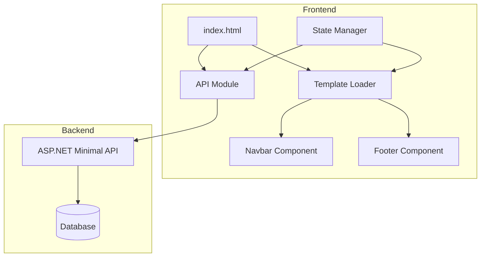

---

## 2. Template Loader

### 2.1 Cos'è il Template Loader?

Il **Template Loader** è un modulo JavaScript responsabile del caricamento dinamico di componenti HTML parziali (come navbar e footer) e della loro iniezione nel DOM principale.

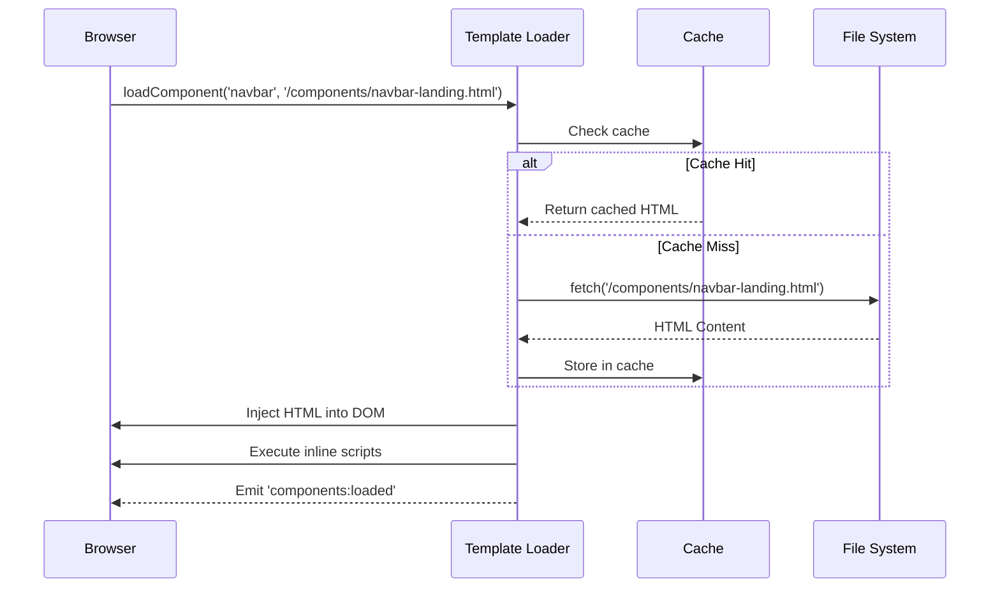

### 2.2 Struttura del Template Loader

```javascript
// template-loader.js

// Cache in memoria per i template caricati
const templateCache = {};

async function loadComponent(elementId, componentPath) {
  // 1. Verifica cache prima di fare fetch
  if (templateCache[componentPath]) {
    document.getElementById(elementId).innerHTML = templateCache[componentPath];
    return;
  }

  // 2. Fetch del componente HTML
  const response = await fetch(componentPath);
  const html = await response.text();
  
  // 3. Memorizza in cache
  templateCache[componentPath] = html;
  
  // 4. Iniezione nel DOM
  document.getElementById(elementId).innerHTML = html;

  // 5. Esecuzione script inline
  const scripts = document.getElementById(elementId).querySelectorAll('script');
  scripts.forEach(script => {
    const newScript = document.createElement('script');
    newScript.textContent = script.textContent;
    script.parentNode.replaceChild(newScript, script);
  });
}

async function loadCommonComponents() {
  try {
    await Promise.all([
      loadComponent('navbar-container', '/components/navbar-landing.html'),
      loadComponent('footer-container', '/components/footer-landing.html')
    ]);

    // Emetti evento personalizzato
    window.dispatchEvent(new CustomEvent('components:loaded'));
  } catch (error) {
    console.error('Errore caricamento componenti:', error);
  }
}
```

### 2.3 Flusso di Caricamento Template

```
┌─────────────────────────────────────────────────────────────────────┐
│                    FLUSSO CARICAMENTO TEMPLATE                       │
├─────────────────────────────────────────────────────────────────────┤
│                                                                     │
│  1. Pagina HTML richiede componenti                                 │
│     ┌────────────────────────────────────────────────────────┐     │
│     │  <div id="navbar-container"></div>                      │     │
│     │  <div id="footer-container"></div>                      │     │
│     └────────────────────────────────────────────────────────┘     │
│                              │                                      │
│                              ▼                                      │
│  2. Template Loader verifica la cache                               │
│     ┌────────────────────────────────────────────────────────┐     │
│     │  templateCache['/components/navbar-landing.html'] = ?  │     │
│     │  ├── definito → USA CACHE                               │     │
│     │  └── undefined → FA FETCH                               │     │
│     └────────────────────────────────────────────────────────┘     │
│                              │                                      │
│                              ▼                                      │
│  3. Se necessario, fetch del file                                   │
│     ┌────────────────────────────────────────────────────────┐     │
│     │  fetch('/components/navbar-landing.html')              │     │
│     │    .then(response => response.text())                  │     │
│     └────────────────────────────────────────────────────────┘     │
│                              │                                      │
│                              ▼                                      │
│  4. Iniezione HTML nel DOM                                          │
│     ┌────────────────────────────────────────────────────────┐     │
│     │  document.getElementById('navbar-container')            │     │
│     │    .innerHTML = cachedHTML;                            │     │
│     └────────────────────────────────────────────────────────┘     │
│                              │                                      │
│                              ▼                                      │
│  5. Esecuzione script inline e dispatch evento                      │
│     ┌────────────────────────────────────────────────────────┐     │
│     │  window.dispatchEvent(new CustomEvent('components:loaded'))│  │
│     └────────────────────────────────────────────────────────┘     │
│                                                                     │
└─────────────────────────────────────────────────────────────────────┘
```

### 2.4 Organizzazione dei Componenti

```
wwwroot/
├── components/
│   ├── navbar-admin.html      ← Navbar area amministrativa
│   ├── navbar-landing.html    ← Navbar pagina pubblica
│   ├── footer-admin.html      ← Footer area amministrativa
│   └── footer-landing.html    ← Footer pagina pubblica
├── pages/
│   ├── films.html
│   └── registi.html
└── js/
    ├── template-loader.js
    ├── api.js
    ├── navbar.js
    └── utils.js
```

---

## 3. Richieste API al Backend

### 3.1 Panoramica del Modulo API

Il modulo **api.js** centralizza tutte le comunicazioni HTTP con il backend attraverso la **Fetch API** nativa di JavaScript.

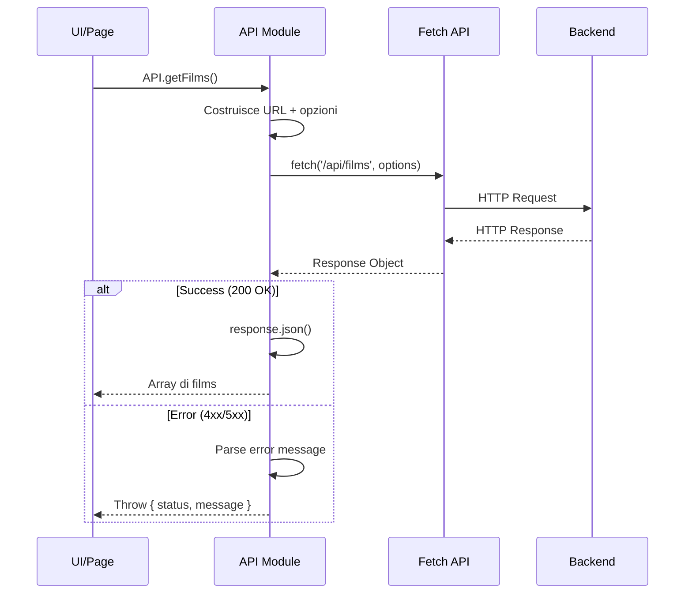

### 3.2 Implementazione del Wrapper apiFetch

```javascript
// api.js

const API_BASE_URL = 'http://localhost:5000';

/**
 * Wrapper generico per le chiamate fetch
 * Gestisce errori, headers, e parse automatico JSON
 */
async function apiFetch(endpoint, options = {}) {
  const defaultOptions = {
    headers: { 
      'Content-Type': 'application/json',
      'Accept': 'application/json'
    }
  };

  let response;
  
  try {
    response = await fetch(`${API_BASE_URL}${endpoint}`, {
      ...defaultOptions,
      ...options
    });
  } catch {
    // Errore di rete (backend non raggiungibile)
    throw {
      status: 0,
      message: 'Impossibile raggiungere il backend. Verifica che sia avviato.'
    };
  }

  // Gestione risposte non OK
  if (!response.ok) {
    const contentType = response.headers.get('content-type') || '';
    let message = 'Errore di rete';
    let errors;

    if (contentType.includes('application/json')) {
      const errorJson = await response.json().catch(() => null);
      if (errorJson) {
        message = errorJson.message || errorJson.title || message;
        errors = errorJson.errors;
      }
    }

    throw { 
      status: response.status, 
      message, 
      errors 
    };
  }

  // Gestione 204 No Content
  if (response.status === 204) {
    return null;
  }

  // Parse JSON della risposta
  return response.json();
}
```

### 3.3 Oggetto API con Metodi CRUD

```javascript
// api.js - Oggetto API centralizzato

const API = {
  // ==================== REGISTI ====================
  getRegisti: () => 
    apiFetch('/registi'),
  
  getRegista: (id) => 
    apiFetch(`/registi/${id}`),
  
  createRegista: (data) => 
    apiFetch('/registi', { 
      method: 'POST', 
      body: JSON.stringify(data) 
    }),
  
  updateRegista: (id, data) => 
    apiFetch(`/registi/${id}`, { 
      method: 'PUT', 
      body: JSON.stringify(data) 
    }),
  
  deleteRegista: (id) => 
    apiFetch(`/registi/${id}`, { 
      method: 'DELETE' 
    }),

  // ==================== FILMS ====================
  getFilms: () => 
    apiFetch('/films'),
  
  getFilm: (id) => 
    apiFetch(`/films/${id}`),
  
  createFilm: (data) => 
    apiFetch('/films', { 
      method: 'POST', 
      body: JSON.stringify(data) 
    }),
  
  updateFilm: (id, data) => 
    apiFetch(`/films/${id}`, { 
      method: 'PUT', 
      body: JSON.stringify(data) 
    }),
  
  deleteFilm: (id) => 
    apiFetch(`/films/${id}`, { 
      method: 'DELETE' 
    }),

  // ==================== CINEMAS ====================
  getCinemas: () => 
    apiFetch('/cinemas'),
  
  getCinema: (id) => 
    apiFetch(`/cinemas/${id}`)
};
```

### 3.4 Gestione degli Errori

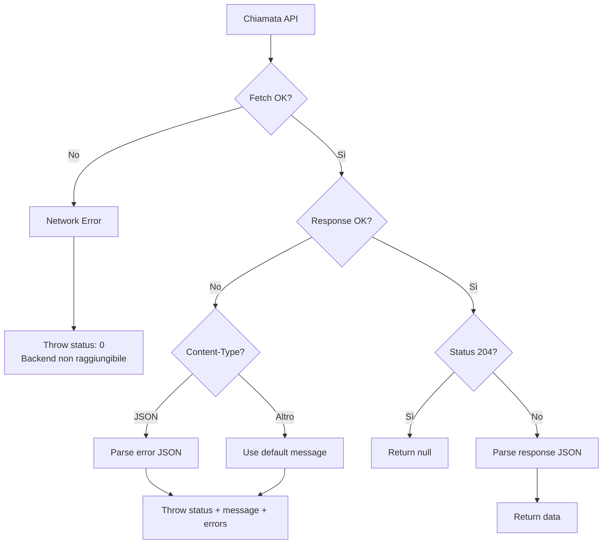

```javascript
// utils.js - Gestione errori centralizzata

function handleApiError(error) {
  console.error('API Error:', error);
  
  let message = 'Si è verificato un errore';
  
  switch (error.status) {
    case 0:
      message = 'Backend non raggiungibile. Verificare la connessione.';
      break;
    case 400:
      message = error.errors 
        ? Object.values(error.errors).flat().join(', ')
        : 'Dati non validi';
      break;
    case 401:
      message = 'Non autorizzato. Effettuare il login.';
      break;
    case 404:
      message = 'Elemento non trovato';
      break;
    case 409:
      message = 'Elemento già esistente';
      break;
    case 500:
      message = 'Errore interno del server';
      break;
  }
  
  showToast(message, 'danger');
  return message;
}

// Esempio di utilizzo
async function loadRegisti() {
  try {
    const registi = await API.getRegisti();
    renderRegistiList(registi);
  } catch (error) {
    handleApiError(error);
  }
}
```

### 3.5 Tabella dei Codici HTTP e Azioni

| Codice | Significato | Azione Frontend |
|--------|-------------|-----------------|
| **200** | OK | Render dei dati |
| **201** | Created | Conferma creazione, refresh lista |
| **204** | No Content | Conferma operazione senza body |
| **400** | Bad Request | Mostra errori validazione |
| **401** | Unauthorized | Redirect al login |
| **404** | Not Found | Messaggio "non trovato" |
| **409** | Conflict | Avviso duplicato |
| **500** | Server Error | Messaggio di errore generico |
| **0** | Network Error | Avviso backend offline |

---

## 4. Gestione dello Stato dell'Applicazione

### 4.1 Strategie di State Management

L'applicazione CineBase utilizza un approccio **ibrido** per la gestione dello stato:

```
┌─────────────────────────────────────────────────────────────────────┐
│                    LIVELLI DI STATO                                 │
├─────────────────────────────────────────────────────────────────────┤
│                                                                     │
│  ┌───────────────────────────────────────────────────────────────┐ │
│  │ LIVELLO 1: sessionStorage - Stato Globale Persistente         │ │
│  │ ─────────────────────────────────────────────────────────────│ │
│  │ • Dati utente autenticato                                     │ │
│  │ • Token di sessione                                           │ │
│  │ • Preferenze utente                                           │ │
│  │ • Persistenza tra refresh pagina                              │ │
│  └───────────────────────────────────────────────────────────────┘ │
│                                                                     │
│  ┌───────────────────────────────────────────────────────────────┐ │
│  │ LIVELLO 2: Module Variables - Stato per Pagina                │ │
│  │ ─────────────────────────────────────────────────────────────│ │
│  │ • Cache dei dati API (allFilms, allRegisti)                   │ │
│  │ • Stato della UI (filtri, sorting)                            │ │
│  │ • Reset automatico al caricamento pagina                       │ │
│  └───────────────────────────────────────────────────────────────┘ │
│                                                                     │
│  ┌───────────────────────────────────────────────────────────────┐ │
│  │ LIVELLO 3: DOM State - Stato Effimero                         │ │
│  │ ─────────────────────────────────────────────────────────────│ │
│  │ • Attributi data-* negli elementi                             │ │
│  │ • Valori dei form                                             │ │
│  │ • Stato dei modali                                            │ │
│  └───────────────────────────────────────────────────────────────┘ │
│                                                                     │
└─────────────────────────────────────────────────────────────────────┘
```

### 4.2 Stato Globale con sessionStorage

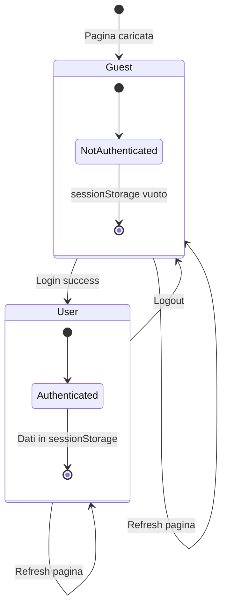

```javascript
// navbar.js - Gestione stato autenticazione

/**
 * Aggiorna l'UI in base allo stato di autenticazione
 */
function updateAuthUI() {
  const user = JSON.parse(
    sessionStorage.getItem('user') || 'null'
  );
  
  const loginBtn = document.getElementById('login-btn');
  const userDropdown = document.getElementById('user-dropdown');
  
  if (user) {
    // Utente autenticato
    if (loginBtn) loginBtn.classList.add('hidden');
    if (userDropdown) {
      userDropdown.classList.remove('hidden');
      document.getElementById('user-name').textContent = user.name;
    }
  } else {
    // Utente non autenticato
    if (loginBtn) loginBtn.classList.remove('hidden');
    if (userDropdown) userDropdown.classList.add('hidden');
  }
}

/**
 * Simula il login (da sostituire con API reale)
 */
function mockLogin() {
  sessionStorage.setItem('user', JSON.stringify({ 
    id: 1, 
    name: 'Admin', 
    role: 'administrator' 
  }));
  updateAuthUI();
}

/**
 * Logout: rimuove lo stato e redirect
 */
function mockLogout() {
  sessionStorage.removeItem('user');
  window.location.href = '/index.html';
}
```

### 4.3 Stato per Pagina con Module Variables

```javascript
// films.js - Stato a livello di modulo

// Cache dei dati caricati
let allFilms = [];
let allRegisti = [];

// Stato della UI
let currentFilter = 'all';
let currentSort = 'title';
let currentPage = 1;
const ITEMS_PER_PAGE = 10;

/**
 * Carica i dati e popola la cache
 */
async function initializePage() {
  try {
    // Caricamento parallelo
    [allFilms, allRegisti] = await Promise.all([
      API.getFilms(),
      API.getRegisti()
    ]);
    
    renderFilms();
    populateRegistiDropdown();
  } catch (error) {
    handleApiError(error);
  }
}

/**
 * Applica filtri e ordinamento
 */
function getFilteredFilms() {
  let filtered = [...allFilms];
  
  // Filtro per stato
  if (currentFilter === 'active') {
    filtered = filtered.filter(f => f.stato === 'Attivo');
  } else if (currentFilter === 'inactive') {
    filtered = filtered.filter(f => f.stato !== 'Attivo');
  }
  
  // Ordinamento
  filtered.sort((a, b) => {
    if (currentSort === 'title') {
      return a.titolo.localeCompare(b.titolo);
    } else if (currentSort === 'year') {
      return b.anno - a.anno;
    }
    return 0;
  });
  
  return filtered;
}
```

### 4.4 Stato nel DOM

```javascript
// form-handlers.js - Gestione stato nei form

/**
 * Popola un form per la modifica usando dataset
 */
function setupEditForm(modalId, formId, data, fields) {
  const form = document.getElementById(formId);
  
  // Memorizza l'ID nell'attributo data-*
  form.dataset.editId = data.id;
  
  // Popola i campi
  fields.forEach(field => {
    const input = form.querySelector(`[name="${field}"]`);
    if (input) {
      input.value = data[field] ?? '';
    }
  });
  
  // Aggiorna il titolo del modal
  const modalTitle = document.querySelector(`#${modalId} .modal-title`);
  if (modalTitle) {
    modalTitle.textContent = 'Modifica Elemento';
  }
}

/**
 * Reset dello stato del form
 */
function resetFormState(formId) {
  const form = document.getElementById(formId);
  
  // Rimuove l'ID di modifica
  delete form.dataset.editId;
  
  // Reset dei campi
  form.reset();
}

/**
 * Verifica se siamo in modalità edit
 */
function isEditMode(formId) {
  const form = document.getElementById(formId);
  return !!form.dataset.editId;
}
```

### 4.5 Proposta: Pattern State Management Avanzato

Per applicazioni più complesse, si può implementare un pattern **Pub/Sub** centralizzato:

```javascript
// state-manager.js - Pattern proposto

class StateManager {
  constructor() {
    this.state = {};
    this.subscribers = {};
  }

  // Ottiene un valore dallo stato
  get(key) {
    return this.state[key];
  }

  // Imposta un valore e notifica i subscriber
  set(key, value) {
    const oldValue = this.state[key];
    this.state[key] = value;
    
    if (this.subscribers[key]) {
      this.subscribers[key].forEach(callback => {
        callback(value, oldValue);
      });
    }
  }

  // Sottoscrive ai cambiamenti
  subscribe(key, callback) {
    if (!this.subscribers[key]) {
      this.subscribers[key] = [];
    }
    this.subscribers[key].push(callback);
    
    // Return unsubscribe function
    return () => {
      this.subscribers[key] = this.subscribers[key]
        .filter(cb => cb !== callback);
    };
  }

  // Persistenza in sessionStorage
  persist(key) {
    const value = this.state[key];
    if (value !== undefined) {
      sessionStorage.setItem(key, JSON.stringify(value));
    }
  }

  // Ripristina da sessionStorage
  restore(key) {
    const stored = sessionStorage.getItem(key);
    if (stored) {
      this.state[key] = JSON.parse(stored);
    }
    return this.state[key];
  }
}

// Singleton
const store = new StateManager();

// Utilizzo
store.subscribe('films', (newValue) => {
  renderFilms(newValue);
});

await store.set('films', await API.getFilms());
```

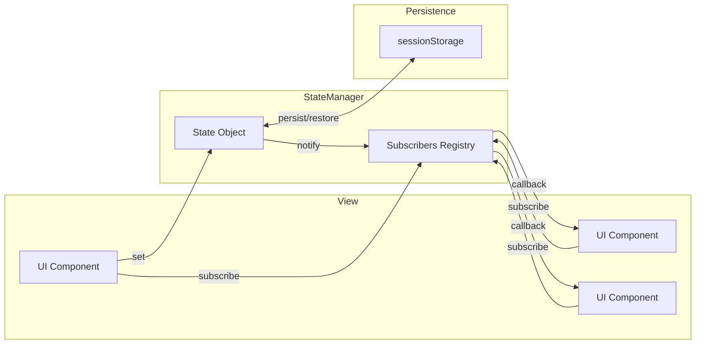

---

## 5. Flusso Completo di una Pagina

### 5.1 Diagramma di Sequenza Completo

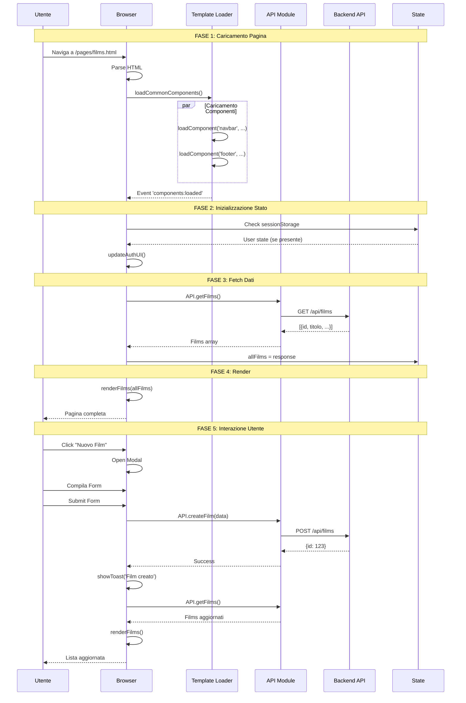

### 5.2 Esempio di Pagina Completa

```html
<!-- films.html -->
<!DOCTYPE html>
<html lang="it">
<head>
  <meta charset="UTF-8">
  <title>Gestione Films - CineBase</title>
  <link rel="stylesheet" href="/css/styles.css">
</head>
<body>
  <!-- Container per componenti dinamici -->
  <div id="navbar-container"></div>
  
  <main class="container">
    <h1>Gestione Films</h1>
    
    <!-- Controlli -->
    <div class="controls">
      <button id="btn-new-film" class="btn btn-primary">
        Nuovo Film
      </button>
      <select id="filter-select">
        <option value="all">Tutti</option>
        <option value="active">Attivi</option>
      </select>
    </div>
    
    <!-- Lista film -->
    <div id="films-list"></div>
    
    <!-- Modal per creazione/modifica -->
    <div id="film-modal" class="modal hidden">
      <form id="film-form">
        <input name="titolo" type="text" required>
        <input name="anno" type="number" required>
        <select name="registaId" required></select>
        <button type="submit">Salva</button>
      </form>
    </div>
  </main>
  
  <div id="footer-container"></div>
  
  <!-- Scripts -->
  <script src="/js/template-loader.js"></script>
  <script src="/js/api.js"></script>
  <script src="/js/utils.js"></script>
  <script src="/js/navbar.js"></script>
  <script src="/js/films.js"></script>
</body>
</html>
```

```javascript
// films.js - Logica della pagina

// Stato del modulo
let allFilms = [];
let allRegisti = [];

// Inizializzazione
document.addEventListener('DOMContentLoaded', async () => {
  // Attendi che i componenti siano caricati
  await loadCommonComponents();
  
  // Aggiorna UI autenticazione
  updateAuthUI();
  
  // Carica i dati
  await initializePage();
  
  // Setup event listeners
  setupEventListeners();
});

async function initializePage() {
  try {
    showLoading();
    
    [allFilms, allRegisti] = await Promise.all([
      API.getFilms(),
      API.getRegisti()
    ]);
    
    renderFilms();
    populateRegistiDropdown();
  } catch (error) {
    handleApiError(error);
  } finally {
    hideLoading();
  }
}

function setupEventListeners() {
  // Pulsante nuovo film
  document.getElementById('btn-new-film').addEventListener('click', () => {
    resetFormState('film-form');
    showModal('film-modal');
  });
  
  // Submit form
  document.getElementById('film-form').addEventListener('submit', async (e) => {
    e.preventDefault();
    await handleFormSubmit();
  });
  
  // Filtro
  document.getElementById('filter-select').addEventListener('change', (e) => {
    renderFilms(e.target.value);
  });
}

async function handleFormSubmit() {
  const form = document.getElementById('film-form');
  const formData = new FormData(form);
  const data = Object.fromEntries(formData);
  
  const isEdit = isEditMode('film-form');
  
  try {
    if (isEdit) {
      await API.updateFilm(form.dataset.editId, data);
      showToast('Film aggiornato con successo', 'success');
    } else {
      await API.createFilm(data);
      showToast('Film creato con successo', 'success');
    }
    
    closeModal('film-modal');
    
    // Ricarica i dati
    [allFilms] = await Promise.all([API.getFilms()]);
    renderFilms();
  } catch (error) {
    handleApiError(error);
  }
}

function renderFilms(filter = 'all') {
  let films = [...allFilms];
  
  if (filter === 'active') {
    films = films.filter(f => f.stato === 'Attivo');
  }
  
  const container = document.getElementById('films-list');
  container.innerHTML = films.map(film => `
    <div class="film-card" data-id="${film.id}">
      <h3>${film.titolo}</h3>
      <p>${film.anno} - ${film.registaNome}</p>
      <button onclick="editFilm(${film.id})">Modifica</button>
      <button onclick="deleteFilm(${film.id})">Elimina</button>
    </div>
  `).join('');
}
```

### 5.3 Diagramma dello Stato durante il Ciclo di Vita

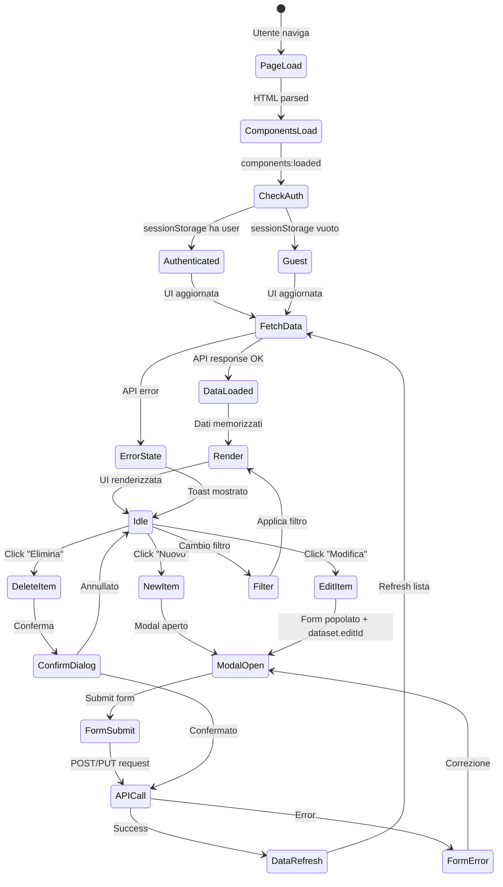

---

## 6. Best Practices

### 6.1 Checklist per lo Sviluppo

| Area | Best Practice | Priorità |
|------|---------------|----------|
| **Template Loading** | Usa cache per evitare richieste duplicate | Alta |
| **Template Loading** | Emetti eventi per sincronizzare i componenti | Alta |
| **API** | Centralizza tutte le chiamate in un modulo dedicato | Alta |
| **API** | Gestisci tutti gli errori HTTP possibili | Alta |
| **API** | Usa Promise.all per richieste parallele indipendenti | Media |
| **State** | Minimizza lo stato globale, preferisci stato locale | Media |
| **State** | Usa sessionStorage per dati persistenti tra refresh | Media |
| **State** | Aggiorna l'UI prima del server (optimistic updates) | Bassa |
| **Security** | Mai salvare dati sensibili in sessionStorage | Alta |
| **UX** | Mostra sempre feedback visivo durante operazioni asincrone | Alta |

### 6.2 Gestione degli Errori Completa

```javascript
// Pattern consigliato per operazioni asincrone

async function safeOperation(operation, options = {}) {
  const {
    loadingMessage = 'Caricamento...',
    successMessage = null,
    onSuccess = () => {},
    onError = () => {}
  } = options;

  try {
    showToast(loadingMessage, 'info');
    const result = await operation();
    
    if (successMessage) {
      showToast(successMessage, 'success');
    }
    
    onSuccess(result);
    return result;
    
  } catch (error) {
    const message = handleApiError(error);
    onError(error);
    throw error;
  }
}

// Utilizzo
await safeOperation(
  () => API.createFilm(formData),
  {
    loadingMessage: 'Creazione film...',
    successMessage: 'Film creato con successo!',
    onSuccess: () => {
      closeModal('film-modal');
      loadFilms();
    }
  }
);
```

### 6.3 Anti-Pattern da Evitare

```
┌─────────────────────────────────────────────────────────────────────┐
│                    ANTI-PATTERN COMUNI                              │
├─────────────────────────────────────────────────────────────────────┤
│                                                                     │
│  ❌ ERRATO                           ✅ CORRETTO                    │
│  ─────────────────────────────────────────────────────────────────│
│                                                                     │
│  fetch('/api/films')                 apiFetch('/films')            │
│    .then(r => r.json())              // Centralizzato              │
│    .then(...)                                                      │
│    .catch(...)                       try {                         │
│                                        const films =                │
│  // Error handling disperso               await API.getFilms();    │
│                                      } catch (e) {                 │
│                                        handleApiError(e);          │
│                                      }                             │
│                                                                     │
│  ─────────────────────────────────────────────────────────────────│
│                                                                     │
│  // Variabili globali               // Module-scoped variables      │
│  window.allFilms = [];              let allFilms = [];             │
│                                                                     │
│  // Inquinamento namespace globale   // Isolamento nel modulo      │
│                                                                     │
│  ─────────────────────────────────────────────────────────────────│
│                                                                     │
│  // Fetch sequenziale               // Fetch parallelo             │
│  const films = await               const [films, registi] =       │
│    API.getFilms();                    await Promise.all([           │
│  const registi =                        API.getFilms(),            │
│    await API.getRegisti();              API.getRegisti()           │
│                                      ]);                           │
│                                                                     │
│  // Lento (tempo = A + B)            // Veloce (tempo = max(A,B))   │
│                                                                     │
└─────────────────────────────────────────────────────────────────────┘
```

### 6.4 Checklist per Code Review

- [ ] Tutte le chiamate API usano il modulo centralizzato
- [ ] Gli errori sono gestiti con `handleApiError`
- [ ] Le operazioni lunghe mostrano un indicatore di loading
- [ ] Lo stato è memorizzato nel livello appropriato
- [ ] I form resettano correttamente lo stato dopo submit
- [ ] Le promise parallele usano `Promise.all`
- [ ] Non ci sono dati sensibili in sessionStorage
- [ ] I template sono caricati una sola volta (cache)
- [ ] Event listeners sono collegati dopo il caricamento dei template

---

## 7. Aggiornamento Auth Lifecycle (Aprile 2026)

Questa sezione allinea il tutorial all'implementazione attuale del progetto, introducendo le modifiche strutturali su autenticazione e refresh token.

### 7.1 Nuova responsabilita distribuita: client + backend

- Il frontend gestisce un `deviceId` persistente in `localStorage` (`cb_device_id`) e lo invia su login/register/refresh/logout.
- Il backend salva `DeviceId` su `RefreshTokens` e consente di usare un refresh token solo dal device associato.
- Il backend limita i token attivi a **1 per coppia utente/device** (revoca automatica dei token attivi precedenti dello stesso device).
- Un servizio in background pulisce periodicamente token revocati o scaduti.

### 7.2 Storage e chiavi di autenticazione lato browser

Chiavi attualmente usate in `wwwroot/js/auth.js`:

- `cb_access_token`
- `cb_refresh_token`
- `cb_user`
- `cb_device_id`

Comportamento `deviceId`:

- primo avvio: genera UUID (`crypto.randomUUID`) e lo persiste
- compatibilita token legacy: se esiste un refresh token ma manca `deviceId`, usa fallback `web-default`

### 7.3 Refresh reattivo (401) + coordinamento richieste concorrenti

Il modulo `api.js` continua a usare il refresh reattivo su `401`, con coda subscriber per evitare refresh multipli concorrenti.

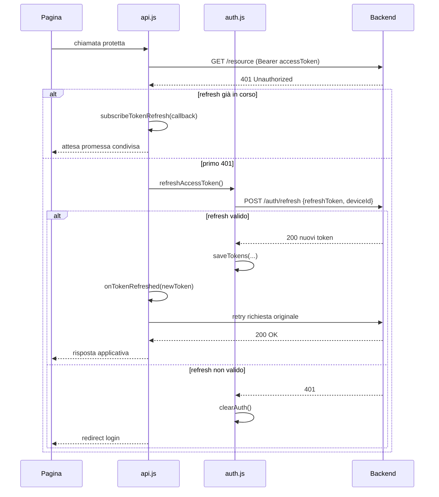

### 7.4 Refresh proattivo nel route guard

`route-guard.js` non reindirizza subito al login quando il token accesso e scaduto: prima tenta un refresh silenzioso se e presente `cb_refresh_token`.

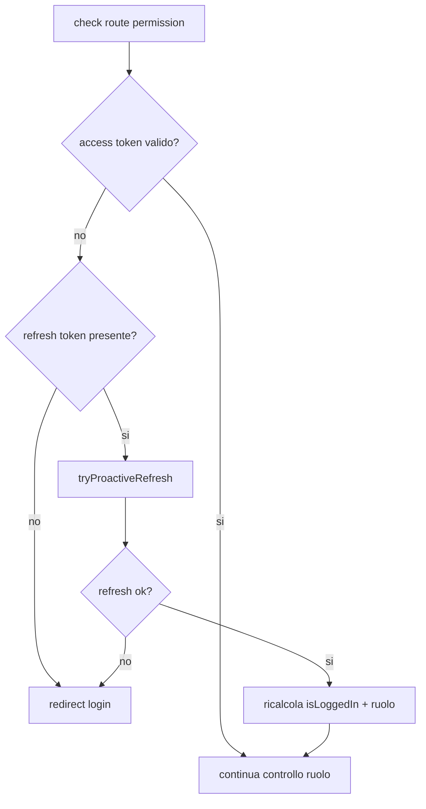

### 7.5 Impatto backend visibile dal frontend

Per effetto delle nuove regole backend:

- un refresh token rubato ma usato con `deviceId` diverso viene rifiutato (`401`)
- login multipli sullo stesso device non aumentano token attivi: il token precedente viene revocato
- la crescita tabella `RefreshTokens` viene ridotta dal cleanup periodico (`RefreshTokenCleanupService`)

---

## Riepilogo

L'architettura frontend di CineBase implementa un pattern **modulare** e **separato** che facilita la manutenibilità:

1. **Template Loader**: Carica dinamicamente i componenti HTML con caching intelligente
2. **API Module**: Centralizza le comunicazioni HTTP con gestione errori robusta
3. **State Management**: Approccio scalabile con tre livelli di persistenza

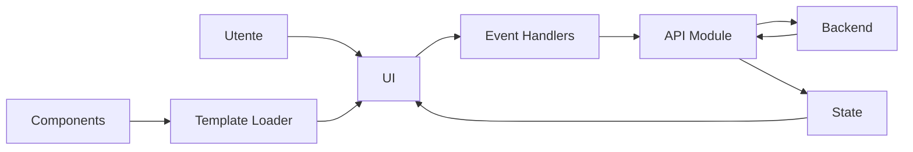

Questo approccio permette di:
- **Scalare** facilmente aggiungendo nuove pagine e API
- **Testare** singolarmente ogni modulo
- **Mantere** il codice pulito e organizzato
- **Debuggare** facilmente grazie alla separazione delle responsabilità
