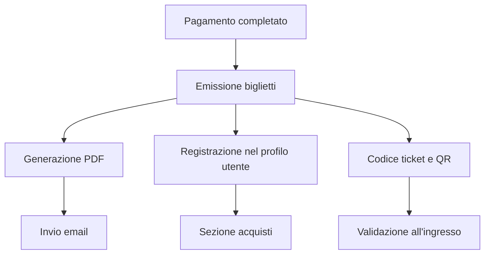
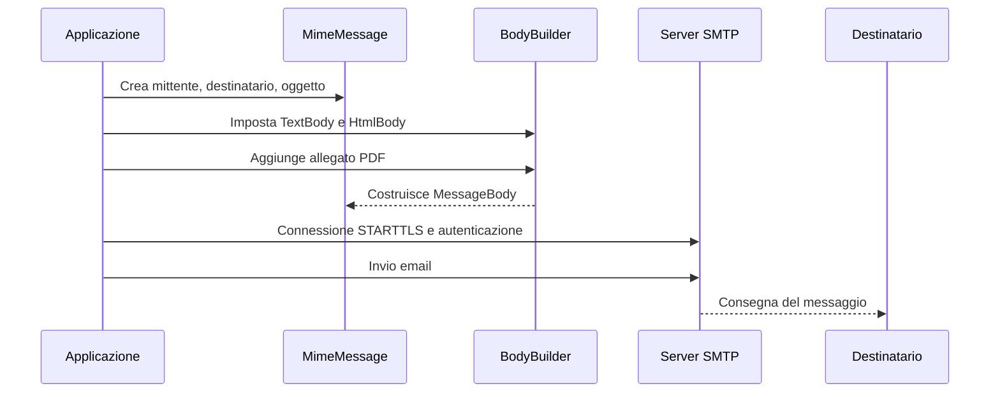
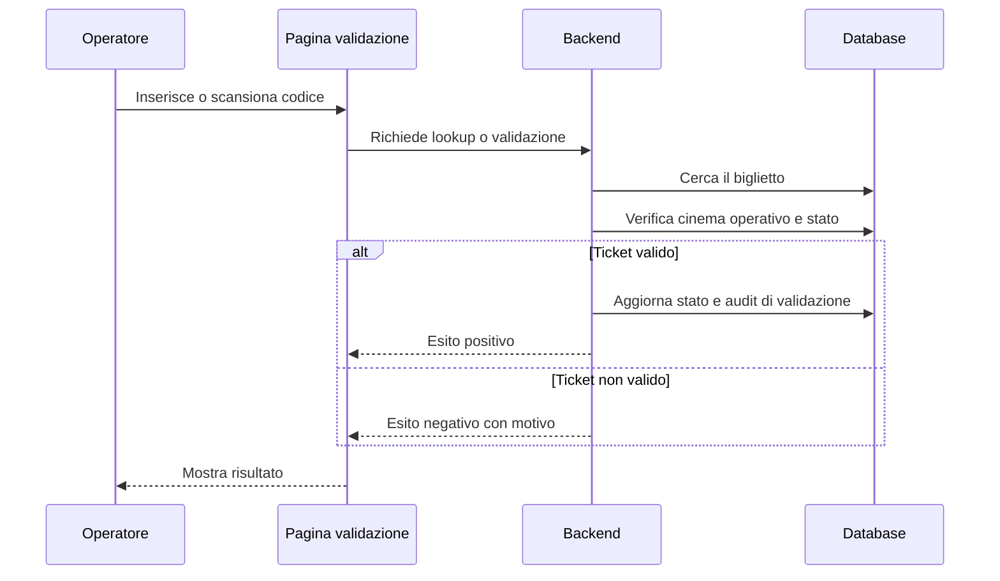

# Tutorial didattico: email con MailKit, PDF con QuestPDF, QR code con QRCoder e ciclo completo del biglietto digitale

**Autore:** OpenCode  
**Progetto di riferimento:** CineBase  
**Ambito:** guida tutoriale accessibile per comprendere e realizzare il flusso completo dei biglietti digitali  

---

## Indice

1. [Obiettivo del tutorial](#1-obiettivo-del-tutorial)
2. [Panoramica del flusso completo](#2-panoramica-del-flusso-completo)
3. [Perché serve un servizio email dedicato](#3-perche-serve-un-servizio-email-dedicato)
4. [Scenario didattico: usare Gmail per l'invio email](#4-scenario-didattico-usare-gmail-per-linvio-email)
5. [Scenario didattico: usare account Microsoft](#5-scenario-didattico-usare-account-microsoft)
6. [Scenario professionale: SendGrid e altri provider usati nella pratica](#6-scenario-professionale-sendgrid-e-altri-provider-usati-nella-pratica)
7. [Configurazione applicativa consigliata](#7-configurazione-applicativa-consigliata)
8. [MailKit: come si costruisce un servizio email](#8-mailkit-come-si-costruisce-un-servizio-email)
9. [Come creare una email HTML con allegati in MailKit](#9-come-creare-una-email-html-con-allegati-in-mailkit)
10. [QuestPDF: come generare il PDF dei biglietti](#10-questpdf-come-generare-il-pdf-dei-biglietti)
11. [QRCoder: come generare il QR code del biglietto](#11-qrcoder-come-generare-il-qr-code-del-biglietto)
12. [Come modellare la creazione dei biglietti](#12-come-modellare-la-creazione-dei-biglietti)
13. [Come inviare i biglietti via email](#13-come-inviare-i-biglietti-via-email)
14. [Come registrare i biglietti nel profilo utente](#14-come-registrare-i-biglietti-nel-profilo-utente)
15. [Come mostrare la sezione acquisti](#15-come-mostrare-la-sezione-acquisti)
16. [Come validare i biglietti all'ingresso](#16-come-validare-i-biglietti-allingresso)
17. [Errori tipici da evitare](#17-errori-tipici-da-evitare)
18. [Conclusione](#18-conclusione)

---

## 1. Obiettivo del tutorial

Questo tutorial spiega in modo progressivo come si costruisce un sottosistema completo per i biglietti digitali in un'applicazione .NET come `CineBase`.

Il percorso tutoriale copre:

- scelta del provider email
- configurazione di account didattici Gmail o Microsoft
- costruzione di un servizio email con `MailKit`
- creazione di email HTML con allegati
- generazione PDF con `QuestPDF`
- generazione QR code con `QRCoder`
- emissione dei biglietti nel backend
- registrazione dei biglietti nel profilo utente
- validazione operativa del ticket in ingresso

---

## 2. Panoramica del flusso completo

Il flusso completo del biglietto digitale può essere letto come una catena di passaggi.



Schema semplificato:

1. l'utente completa il pagamento
2. il backend emette un biglietto per ogni posto acquistato
3. il backend genera il PDF dei biglietti
4. il backend invia un'email con riepilogo e allegato
5. l'utente ritrova i biglietti nel proprio profilo, sezione acquisti
6. all'ingresso del cinema lo staff verifica e valida il codice del biglietto

Questo significa che il sistema non deve limitarsi a creare un file PDF: deve governare un processo completo.

---

## 3. Perché serve un servizio email dedicato

Un'applicazione non dovrebbe inviare email scrivendo codice SMTP direttamente dentro la logica del pagamento o dell'ordine.

È preferibile introdurre un servizio dedicato perché:

- separa la logica di business dalla logica infrastrutturale
- rende più facili i test
- consente di cambiare provider email in futuro
- evita di accoppiare l'app a Gmail, Microsoft o SendGrid in modo rigido

In termini architetturali, la soluzione più semplice è introdurre:

- `IEmailService`
- `EmailService`
- `EmailOptions`

---

## 4. Scenario didattico: usare Gmail per l'invio email

Per un progetto didattico che usa `MailKit` con autenticazione SMTP semplice, Gmail è in genere il punto di partenza più lineare.

Google oggi raccomanda OAuth e `Sign in with Google`, ma per un backend .NET che usa SMTP classico il percorso più pratico resta la password per app. Questa scelta è adatta a:

- prove locali
- esercizi di laboratorio
- test manuali a basso volume

## 4.1 Riferimenti ufficiali Google

- Verifica in due passaggi: `https://support.google.com/accounts/answer/185839?hl=en`
- Password per app: `https://support.google.com/accounts/answer/185833?hl=en`
- Parametri IMAP, POP e SMTP Gmail: `https://developers.google.com/workspace/gmail/imap/imap-smtp`
- Uso di Gmail con client esterni: `https://support.google.com/mail/answer/7126229?hl=en`
- Invio da alias o altro indirizzo: `https://support.google.com/mail/answer/22370?hl=en`

## 4.2 Procedura operativa passo passo per Gmail

1. L'operatore umano apre la guida ufficiale della verifica in due passaggi e attiva `2-Step Verification` sull'account Google che verrà usato come mittente.
2. Terminata l'attivazione, l'operatore umano apre la pagina ufficiale delle password per app.
3. Nella pagina delle password per app crea una nuova password dedicata al progetto, con un nome riconoscibile come `CineBase SMTP`.
4. Copia il valore generato e lo conserva in modo sicuro. Questo valore sostituisce la password normale dell'account nell'applicazione SMTP.
5. Apre `backend/.env.example` per verificare i nomi ufficiali delle variabili attese dal progetto.
6. Crea oppure aggiorna `backend/.env`.
7. Inserisce le credenziali Gmail nelle variabili SMTP del backend.
8. Riavvia il backend. Questo passaggio è necessario perché `backend/FilmAPI/Program.cs` invoca `Env.Load();` all'avvio e quindi rilegge `.env` solo a processo avviato.
9. Esegue un invio di prova appena `EmailService` o un endpoint di test è disponibile.

## 4.3 Variabili d'ambiente da impostare per Gmail

```dotenv
SMTP_HOST=smtp.gmail.com
SMTP_PORT=587
SMTP_USER=cinebase.demo@gmail.com
SMTP_PASSWORD=<password_per_app_google>
SMTP_FROM_EMAIL=cinebase.demo@gmail.com
SMTP_FROM_NAME=CineBase
```

## 4.4 Significato pratico delle variabili in Gmail

- `SMTP_HOST`: server SMTP ufficiale Gmail.
- `SMTP_PORT`: `587`, da usare con `STARTTLS`.
- `SMTP_USER`: indirizzo Gmail completo.
- `SMTP_PASSWORD`: password per app generata da Google.
- `SMTP_FROM_EMAIL`: indirizzo mittente mostrato al destinatario.
- `SMTP_FROM_NAME`: nome visualizzato del mittente.

Regola pratica:

- nei primi test didattici conviene mantenere `SMTP_FROM_EMAIL` uguale a `SMTP_USER`

Se si vuole inviare da un alias o da un altro indirizzo posseduto, Gmail richiede la procedura ufficiale `Send mail as`. In quel caso l'operatore umano deve verificare l'indirizzo anche lato Gmail prima di usarlo come `SMTP_FROM_EMAIL`.

## 4.5 Limiti pratici di Gmail

Gmail è utile per il laboratorio, ma non è il riferimento giusto per un invio applicativo massivo.

Limiti tipici:

- soglie di invio giornaliere
- maggior rischio di blocchi o challenge di sicurezza
- deliverability non progettata per email transazionali ad alto volume

## 4.6 Nota importante di compatibilità

La documentazione ufficiale Google raccomanda, quando possibile, `Sign in with Google` o OAuth2. Tuttavia il modello didattico della `FASE 8` è basato su `MailKit` e SMTP classico, quindi la password per app resta il compromesso più semplice e realistico per un ambiente di test.

---

## 5. Scenario didattico: usare account Microsoft

Nel mondo Microsoft conviene distinguere nettamente due casi:

- account personali `Outlook.com`, `Hotmail`, `Live`
- mailbox organizzative `Microsoft 365` o `Exchange Online`

Il primo caso può essere usato in laboratorio come alternativa a Gmail. Il secondo caso richiede più attenzione amministrativa e, con il modello SMTP semplice attuale del progetto, non è la scelta didattica più lineare.

## 5.1 Riferimenti ufficiali Microsoft

- Outlook.com POP, IMAP e SMTP settings: `https://support.microsoft.com/en-us/office/pop-imap-and-smtp-settings-for-outlook-com-d088b986-291d-42b8-9564-9c414e2aa040`
- Verifica in due passaggi per account Microsoft personali: `https://support.microsoft.com/en-us/account-billing/how-to-use-two-step-verification-with-your-microsoft-account-c7910146-672f-01e9-50a0-93b4585e7eb4`
- App passwords per account Microsoft personali: `https://support.microsoft.com/en-us/account-billing/how-to-get-and-use-app-passwords-5896ed9b-4263-e681-128a-a6f2979a7944`
- SMTP AUTH in Exchange Online: `https://learn.microsoft.com/en-us/exchange/clients-and-mobile-in-exchange-online/authenticated-client-smtp-submission`
- Invio email da device o applicazioni tramite Microsoft 365 o Office 365: `https://learn.microsoft.com/en-us/exchange/mail-flow-best-practices/how-to-set-up-a-multifunction-device-or-application-to-send-email-using-microsoft-365-or-office-365`

## 5.2 Procedura operativa passo passo per account personali Outlook.com

1. L'operatore umano apre `https://account.microsoft.com/security` e attiva la verifica in due passaggi seguendo la guida ufficiale Microsoft.
2. Dopo l'attivazione apre la pagina ufficiale delle `App passwords`.
3. Genera una password per app dedicata al progetto.
4. Apre `backend/.env.example` per controllare i nomi delle variabili richieste dal backend.
5. Crea oppure aggiorna `backend/.env`.
6. Inserisce i valori SMTP del proprio account personale.
7. Riavvia il backend e prova l'invio.

## 5.3 Variabili d'ambiente da impostare per Outlook.com personale

```dotenv
SMTP_HOST=smtp-mail.outlook.com
SMTP_PORT=587
SMTP_USER=<indirizzo_outlook_completo>
SMTP_PASSWORD=<app_password_microsoft>
SMTP_FROM_EMAIL=<indirizzo_outlook_completo>
SMTP_FROM_NAME=CineBase
```

## 5.4 Cosa aspettarsi davvero dagli account Microsoft personali

La documentazione ufficiale di Outlook.com indica `OAuth2/Modern Auth` come metodo standard di autenticazione SMTP. La password per app resta una via di compatibilità per dispositivi o applicazioni che non gestiscono la seconda fase di accesso.

Conseguenza pratica:

- il test con account personale Microsoft può funzionare
- il test con account personale Microsoft può anche richiedere ulteriori verifiche o fallire se il provider forza un percorso più moderno

Se l'autenticazione semplice fallisce anche con password per app, il progetto non dovrebbe insistere su questo scenario come baseline didattica. In quel caso è più affidabile usare Gmail per il test didattico oppure passare direttamente a `Twilio SendGrid`.

## 5.5 Caso Microsoft 365 o Exchange Online

Per una mailbox organizzativa Microsoft 365, la documentazione ufficiale richiede di verificare almeno questi punti:

1. esistenza di una mailbox licenziata
2. `SMTP AUTH` abilitato sull'organizzazione o almeno sulla mailbox
3. `TLS 1.2` o superiore disponibile
4. uso di `smtp.office365.com` su porta `587`
5. compatibilità tra policy di sicurezza del tenant e il metodo di autenticazione usato dal client

Configurazione di riferimento per `client SMTP submission`:

```dotenv
SMTP_HOST=smtp.office365.com
SMTP_PORT=587
SMTP_USER=<mailbox_microsoft_365>
SMTP_PASSWORD=<credenziale_consentita_dal_tenant>
SMTP_FROM_EMAIL=<indirizzo_mittente>
SMTP_FROM_NAME=CineBase
```

Nota architetturale importante:

- la documentazione Microsoft raccomanda `Modern Auth` con OAuth
- `Basic authentication` per client SMTP submission è in deprecazione
- se `SMTP_FROM_EMAIL` è diverso dalla mailbox usata in `SMTP_USER`, possono servire permessi `Send As`
- il modello attuale di `CineBase`, basato su sole variabili `SMTP_USER` e `SMTP_PASSWORD`, è perfettamente adatto a Gmail e `Twilio SendGrid`, ma non rappresenta l'intero caso `OAuth2-only` di Microsoft 365

Conclusione pragmatica:

- per test personali e di laboratorio si può tentare Outlook.com con app password
- per ambienti aziendali veri, se il tenant impone OAuth2 o blocca `SMTP AUTH`, il progetto deve essere esteso per `XOAUTH2` oppure deve usare un provider professionale dedicato

---

## 6. Scenario professionale: Twilio SendGrid e altri provider usati nella pratica

Quando il progetto deve inviare molte email, è preferibile usare un provider specializzato.

Nel 2026 il nome corretto del servizio è `Twilio SendGrid`. La documentazione ufficiale continua a vivere sotto percorsi URL che contengono `sendgrid`, quindi la presenza di `sendgrid` nell'indirizzo è normale.

Tra i provider molto usati nella pratica ci sono:

- `Twilio SendGrid`
- `Mailgun`
- `Amazon SES`
- `Postmark`
- `Brevo`
- `Resend`

## 6.1 Riferimenti ufficiali Twilio SendGrid

- SMTP getting started: `https://www.twilio.com/docs/sendgrid/for-developers/sending-email/getting-started-smtp`
- API keys: `https://www.twilio.com/docs/sendgrid/ui/account-and-settings/api-keys`
- Sender Identity overview: `https://www.twilio.com/docs/sendgrid/for-developers/sending-email/sender-identity`
- Single Sender Verification: `https://www.twilio.com/docs/sendgrid/ui/sending-email/sender-verification`
- Domain Authentication: `https://www.twilio.com/docs/sendgrid/ui/account-and-settings/how-to-set-up-domain-authentication`
- Web API vs SMTP: `https://www.twilio.com/docs/sendgrid/for-developers/sending-email/web-api-vs-smtp`

## 6.2 Perché un provider dedicato è spesso migliore

Vantaggi principali:

- migliore deliverability
- supporto a domini verificati
- statistiche di consegna
- strumenti per bounce, spam complaint e suppressions
- scalabilità su grandi volumi

## 6.3 Perché Twilio SendGrid è particolarmente adatto a CineBase

Twilio SendGrid offre sia Web API sia SMTP relay. La documentazione ufficiale raccomanda spesso la Web API per nuovi progetti, ma nel caso di `CineBase` la scelta SMTP resta molto coerente perché:

- la fase usa `MailKit`
- il repository ha già placeholder `SMTP_*`
- il codice può restare provider-agnostic dietro `IEmailService`

## 6.4 Procedura operativa passo passo per proof of concept o staging leggero

1. L'operatore umano crea un account su Twilio SendGrid.
2. Accede alla console Twilio SendGrid.
3. Apre `Settings > API Keys`.
4. Crea una nuova API key con permessi coerenti con l'invio email. Per un caso semplice di laboratorio o staging, il focus minimo è il permesso `Mail Send`.
5. Copia la key e la conserva in modo sicuro. Twilio SendGrid la mostra una sola volta.
6. Apre `Settings > Sender Authentication`.
7. Per un test rapido esegue `Single Sender Verification`.
8. Compila i campi richiesti e conferma l'indirizzo mittente cliccando il link ricevuto via email.
9. Aggiorna `backend/.env` con host, porta e credenziali SMTP.
10. Riavvia il backend ed esegue un invio di prova.

## 6.5 Variabili d'ambiente da impostare per Twilio SendGrid via SMTP relay

```dotenv
SMTP_HOST=smtp.sendgrid.net
SMTP_PORT=587
SMTP_USER=apikey
SMTP_PASSWORD=<twilio_sendgrid_api_key>
SMTP_FROM_EMAIL=<indirizzo_verificato_o_su_dominio_autenticato>
SMTP_FROM_NAME=CineBase
```

Osservazione importante:

- `SMTP_USER` non è l'email dell'account Twilio SendGrid
- `SMTP_USER` è il valore letterale `apikey`
- `SMTP_PASSWORD` è la API key Twilio SendGrid
- `SMTP_FROM_EMAIL` deve coincidere con un mittente verificato oppure appartenere a un dominio autenticato

## 6.6 Procedura operativa passo passo per uso professionale con Domain Authentication

1. L'operatore umano identifica il dominio da usare per le email transazionali, ad esempio `example.com`.
2. Verifica chi ha accesso alla gestione DNS del dominio.
3. Apre `Settings > Sender Authentication > Domain Authentication` nella console Twilio SendGrid.
4. Seleziona il provider DNS corretto oppure `Other Host`.
5. Inserisce il solo root domain, ad esempio `example.com`, senza `www` e senza protocollo.
6. Mantiene attiva l'opzione `Automated Security` se il provider DNS lo consente.
7. Copia i record DNS generati da Twilio SendGrid e li inserisce nel DNS del dominio.
8. Torna nella console Twilio SendGrid e avvia la verifica.
9. Attende il tempo necessario alla propagazione DNS. La documentazione ufficiale considera possibili fino a `48` ore.
10. Dopo la verifica, imposta `SMTP_FROM_EMAIL` usando un indirizzo del dominio autenticato, ad esempio `tickets@example.com`.

## 6.7 Altri provider molto comuni

### Mailgun

È noto per flessibilità tecnica e buoni strumenti per ambienti applicativi.

### Amazon SES

È molto economico e scalabile, ma può richiedere più configurazione operativa.

### Postmark

È molto apprezzato per email transazionali come conferme ordine e reset password.

### Brevo

È usato spesso in progetti piccoli o medi perché unisce email marketing e transazionali.

### Resend

È una soluzione moderna, molto usata in stack recenti e app orientate a developer experience semplice.

## 6.8 Strategia consigliata per un progetto didattico serio

Una strategia molto equilibrata è questa:

1. usare SMTP semplice in ambiente locale o didattico
2. mantenere `IEmailService` astratto
3. lasciare aperta la possibilità di passare a `Twilio SendGrid` o provider equivalente senza riscrivere il dominio

---

## 7. Configurazione applicativa consigliata

Nel repository il backend carica automaticamente le variabili da `backend/.env` perché `backend/FilmAPI/Program.cs` carica esplicitamente quel file all'avvio.

I placeholder ufficiali sono già presenti in `backend/.env.example`.

## 7.1 Procedura operativa nel repository

1. L'operatore umano apre `backend/.env.example`.
2. Crea oppure aggiorna `backend/.env`.
3. Valorizza solo le variabili del provider email scelto.
4. Evita di pubblicare o versionare le credenziali reali.
5. Riavvia il backend dopo ogni modifica alle variabili SMTP.

## 7.2 Variabili SMTP reali del progetto

| Variabile | Descrizione | Gmail | Outlook.com | Twilio SendGrid |
| --- | --- | --- | --- | --- |
| `SMTP_HOST` | server SMTP | `smtp.gmail.com` | `smtp-mail.outlook.com` | `smtp.sendgrid.net` |
| `SMTP_PORT` | porta SMTP | `587` | `587` | `587` |
| `SMTP_USER` | identità di autenticazione | email Gmail completa | email Outlook completa | `apikey` |
| `SMTP_PASSWORD` | segreto di autenticazione | password per app Google | app password Microsoft o credenziale compatibile | API key Twilio SendGrid |
| `SMTP_FROM_EMAIL` | mittente visibile | di norma uguale a `SMTP_USER` | di norma uguale a `SMTP_USER` | indirizzo verificato o su dominio autenticato |
| `SMTP_FROM_NAME` | nome visualizzato | `CineBase` | `CineBase` | `CineBase` |

## 7.3 Blocchi `.env` pronti all'uso

### Gmail

```dotenv
SMTP_HOST=smtp.gmail.com
SMTP_PORT=587
SMTP_USER=cinebase.demo@gmail.com
SMTP_PASSWORD=<password_per_app_google>
SMTP_FROM_EMAIL=cinebase.demo@gmail.com
SMTP_FROM_NAME=CineBase
```

### Outlook.com personale

```dotenv
SMTP_HOST=smtp-mail.outlook.com
SMTP_PORT=587
SMTP_USER=<indirizzo_outlook_completo>
SMTP_PASSWORD=<app_password_microsoft>
SMTP_FROM_EMAIL=<indirizzo_outlook_completo>
SMTP_FROM_NAME=CineBase
```

### Twilio SendGrid

```dotenv
SMTP_HOST=smtp.sendgrid.net
SMTP_PORT=587
SMTP_USER=apikey
SMTP_PASSWORD=<twilio_sendgrid_api_key>
SMTP_FROM_EMAIL=tickets@example.com
SMTP_FROM_NAME=CineBase
```

## 7.4 Nota su `STARTTLS` e porta `587`

Nel modello attuale del repository non esiste una variabile `SMTP_USE_STARTTLS`.

Per i tre scenari documentati, la combinazione da considerare standard è:

- `SMTP_PORT=587`
- `MailKit.Security.SecureSocketOptions.StartTls`

Se in futuro serve supportare porta `465`, SSL implicito o OAuth2 esplicito, il progetto dovrebbe estendere il modello di configurazione.

---

## 8. MailKit: come si costruisce un servizio email

Con `MailKit` e `MimeKit` la costruzione di un servizio email è molto lineare.

Componenti tipici:

- `MimeMessage` per il messaggio
- `BodyBuilder` per testo, HTML e allegati
- `SmtpClient` di MailKit per connessione e invio

Interfaccia semplice:

```csharp
public interface IEmailService
{
    Task<EmailSendResult> SendAsync(EmailMessage message, CancellationToken cancellationToken = default);
}
```

DTO possibili:

- `EmailMessage`
- `EmailAttachment`
- `EmailSendResult`

Questa scelta rende più facile:

- testare il servizio con fake
- sostituire SMTP con API HTTP in futuro

---

## 9. Come creare una email HTML con allegati in MailKit

Questa è una delle parti più importanti del tutorial.



Esempio didattico essenziale:

```csharp
using MailKit.Net.Smtp;
using MailKit.Security;
using MimeKit;

public async Task SendOrderEmailAsync()
{
    var message = new MimeMessage();
    message.From.Add(new MailboxAddress("CineBase", "cinebase.demo@gmail.com"));
    message.To.Add(MailboxAddress.Parse("utente@example.com"));
    message.Subject = "Conferma acquisto biglietti";

    var builder = new BodyBuilder
    {
        TextBody = "L'ordine è stato completato con successo. I biglietti sono allegati in PDF.",
        HtmlBody = @"<html>
<body style='font-family: Arial, sans-serif;'>
  <h1>Conferma acquisto</h1>
  <p>L'ordine è stato completato con successo.</p>
  <p>In allegato è presente il PDF dei biglietti.</p>
  <p>Il profilo utente resta il punto di recupero ufficiale dell'acquisto.</p>
</body>
</html>"
    };

    var pdfBytes = File.ReadAllBytes("biglietti.pdf");
    builder.Attachments.Add("biglietti.pdf", pdfBytes, ContentType.Parse("application/pdf"));

    message.Body = builder.ToMessageBody();

    using var client = new SmtpClient();
    await client.ConnectAsync("smtp.gmail.com", 587, SecureSocketOptions.StartTls);
    await client.AuthenticateAsync("cinebase.demo@gmail.com", "APP_PASSWORD");
    await client.SendAsync(message);
    await client.DisconnectAsync(true);
}
```

Elementi importanti da osservare:

- `TextBody` offre una versione leggibile anche dai client che non usano HTML
- `HtmlBody` consente un layout più ricco
- l'allegato PDF viene aggiunto al `BodyBuilder`
- `SecureSocketOptions.StartTls` protegge il canale SMTP

## 9.1 Buone pratiche per l'HTML email

Le email HTML non sono pagine web normali.

Regole pratiche:

- usare HTML semplice
- preferire stili inline o molto basilari
- evitare JavaScript
- evitare layout troppo sofisticati
- mantenere testo importante anche in forma leggibile senza immagini

---

## 10. QuestPDF: come generare il PDF dei biglietti

`QuestPDF` consente di costruire documenti PDF con API dichiarative.

Per il caso biglietti, la struttura tipica può essere:

- una pagina per ogni biglietto
- header con brand e cinema
- sezione dati spettacolo
- sezione posto
- blocco QR e codice

Esempio concettuale:

```csharp
using QuestPDF.Fluent;
using QuestPDF.Helpers;
using QuestPDF.Infrastructure;

public byte[] GenerateTicketPdf(IEnumerable<TicketPdfModel> tickets)
{
    return Document.Create(container =>
    {
        foreach (var ticket in tickets)
        {
            container.Page(page =>
            {
                page.Margin(24);
                page.Header().Text("CineBase - Biglietto digitale").SemiBold().FontSize(18);

                page.Content().Column(column =>
                {
                    column.Spacing(8);
                    column.Item().Text($"Film: {ticket.FilmTitle}");
                    column.Item().Text($"Cinema: {ticket.CinemaName}");
                    column.Item().Text($"Data e ora: {ticket.ShowDateTimeText}");
                    column.Item().Text($"Sala: {ticket.SalaName}");
                    column.Item().Text($"Posto: {ticket.Sector} - fila {ticket.Row} posto {ticket.Seat}");
                    column.Item().Text($"Codice: {ticket.TicketCode}");
                });

                page.Footer().AlignCenter().Text("Presentare questo biglietto all'ingresso");
            });
        }
    }).GeneratePdf();
}
```

L'esempio è volutamente semplice. In una versione più completa si possono inserire:

- QR code come immagine
- box grafici per evidenziare sala e posto
- prezzi e supplementi
- codice locale del cinema

---

## 11. QRCoder: come generare il QR code del biglietto

`QRCoder` permette di generare facilmente il contenuto grafico del QR.

Un approccio tipico è codificare un URL di validazione:

```text
https://app.example.com/validazione-biglietti.html?codice=CB-20260418-7X4K9P2M
```

Esempio concettuale:

```csharp
using QRCoder;

public byte[] GenerateQrPng(string validationUrl)
{
    using var generator = new QRCodeGenerator();
    using var data = generator.CreateQrCode(validationUrl, QRCodeGenerator.ECCLevel.Q);
    var pngQr = new PngByteQRCode(data);
    return pngQr.GetGraphic(8);
}
```

Il risultato può essere:

- inserito nel PDF
- mostrato nel frontend
- eventualmente allegato anche in altre rappresentazioni future

---

## 12. Come modellare la creazione dei biglietti

La creazione dei biglietti dovrebbe avvenire subito dopo il pagamento riuscito.

Regola di dominio:

- un biglietto per ogni posto acquistato

Il modello `Biglietto` dovrebbe contenere almeno:

- riferimento a ordine
- riferimento a show
- riferimento a posto
- riferimento a utente
- codice univoco
- prezzo base
- supplemento
- prezzo totale
- stato
- dati di validazione

Flusso didattico raccomandato:

1. leggere l'ordine pagato
2. leggere i posti venduti per quell'ordine
3. generare un record `Biglietto` per ciascun posto
4. assegnare un codice univoco
5. salvare tutti i record

---

## 13. Come inviare i biglietti via email

L'invio via email è un passaggio successivo all'emissione del ticket.

Ordine corretto:

1. pagamento riuscito
2. emissione ticket completata
3. generazione PDF completata
4. tentativo di invio email

Se l'email fallisce:

- l'ordine non deve essere annullato
- il biglietto non deve essere eliminato
- il sistema deve registrare l'errore e consentire recupero dal profilo

Questo è un punto didattico fondamentale, perché insegna a distinguere:

- core business
- servizi accessori ma importanti

---

## 14. Come registrare i biglietti nel profilo utente

Il profilo utente non deve mostrare solo dati anagrafici.

Nel caso di un'app di ticketing, il profilo deve diventare anche archivio operativo degli acquisti.

Informazioni utili da esporre:

- elenco ordini
- stato ordine
- elenco biglietti collegati all'ordine
- codice biglietto
- stato del biglietto
- link download PDF

Questa parte è importante perché garantisce resilienza:

- se l'email non arriva, l'utente non perde il biglietto
- se il PDF allegato viene cancellato, il sistema può rigenerarlo o scaricarlo dal profilo

---

## 15. Come mostrare la sezione acquisti

La sezione acquisti del profilo può essere organizzata in due livelli.

## 15.1 Livello ordine

Ogni ordine può mostrare:

- codice ordine
- data acquisto
- film
- cinema
- importo totale
- stato pagamento
- link PDF

## 15.2 Livello biglietto

Per ogni ordine si possono mostrare i biglietti emessi con:

- codice biglietto
- sala
- fila
- posto
- stato `Issued` o `Validated`

Questa struttura è molto leggibile e si presta bene sia al frontend sia ai test.

---

## 16. Come validare i biglietti all'ingresso

La validazione è la fase finale del ciclo di vita del biglietto.



Il backend dovrebbe eseguire alcuni controlli essenziali:

1. il codice esiste
2. il biglietto appartiene al cinema operativo corretto
3. il biglietto non è già stato validato
4. il biglietto non è annullato

Se tutti i controlli passano, il sistema registra:

- `ValidatoAtUtc`
- `ValidatoDaUserId`
- `ValidatoCinemaId`

## 16.1 Perché il cinema operativo è importante

Questo controllo impedisce, ad esempio, che un biglietto emesso per un cinema venga validato in un altro cinema della rete.

È una regola utile sia dal punto di vista funzionale sia dal punto di vista didattico, perché mostra come si applicano vincoli di contesto nel backend.

## 16.2 Input manuale e scansione

Il sistema dovrebbe supportare:

- inserimento manuale del codice
- apertura diretta della pagina con query string
- scansione QR o barcode dal browser, se il frontend lo prevede

Tutti questi ingressi devono convergere sulla stessa logica di validazione backend.

---

## 17. Errori tipici da evitare

Errori molto comuni in questo tipo di funzionalità:

- usare l'email come unica fonte del biglietto
- annullare l'ordine se l'invio email fallisce
- generare PDF dentro il controller senza servizio dedicato
- accoppiare il dominio a un provider specifico come Gmail
- validare il biglietto solo nel frontend
- non registrare chi ha validato e quando
- non prevedere un fallback nel profilo utente

Un altro errore frequente è ignorare l'idempotenza.

Se una richiesta viene ripetuta, il sistema non dovrebbe emettere biglietti duplicati né validare due volte lo stesso ticket.

---

## 18. Conclusione

Il sottosistema di ticketing digitale è un ottimo esempio di architettura applicativa completa, perché mette insieme:

- dominio ordine e pagamento
- generazione documenti
- integrazione email
- persistenza dei dati utente
- controlli operativi in ingresso

Una realizzazione corretta non si limita a far partire una email con un allegato, ma costruisce un ciclo di vita coerente del biglietto: creazione, distribuzione, consultazione, validazione.

Questa è la prospettiva giusta con cui affrontare la `FASE 8` di `CineBase`.
