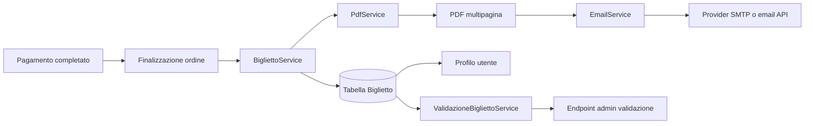
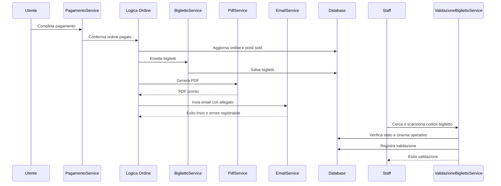
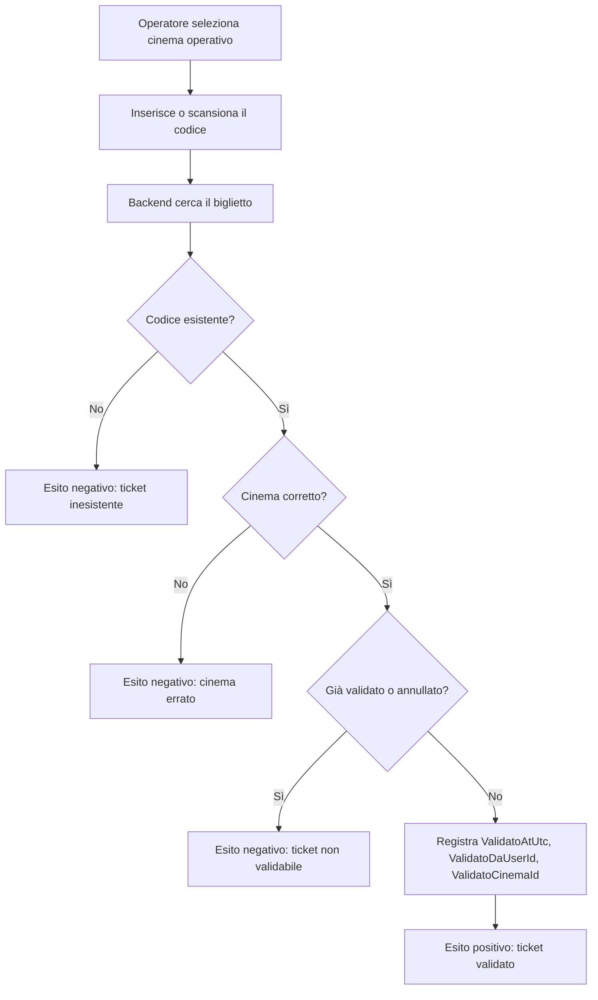

# Strategia di implementazione della Fase 8: ticketing digitale, PDF, email e validazione

**Autore:** OpenCode  
**Progetto di riferimento:** CineBase  
**Ambito:** strategia tecnica e didattica per la `FASE 8 - Backend ticketing digitale, PDF/email e validazione biglietti`  

---

## Indice

1. [Obiettivo del documento](#1-obiettivo-del-documento)
2. [Contesto della Fase 8](#2-contesto-della-fase-8)
3. [Risultato atteso a fine fase](#3-risultato-atteso-a-fine-fase)
4. [Principi guida della strategia](#4-principi-guida-della-strategia)
5. [Architettura applicativa raccomandata](#5-architettura-applicativa-raccomandata)
6. [Ruolo dei servizi principali](#6-ruolo-dei-servizi-principali)
7. [Flusso completo dal pagamento al biglietto validato](#7-flusso-completo-dal-pagamento-al-biglietto-validato)
8. [Strategia di generazione dei codici biglietto](#8-strategia-di-generazione-dei-codici-biglietto)
9. [Strategia PDF con QuestPDF](#9-strategia-pdf-con-questpdf)
10. [Strategia QR code e barcode](#10-strategia-qr-code-e-barcode)
11. [Strategia email con MailKit](#11-strategia-email-con-mailkit)
12. [Provider email: approccio didattico e approccio professionale](#12-provider-email-approccio-didattico-e-approccio-professionale)
13. [Registrazione dei biglietti nel profilo utente](#13-registrazione-dei-biglietti-nel-profilo-utente)
14. [Strategia di validazione in ingresso](#14-strategia-di-validazione-in-ingresso)
15. [Sicurezza, robustezza e failure handling](#15-sicurezza-robustezza-e-failure-handling)
16. [Piano di implementazione raccomandato](#16-piano-di-implementazione-raccomandato)
17. [Test raccomandati per la fase](#17-test-raccomandati-per-la-fase)
18. [Checklist finale della fase](#18-checklist-finale-della-fase)

---

## 1. Obiettivo del documento

Questo documento descrive la strategia consigliata per implementare correttamente la `FASE 8` in `CineBase`.

L'obiettivo non è solo spiegare quali librerie usare, ma chiarire:

- come suddividere le responsabilità applicative
- come evitare accoppiamenti fragili tra pagamento, emissione ticket, PDF ed email
- come costruire una soluzione didattica ma vicina alle pratiche reali

---

## 2. Contesto della Fase 8

La fase arriva dopo il completamento della parte più critica del checkout:

- esistono già `Ordine`, `Biglietto`, `ShowPostoStato` e il dominio del pagamento
- l'ordine può già essere finalizzato in stato `Paid`
- i posti possono già passare da `Hold` a `Sold`
- il sistema espone già liste ordini e ticket per il profilo

La `FASE 8` deve completare il ciclo operativo del biglietto digitale.

In termini pratici, un ordine pagato deve produrre:

- un biglietto per ogni posto acquistato
- un PDF scaricabile dell'ordine o dei biglietti
- un'email di conferma con allegato
- una successiva validazione in ingresso, auditabile e bloccata in caso di doppio uso

---

## 3. Risultato atteso a fine fase

Alla fine della fase il progetto dovrebbe consentire questo scenario completo:

1. l'utente paga con successo un ordine
2. il backend emette i biglietti con codici univoci
3. il backend genera un PDF multipagina con un biglietto per pagina
4. il backend tenta l'invio dell'email di conferma con PDF allegato
5. l'utente può comunque vedere ordine e biglietti nel proprio profilo anche se l'email fallisce
6. lo staff può cercare o scansionare il codice del biglietto
7. il backend valida il biglietto una sola volta e registra operatore, cinema e data/ora

---

## 4. Principi guida della strategia

### 4.1 Il pagamento resta separato dall'invio email

Il successo del pagamento non deve dipendere dalla consegna dell'email.

Regola fondamentale:

- ordine pagato e biglietti emessi sono la source of truth
- PDF ed email sono attività successive

Se SMTP o provider email falliscono, l'ordine non deve tornare indietro.

### 4.2 Il biglietto digitale è un'entità di dominio, non un semplice allegato

Il PDF è solo una rappresentazione del biglietto.

La source of truth resta il record `Biglietto` nel database, con:

- codice biglietto
- stato
- riferimento a show, posto e ordine
- metadati di validazione

### 4.3 La validazione deve convergere sempre sulla stessa logica backend

Che il codice arrivi da:

- input manuale
- scansione QR
- scansione barcode
- apertura diretta di URL con query string

la logica deve sempre passare da `ValidazioneBigliettoService`.

### 4.4 Il profilo utente è il fallback operativo

L'email è utile, ma non è l'unico canale di consegna.

L'utente autenticato deve poter recuperare:

- elenco ordini
- elenco biglietti
- dettaglio biglietto
- download PDF

---

## 5. Architettura applicativa raccomandata

La suddivisione consigliata è la seguente:



- `BigliettoService`
  - genera i record `Biglietto`
  - produce i codici univoci
  - fornisce read model per profilo e validazione
- `PdfService`
  - costruisce il PDF multipagina dei biglietti
  - non decide logiche di business
- `EmailService`
  - compone ed invia l'email
  - non genera ticket e non finalizza ordini
- `ValidazioneBigliettoService`
  - cerca il biglietto per codice
  - verifica cinema operativo, stato e validabilità
  - esegue la validazione idempotente

Orchestrazione raccomandata:

1. il pagamento va a buon fine
2. la logica di finalizzazione ordine chiama l'emissione ticket
3. una volta emessi i ticket, il sistema può generare PDF ed email
4. eventuali errori PDF/email vengono registrati sull'ordine, non trasformati in rollback del pagamento

---

## 6. Ruolo dei servizi principali

## 6.1 `BigliettoService`

Responsabilità consigliate:

- generare un biglietto per ogni posto venduto
- produrre `CodiceBiglietto` e `BarcodeValue`
- impedire doppia emissione sullo stesso `ShowId + SalaPostoId`
- recuperare i dati necessari per stampa, email e profilo

Buona regola:

- la generazione deve essere idempotente rispetto all'ordine già finalizzato

## 6.2 `PdfService`

Responsabilità consigliate:

- ricevere un modello già pronto per la stampa
- generare `byte[]` o stream PDF
- produrre un documento leggibile sia da desktop sia da smartphone

## 6.3 `EmailService`

Responsabilità consigliate:

- comporre oggetto, testo plain text, corpo HTML e allegati
- inviare tramite SMTP o provider equivalente
- restituire esito, timestamp ed eventuale errore leggibile

## 6.4 `ValidazioneBigliettoService`

Responsabilità consigliate:

- trovare il biglietto per codice
- verificare appartenenza al cinema operativo
- bloccare ticket già validati o annullati
- registrare `ValidatoAtUtc`, `ValidatoDaUserId`, `ValidatoCinemaId`

---

## 7. Flusso completo dal pagamento al biglietto validato

Flusso raccomandato:



1. `PagamentoService` o la logica di finalizzazione porta l'ordine a `Paid`
2. il backend trasforma i posti `Hold` in `Sold`
3. `BigliettoService` emette un biglietto per ogni posto dell'ordine
4. il backend salva i record in modo atomico con l'ordine finale
5. fuori dalla parte critica del pagamento, `PdfService` genera il PDF
6. `EmailService` prova a spedire la conferma con allegato PDF
7. l'ordine registra `TicketEmailSentAtUtc` oppure `TicketEmailLastError`
8. il profilo utente mostra ordine, ticket e download PDF
9. in ingresso allo spettacolo, lo staff cerca o scansiona il codice
10. `ValidazioneBigliettoService` valida il ticket e registra audit completo

Separazione importante:

- emissione ticket: parte del dominio pagato
- PDF ed email: post-processing operativo

---

## 8. Strategia di generazione dei codici biglietto

Il codice del biglietto dovrebbe essere:

- univoco
- non ambiguo alla lettura umana
- abbastanza corto da poter essere digitato manualmente
- abbastanza robusto da evitare collisioni realistiche

Formato didattico ragionevole:

```text
CB-20260418-7X4K9P2M
```

Strategia consigliata:

1. prefisso funzionale, ad esempio `CB`
2. data compatta o informazione temporale utile al debugging
3. segmento casuale alfanumerico uppercase
4. vincolo `UNIQUE` sul database come garanzia finale

Regola pratica:

- il sistema può tentare la generazione più volte in caso di collisione rara

Il `BarcodeValue` può coincidere con `CodiceBiglietto` per semplicità didattica.

---

## 9. Strategia PDF con QuestPDF

`QuestPDF` è adatto al progetto perché:

- permette layout dichiarativi chiari
- produce output PDF consistente
- si integra bene con .NET

Strategia consigliata per CineBase:

- un biglietto per pagina
- intestazione con brand e dati cinema
- sezione centrale con dati dello spettacolo
- blocco visivo per posto, sala e orario
- QR code e barcode in area ben visibile
- footer con codice biglietto e note operative

Contenuti minimi per ogni pagina:

- titolo film
- data e ora show
- nome cinema, città, indirizzo, codice locale
- sala, settore, fila, posto
- prezzo base, supplemento, totale
- codice biglietto in chiaro
- barcode
- QR code verso URL di validazione

Scelta raccomandata:

- `PdfService` riceve una lista di DTO già pronti, ad esempio `TicketPdfModel`
- `QuestPDF` non deve accedere direttamente al database

---

## 10. Strategia QR code e barcode

`QRCoder` è adatto per generare immagini QR da incorporare nel PDF e, se necessario, nel frontend.

Scelta raccomandata per il QR:

- codificare un URL come `validazione-biglietti.html?codice=...`

Vantaggi:

- lo staff può aprire direttamente la pagina di validazione
- il browser può precompilare il codice
- il flusso mobile è più rapido

Per il barcode, in un progetto didattico è accettabile:

- mostrare il valore testuale in chiaro
- usare lo stesso codice anche come base per una libreria barcode successiva

Osservazione pratica:

- se la libreria barcode grafica non viene introdotta subito, la fase può comunque restare coerente purché il codice in chiaro e il QR siano presenti e la documentazione espliciti il limite

---

## 11. Strategia email con MailKit

`MailKit` è una scelta molto adatta per .NET perché consente di:

- usare SMTP in modo esplicito e controllato
- creare email multipart con testo, HTML e allegati
- gestire autenticazione moderna e connessioni sicure

Strategia consigliata:

- costruire l'email con `MimeMessage`
- includere sia parte plain text sia parte HTML
- allegare il PDF con nome file riconoscibile, ad esempio `biglietti-ORD-20260418-001.pdf`

L'email dovrebbe contenere:

- riepilogo ordine
- dati principali dello spettacolo
- riferimento ai ticket acquistati
- indicazione che il profilo utente resta il punto di recupero ufficiale

Regola importante:

- il servizio email non deve lanciare eccezioni non gestite fino al livello del pagamento; deve restituire un errore applicativo registrabile

Implicazione pratica per `CineBase`:

- l'infrastruttura email della fase deve usare le variabili già previste dal repository in `backend/.env.example`
- i nomi da considerare ufficiali sono `SMTP_HOST`, `SMTP_PORT`, `SMTP_USER`, `SMTP_PASSWORD`, `SMTP_FROM_EMAIL`, `SMTP_FROM_NAME`
- il backend rilegge questi valori all'avvio tramite `Env.Load();` in `backend/FilmAPI/Program.cs`

Riferimento operativo:

- il documento tutoriale dettagliato per la preparazione del provider e delle credenziali è `docs/tutorials/TUTORIAL_EMAIL_MAILKIT_BIGLIETTI_PDF_QRCODE.md`

---

## 12. Provider email: approccio didattico e approccio professionale

Per il progetto conviene distinguere chiaramente due scenari.

Riferimenti ufficiali principali:

- Google app passwords: `https://support.google.com/accounts/answer/185833?hl=en`
- Google 2-Step Verification: `https://support.google.com/accounts/answer/185839?hl=en`
- Gmail IMAP/POP/SMTP: `https://developers.google.com/workspace/gmail/imap/imap-smtp`
- Outlook.com SMTP settings: `https://support.microsoft.com/en-us/office/pop-imap-and-smtp-settings-for-outlook-com-d088b986-291d-42b8-9564-9c414e2aa040`
- Microsoft account app passwords: `https://support.microsoft.com/en-us/account-billing/how-to-get-and-use-app-passwords-5896ed9b-4263-e681-128a-a6f2979a7944`
- Exchange Online SMTP AUTH: `https://learn.microsoft.com/en-us/exchange/clients-and-mobile-in-exchange-online/authenticated-client-smtp-submission`
- Twilio SendGrid API Keys: `https://www.twilio.com/docs/sendgrid/ui/account-and-settings/api-keys`
- Twilio SendGrid Sender Identity: `https://www.twilio.com/docs/sendgrid/for-developers/sending-email/sender-identity`
- Twilio SendGrid Single Sender Verification: `https://www.twilio.com/docs/sendgrid/ui/sending-email/sender-verification`
- Twilio SendGrid Domain Authentication: `https://www.twilio.com/docs/sendgrid/ui/account-and-settings/how-to-set-up-domain-authentication`
- Twilio SendGrid Web API vs SMTP: `https://www.twilio.com/docs/sendgrid/for-developers/sending-email/web-api-vs-smtp`

## 12.1 Scenario didattico o locale

Per sviluppo e test si può usare:

- un account Gmail con password per app
- un account Microsoft con credenziali applicative o servizi SMTP compatibili del tenant
- un server SMTP locale di test, ad esempio un fake SMTP o un mail catcher

Mappatura strategica sulle variabili del repository:

### Gmail

```dotenv
SMTP_HOST=smtp.gmail.com
SMTP_PORT=587
SMTP_USER=<gmail_completo>
SMTP_PASSWORD=<password_per_app_google>
SMTP_FROM_EMAIL=<gmail_completo>
SMTP_FROM_NAME=CineBase
```

### Outlook.com personale

```dotenv
SMTP_HOST=smtp-mail.outlook.com
SMTP_PORT=587
SMTP_USER=<outlook_completo>
SMTP_PASSWORD=<app_password_microsoft>
SMTP_FROM_EMAIL=<outlook_completo>
SMTP_FROM_NAME=CineBase
```

Osservazione strategica:

- Gmail è il baseline didattico più lineare per il modello `MailKit + SMTP_USER + SMTP_PASSWORD`
- Outlook.com personale può essere usato come scenario alternativo, ma va considerato meno prevedibile
- Microsoft 365 organizzativo richiede verifiche amministrative aggiuntive e può richiedere OAuth2, che esula dal minimo necessario per la fase

Questo scenario è utile perché:

- è facile da capire
- consente di vedere rapidamente email reali o simulate
- riduce l'infrastruttura iniziale

Limiti:

- rischio di rate limit
- deliverability non adatta a volumi elevati
- configurazioni più fragili

## 12.2 Scenario professionale o quasi-produzione

Per carichi reali o semi-reali si dovrebbe preferire un provider dedicato, ad esempio:

- Twilio SendGrid
- Mailgun
- Amazon SES
- Postmark
- Brevo
- Resend

Vantaggi:

- migliore deliverability
- gestione domini verificati
- statistiche di invio
- webhooks e audit più ricchi
- maggiore adattabilità a grandi quantità di email

Decisione strategica consigliata per CineBase:

- durante la fase didattica si può iniziare da SMTP semplice
- l'interfaccia `IEmailService` va però progettata in modo da non dipendere da Gmail o Microsoft in modo rigido
- per un salto verso uno scenario più realistico senza riscrivere il codice della fase, `Twilio SendGrid` via SMTP relay è la scelta più coerente con il repository attuale

Mappatura strategica sulle variabili del repository per `Twilio SendGrid`:

```dotenv
SMTP_HOST=smtp.sendgrid.net
SMTP_PORT=587
SMTP_USER=apikey
SMTP_PASSWORD=<twilio_sendgrid_api_key>
SMTP_FROM_EMAIL=<indirizzo_verificato_oppure_su_dominio_autenticato>
SMTP_FROM_NAME=CineBase
```

Regola operativa importante:

- in `Twilio SendGrid`, `SMTP_USER` vale letteralmente `apikey`
- il segreto reale va in `SMTP_PASSWORD`
- `SMTP_FROM_EMAIL` deve essere già stato verificato come single sender oppure appartenere a un dominio autenticato

---

## 13. Registrazione dei biglietti nel profilo utente

Il profilo utente deve essere considerato parte integrante del sistema ticketing.

Ogni biglietto emesso dovrebbe risultare consultabile tramite:

- lista ordini dell'utente
- dettaglio ordine
- lista biglietti dell'utente
- dettaglio biglietto
- download PDF dell'ordine

Questo soddisfa tre obiettivi:

- recupero in caso di email non consegnata
- chiarezza per l'utente
- supporto al debugging didattico durante lo sviluppo

Read model utili:

- `OrdineDetailDTO`
- `BigliettoDTO`
- `TicketValidationLookupDTO`
- `TicketPdfModel`

---

## 14. Strategia di validazione in ingresso

La validazione deve essere rapida ma sicura.



Flusso consigliato:

1. l'operatore seleziona il cinema operativo
2. il sistema riceve il codice digitato o scansionato
3. il backend cerca il biglietto
4. verifica che il ticket appartenga al cinema selezionato
5. verifica che non sia già validato
6. registra audit e aggiorna lo stato a `Validated`
7. restituisce esito positivo o motivo del rifiuto

Casi da bloccare:

- codice inesistente
- biglietto già validato
- biglietto annullato
- biglietto di altro cinema

Scelta importante:

- il cinema operativo va sempre controllato lato backend, non solo lato frontend

---

## 15. Sicurezza, robustezza e failure handling

Regole raccomandate:

- i codici biglietto devono avere `UNIQUE` a database
- la validazione deve essere idempotente e protetta da race condition
- l'ordine pagato non deve essere invalidato da errore PDF o email
- gli endpoint di validazione dovrebbero essere rate limited
- il download PDF deve verificare ownership utente oppure autorizzazione staff

Failure handling consigliato:

- se il PDF fallisce, registrare errore e consentire retry
- se l'email fallisce, salvare `TicketEmailLastError`
- se la validazione trova ticket già validato, restituire risposta chiara e auditabile

---

## 16. Piano di implementazione raccomandato

Ordine consigliato:

1. introdurre configurazione e dependency injection per `QuestPDF`, `QRCoder`, `MailKit`
2. implementare `BigliettoService`
3. rendere idempotente l'emissione ticket post-pagamento
4. implementare `PdfService`
5. implementare endpoint download PDF ordine
6. implementare `EmailService`
7. collegare l'invio email al completamento dell'ordine senza renderlo bloccante
8. implementare `ValidazioneBigliettoService`
9. esporre endpoint admin di lookup e validazione
10. aggiungere test integrazione e test negativi

Motivazione:

- prima si mette in sicurezza il dominio
- poi si aggiungono le rappresentazioni esterne del ticket
- infine si abilita il consumo operativo da parte dello staff

---

## 17. Test raccomandati per la fase

Test minimi consigliati:

- emissione di un biglietto per ogni posto acquistato
- blocco della doppia emissione sullo stesso posto
- generazione PDF con contenuti obbligatori
- download PDF consentito solo al proprietario o allo staff autorizzato
- invio email con allegato PDF simulato o con fake provider
- lookup biglietto valido per codice
- doppia validazione bloccata
- validazione con cinema errato bloccata
- validazione con codice inesistente respinta

Buona pratica:

- per i test automatici l'invio email reale non è necessario; è preferibile usare fake o mock dell'interfaccia email

---

## 18. Checklist finale della fase

- `BigliettoService` implementato
- generazione codici univoci implementata
- `PdfService` multipagina implementato
- endpoint download PDF disponibile
- `EmailService` implementato con fallback di errore registrato
- invio email non bloccante rispetto all'ordine pagato
- `ValidazioneBigliettoService` implementato
- endpoint `GET /admin/tickets/validate/{code}` implementato
- endpoint `POST /admin/tickets/validate` implementato
- audit di validazione persistito
- test ticket, PDF ed endpoint di validazione verdi

---

## Conclusione operativa

La strategia corretta per la `FASE 8` consiste nel trattare il biglietto digitale come un vero oggetto di dominio e nel trattare PDF ed email come canali di distribuzione, non come fondamento della verità applicativa.

In questo modo il progetto resta:

- didatticamente chiaro
- tecnicamente coerente
- robusto rispetto a errori di SMTP o generazione documento
- pronto per essere esteso nelle fasi frontend successive
