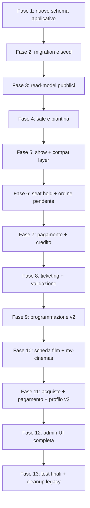

# Tutorial operativo per sviluppatori: implementazione Iterazione 4 fase-per-fase

**Autore:** OpenCode  
**Progetto di riferimento:** CineBase  
**Ambito:** Guida pratica per sviluppatori all'implementazione dell'iterazione 4  
**Target:** sviluppatori backend/frontend, revisori tecnici, studenti che devono eseguire il piano in modo incrementale

---

## Indice

1. [Obiettivo del documento](#1-obiettivo-del-documento)
2. [Come usare questa guida insieme agli altri documenti](#2-come-usare-questa-guida-insieme-agli-altri-documenti)
3. [Principi operativi da seguire durante tutta l'implementazione](#3-principi-operativi-da-seguire-durante-tutta-limplementazione)
4. [Ordine generale delle fasi](#4-ordine-generale-delle-fasi)
5. [Preparazione del branch e baseline iniziale](#5-preparazione-del-branch-e-baseline-iniziale)
6. [Fase 1 - Modello dati v2 e compat layer](#6-fase-1---modello-dati-v2-e-compat-layer)
7. [Fase 2 - Migration, seed e data migration legacy](#7-fase-2---migration-seed-e-data-migration-legacy)
8. [Fase 3 - Backend catalogo pubblico, scheda film e cinema preferito](#8-fase-3---backend-catalogo-pubblico-scheda-film-e-cinema-preferito)
9. [Fase 4 - Backend sale e piantina posti](#9-fase-4---backend-sale-e-piantina-posti)
10. [Fase 5 - Backend show e bridge legacy proiezioni](#10-fase-5---backend-show-e-bridge-legacy-proiezioni)
11. [Fase 6 - Backend seat map, hold posti e ordine pendente](#11-fase-6---backend-seat-map-hold-posti-e-ordine-pendente)
12. [Fase 7 - Backend pagamento, credito piattaforma e finalizzazione checkout](#12-fase-7---backend-pagamento-credito-piattaforma-e-finalizzazione-checkout)
13. [Fase 8 - Backend ticketing digitale, PDF/email e validazione biglietti](#13-fase-8---backend-ticketing-digitale-pdfemail-e-validazione-biglietti)
14. [Fase 9 - Frontend programmazione v2](#14-fase-9---frontend-programmazione-v2)
15. [Fase 10 - Frontend scheda film e my-cinemas](#15-fase-10---frontend-scheda-film-e-my-cinemas)
16. [Fase 11 - Frontend acquisto, pagamento, esito e profilo v2](#16-fase-11---frontend-acquisto-pagamento-esito-e-profilo-v2)
17. [Fase 12 - Frontend admin: sale, show, ricarica credito, validazione](#17-fase-12---frontend-admin-sale-show-ricarica-credito-validazione)
18. [Fase 13 - Test finali, cleanup legacy e documentazione](#18-fase-13---test-finali-cleanup-legacy-e-documentazione)
19. [Checklist trasversali di review tecnica](#19-checklist-trasversali-di-review-tecnica)
20. [Errori da evitare](#20-errori-da-evitare)
21. [Conclusione operativa](#21-conclusione-operativa)

---

## 1. Obiettivo del documento

Questo tutorial non spiega solo l'architettura di Iterazione 4: spiega **come implementarla in pratica**, passo dopo passo.

Il focus e operativo. Per ogni fase vengono chiariti:

- obiettivo concreto
- prerequisiti
- file principali da toccare
- ordine dei cambi
- test minimi da eseguire
- rischi tipici
- definition of done

Questo documento deve essere letto come un playbook per sviluppatori.

---

## 2. Come usare questa guida insieme agli altri documenti

Questa guida va usata insieme a:

- `docs/project/dev_iteration/4/PianoDiLavoro.md`
  - e il documento di pianificazione e tracciamento delle fasi
- `docs/tutorials/TUTORIAL_ITERAZIONE_4_MULTISALA_TICKETING.md`
  - e il documento architetturale/didattico che spiega il dominio
- `docs/project/status.md`
  - e il documento di stato del progetto
- `docs/project/changelog.md`
  - e il log delle modifiche introdotte

Regola pratica:

- quando serve capire il **perché** di una scelta -> leggere il tutorial architetturale
- quando serve capire il **come** di una fase -> leggere questo tutorial operativo

---

## 3. Principi operativi da seguire durante tutta l'implementazione

## 3.1 Non fare un refactor big bang

L'errore più pericoloso sarebbe sostituire tutto subito.

Ordine corretto:

1. introdurre il nuovo dominio
2. migrare i dati
3. esporre i nuovi endpoint
4. adattare i frontend
5. eliminare il legacy solo alla fine

## 3.2 Il backend nuovo deve diventare la source of truth prima del cleanup

Questo significa che:

- la logica di validazione show deve vivere in `ShowService`
- la logica di seat hold deve vivere nel nuovo dominio checkout
- la logica di pagamento deve vivere nel nuovo dominio ordine/ticket
- il compat layer non deve ricevere nuova business logic propria

## 3.3 Le fasi backend devono chiudersi con test

Per le fasi 1-8, la regola pratica e:

- niente passaggio alla fase successiva senza build verde
- dove possibile, aggiungere subito test integrazione della fase appena introdotta

## 3.4 I frontend nuovi devono consumare read-model pensati per la UI

Non bisogna costruire pagine complesse costringendo il frontend a ricomporre troppe relazioni grezze.

Buona regola:

- il backend espone payload aggregati vicini al layout richiesto
- il frontend si concentra su rendering e interazioni, non sulla ricostruzione pesante del dominio

## 3.5 La rimozione del legacy e una fase finale, non una scorciatoia

`Proiezione` e `Prenotazione` non vanno eliminate finché:

- tutti i flussi nuovi non sono completi
- i test non sono verdi
- le pagine che le usano non sono state migrate

---

## 4. Ordine generale delle fasi



Osservazione importante:

- le fasi 1-8 sono la vera spina dorsale del sistema
- le fasi 9-12 sono il completamento UX e operativo
- la fase 13 e obbligatoria, non opzionale

---

## 5. Preparazione del branch e baseline iniziale

Prima di iniziare l'implementazione:

1. creare il branch `dev_iteration_4`
2. verificare che la baseline attuale sia verde
3. fotografare lo stato del DB e dell'albero dei file
4. assicurarsi che `Program.cs`, `FilmDbContext`, `DataSeeder`, DTO e test siano leggibili e compresi

### 5.1 Comandi baseline consigliati

```text
git status
dotnet test tests/backend/FilmAPI.Tests.csproj
```

### 5.2 Deliverable di preparazione

- branch creato
- baseline test confermata
- piano di lavoro e tutorial architetturale letti

---

## 6. Fase 1 - Modello dati v2 e compat layer

## 6.1 Obiettivo

Introdurre il nuovo modello dati senza rompere il dominio legacy.

Questa e una fase di **ampliamento del dominio**, non di sostituzione.

## 6.2 File principali da toccare

Backend:

- `backend/FilmAPI/Model/`
- `backend/FilmAPI/Data/FilmDbContext.cs`
- `backend/FilmAPI/Program.cs` solo se servono opzioni/config registrate in DI
- `.env.example` o configurazione equivalente

## 6.3 Ordine dei passi raccomandato

1. creare gli enum nuovi
2. creare le entità nuove
3. estendere `Film`
4. estendere `Cinema`
5. estendere `User`
6. aggiornare `FilmDbContext`
7. verificare che `Proiezione` e `Prenotazione` siano ancora presenti
8. compilare

## 6.4 Modelli da introdurre in questa fase

- `Sala`
- `SalaPosto`
- `Show`
- `ShowPostoStato`
- `Ordine`
- `Biglietto`
- `MovimentoCredito`

## 6.5 Cose da NON fare in questa fase

- non creare ancora la migration se il modello non e completo
- non rimuovere `Proiezione`
- non rimuovere `Prenotazione`
- non cambiare ancora gli endpoint legacy
- non iniziare il frontend nuovo

## 6.6 Test e verifiche minime

- build backend OK
- eventuali test rotti solo per motivi di compilazione devono essere adattati subito

## 6.7 Rischi tipici

- indici o relazioni incoerenti nel `DbContext`
- navigazioni circolari o non coerenti con delete behavior
- naming confuso tra `Show`, `Proiezione` e DTO esistenti

## 6.8 Definition of done

La fase e chiusa quando:

- il nuovo schema applicativo esiste nel codice
- il legacy esiste ancora
- il progetto compila

---

## 7. Fase 2 - Migration, seed e data migration legacy

## 7.1 Obiettivo

Applicare fisicamente il nuovo schema al database e migrare le vecchie `Proiezione` in `Show`.

## 7.2 File principali da toccare

- `backend/FilmAPI/Data/FilmDbContext.cs`
- `backend/FilmAPI/Data/DataSeeder.cs`
- cartella migration EF
- eventuale helper di data migration

## 7.3 Ordine dei passi raccomandato

1. congelare il modello della fase 1
2. creare migration EF
3. aggiornare seed dev
4. introdurre algoritmo di migrazione `Proiezione -> Show`
5. creare sala default per i cinema esistenti
6. gestire i conflitti di orario creando sale auto-migrate
7. applicare migration
8. verificare i dati migrati

## 7.4 Algoritmo pratico di data migration

Pseudo-flusso:

```text
for each cinema:
  ensure default Sala 1 exists

for each legacy Proiezione:
  candidateSala = Sala 1 del cinema
  if la finestra temporale collide nella sala:
    creare nuova sala auto-migrata
    usare la nuova sala
  creare Show con StartAtUtc, FilmId, CinemaId, SalaId, DurataMinutiSnapshot
```

## 7.5 Cose da NON fare in questa fase

- non convertire `Prenotazione` in `Biglietto`
- non rimuovere ancora i record legacy
- non fare assunzioni irreversibili su prezzi storici senza default esplicito

## 7.6 Test e verifiche minime

- migration applicata senza errori
- ogni cinema esistente ha almeno una sala
- le vecchie proiezioni sono visibili come show migrati
- nessuna perdita dati evidente

## 7.7 Rischi tipici

- dati storici incoerenti
- conflitti di orario inattesi
- durata film mancante o uso errato dell'ora legacy

## 7.8 Definition of done

- schema DB aggiornato
- show migrati
- seed dev coerente con il nuovo dominio

---

## 8. Fase 3 - Backend catalogo pubblico, scheda film e cinema preferito

## 8.1 Obiettivo

Costruire i read-model pubblici che serviranno alle nuove pagine di discovery.

## 8.2 File principali da toccare

- `backend/FilmAPI/DTO/FilmDTO.cs`
- nuovi DTO `ProgrammazioneDTO`, `FilmSchedaDTO`, `CinemaCardDTO`
- `Services/IProgrammazioneService.cs`
- `Services/ProgrammazioneService.cs`
- `Endpoints/ProgrammazioneEndpoints.cs`
- `Endpoints/ProfiloEndpoints.cs`

## 8.3 Ordine dei passi raccomandato

1. estendere i DTO film con `DescrizioneLunga`, `CastText`, `DataRilascio`
2. costruire read-model `programmazione/films`
3. costruire read-model `films/{id}/scheda`
4. costruire read-model `my-cinemas`
5. aggiungere gestione cinema preferito utente
6. aggiungere test integrazione

## 8.4 Decisioni pratiche importanti

- `In evidenza` e `In uscita` vanno calcolati lato backend
- `DisponibileNelCinemaSelezionato` deve arrivare già nel payload
- il backend deve fare il lavoro di aggregazione per `Data -> TipoSala -> orari`

## 8.5 Cose da NON fare in questa fase

- non scrivere ancora il frontend nuovo
- non lasciare al frontend il calcolo di featured/upcoming
- non restituire solo entità grezze se la pagina richiede dati aggregati

## 8.6 Test e verifiche minime

- `GET /programmazione/films` con tabs funzionante
- `GET /films/{id}/scheda` coerente
- `GET/PUT /profilo/cinema-preferito` funzionanti
- test categoria + search verdi

## 8.7 Definition of done

- API pubbliche di discovery pronte per il frontend
- cinema preferito utente gestibile da backend

---

## 9. Fase 4 - Backend sale e piantina posti

## 9.1 Obiettivo

Rendere persistente e gestibile la struttura fisica delle sale.

## 9.2 File principali da toccare

- `DTO/SalaDTO.cs`
- `Services/ISalaService.cs`
- `Services/SalaService.cs`
- `Endpoints/SaleEndpoints.cs`
- eventuali mapper e validator

## 9.3 Ordine dei passi raccomandato

1. definire DTO di input/output sala e piantina
2. implementare CRUD sala
3. implementare salvataggio layout posti completo
4. implementare validazioni di unicità
5. implementare vincoli di cancellazione
6. aggiungere test integrazione

## 9.4 Decisioni pratiche importanti

- la piantina va salvata come `SalaPosto[]`, non come JSON opaco finale
- il salvataggio layout e preferibile come operazione completa di replace controllato
- `PowerUserOrAdmin` e il livello RBAC corretto per sale

## 9.5 Cose da NON fare in questa fase

- non legare ancora i posti agli show
- non introdurre logica di checkout qui
- non permettere delete sala con show futuri o ticket esistenti

## 9.6 Test e verifiche minime

- CRUD sale verde
- vincolo progressivo sala per cinema verificato
- salvataggio e rilettura piantina coerenti

## 9.7 Definition of done

- backend sale stabile e testato

---

## 10. Fase 5 - Backend show e bridge legacy proiezioni

## 10.1 Obiettivo

Fare di `Show` il vero dominio operativo della programmazione, ma senza spezzare subito il legacy.

## 10.2 File principali da toccare

- `DTO/ShowDTO.cs`
- `Services/IShowService.cs`
- `Services/ShowService.cs`
- `Endpoints/ShowsEndpoints.cs`
- `Endpoints/ProiezioniEndpoints.cs`
- eventuali mapper `Show -> ProiezioneDTO`

## 10.3 Ordine dei passi raccomandato

1. implementare CRUD `Show`
2. implementare validazione anti-overlap
3. esporre query per cinema/data/film
4. aggiornare il layer legacy `proiezioni`
5. aggiungere test sia sul dominio nuovo sia sul bridge legacy

## 10.4 Regola tecnica sulla validazione anti-overlap

La validazione corretta non e:

```text
no stesso start time
```

La validazione corretta e:

```text
[newStart, newEnd) non interseca alcun [existingStart, existingEnd) della stessa sala
```

## 10.5 Cose da NON fare in questa fase

- non lasciare il vecchio `ProiezioneService` come source of truth
- non duplicare la business logic in due servizi diversi

## 10.6 Test e verifiche minime

- CRUD show
- blocco overlap reale
- endpoint `proiezioni` ancora funzionanti o chiaramente adattati

## 10.7 Definition of done

- `ShowService` esiste ed e la source of truth della programmazione
- il compat layer `proiezioni` e documentato e testato

---

## 11. Fase 6 - Backend seat map, hold posti e ordine pendente

## 11.1 Obiettivo

Introdurre la parte più delicata dell'iterazione: la concorrenza sui posti.

## 11.2 File principali da toccare

- `DTO/CheckoutDTO.cs`
- `Services/ISeatHoldService.cs`
- `Services/SeatHoldService.cs`
- `Services/ICheckoutService.cs`
- `Services/CheckoutService.cs`
- `Endpoints/CheckoutEndpoints.cs`
- `Background/SeatHoldCleanupService.cs`

## 11.3 Ordine dei passi raccomandato

1. implementare `GET seat-map`
2. implementare `POST hold`
3. implementare `refresh hold`
4. implementare `release hold`
5. implementare cleanup job
6. implementare creazione ordine pendente
7. aggiungere test di concorrenza

## 11.4 Modello corretto di lock

La strategia corretta e basata su `ShowPostoStato` con unique su `(ShowId, SalaPostoId)`.

Questo evita l'errore classico di basarsi solo sulla scadenza o su chiavi non veramente esclusive.

## 11.5 Cose da NON fare in questa fase

- non usare solo il frontend per marcare posti occupati
- non considerare il timer UI come unica protezione
- non creare ordine senza ownership e validita del hold

## 11.6 Test e verifiche minime

- stesso posto richiesto in parallelo -> un solo vincitore
- hold scaduto -> posto di nuovo disponibile
- massimo 10 posti per ordine

## 11.7 Definition of done

- concorrenza posti gestita correttamente
- ordine pendente creato solo in condizioni valide

---

## 12. Fase 7 - Backend pagamento, credito piattaforma e finalizzazione checkout

## 12.1 Obiettivo

Portare il checkout da `Pending` a `Paid` in modo robusto, auditabile e idempotente.

## 12.2 File principali da toccare

- `Services/IPagamentoService.cs`
- `Services/PagamentoService.cs`
- `Services/ICreditoService.cs`
- `Services/CreditoService.cs`
- `Endpoints/PagamentoEndpoints.cs`
- `Endpoints/CreditoEndpoints.cs`
- eventuale integrazione `Stripe.net`

## 12.3 Ordine dei passi raccomandato

1. integrare Stripe in test mode
2. implementare saldo credito utente
3. implementare ricarica credito admin/poweruser
4. implementare finalizzazione ordine con split credito/carta
5. implementare webhook Stripe
6. aggiungere test economici

## 12.4 Regole tecniche critiche

- totale ordine sempre ricalcolato lato backend
- split credito/carta validato lato backend
- `MovimentoCredito` sempre registrato
- `Idempotency-Key` supportata

## 12.5 Cose da NON fare in questa fase

- non fidarsi dei totali inviati dal frontend
- non scalare credito senza audit
- non marcare ordine `Paid` se il `PaymentIntent` non e coerente

## 12.6 Test e verifiche minime

- pagamento solo carta
- pagamento solo credito
- pagamento misto
- saldo insufficiente
- replay webhook

## 12.7 Definition of done

- ordine finalizzabile correttamente con i tre metodi richiesti
- credito auditato e interrogabile

---

## 13. Fase 8 - Backend ticketing digitale, PDF/email e validazione biglietti

## 13.1 Obiettivo

Generare biglietti veri e permetterne la validazione operativa.

## 13.2 File principali da toccare

- `Services/IBigliettoService.cs`
- `Services/BigliettoService.cs`
- `Services/IPdfService.cs`
- `Services/PdfService.cs`
- `Services/IEmailService.cs`
- `Services/EmailService.cs`
- `Services/IValidazioneBigliettoService.cs`
- `Services/ValidazioneBigliettoService.cs`
- `Endpoints/ValidazioneBigliettiEndpoints.cs`

## 13.3 Ordine dei passi raccomandato

1. generare ticket dal pagamento riuscito
2. generare PDF ordine multipagina
3. esporre download PDF
4. inviare email conferma
5. implementare validazione ticket
6. aggiungere test ticket/validazione

## 13.4 Regole tecniche critiche

- il ticket nasce solo dopo ordine `Paid`
- PDF/email non devono invalidare un ordine già pagato se falliscono
- validazione bloccata su ticket già validato
- validazione bloccata se cinema operativo non coerente

## 13.5 Cose da NON fare in questa fase

- non fare rollback dell'ordine per un errore SMTP
- non usare il QR come unica source of truth: la source of truth e sempre il DB

## 13.6 Test e verifiche minime

- ticket emessi una sola volta
- PDF scaricabile
- doppia validazione bloccata
- mismatch cinema bloccato

## 13.7 Definition of done

- ticketing e validazione disponibili lato backend e testati

---

## 14. Fase 9 - Frontend programmazione v2

## 14.1 Obiettivo

Sostituire l'attuale UI show-centric con una UI film-centric.

## 14.2 File principali da toccare

- `frontend/CineBase.Web/wwwroot/programmazione.html`
- `frontend/CineBase.Web/wwwroot/js/pages/programmazione.js`
- `frontend/CineBase.Web/wwwroot/js/api.js`
- `components/navbar-landing.html`
- `index.html` e/o `home.js`

## 14.3 Ordine dei passi raccomandato

1. aggiungere metodi API necessari
2. costruire modale cinema
3. implementare tabs e filtri
4. implementare persistenza cinema preferito
5. renderizzare card film
6. verificare flow completo anonimo/loggato

## 14.4 Cose da NON fare in questa fase

- non riutilizzare il vecchio payload proiezioni se esiste già il nuovo read-model
- non lasciare il frontend a deduplicare film da proiezioni grezze

## 14.5 Test e verifiche minime

- una sola card per film
- tabs corretti
- persistenza cinema corretta

## 14.6 Definition of done

- `programmazione.html` e coerente col nuovo dominio pubblico

---

## 15. Fase 10 - Frontend scheda film e my-cinemas

## 15.1 Obiettivo

Completare la discovery pubblica con dettaglio film e vista cinema-centric.

## 15.2 File principali da toccare

- `scheda-film.html`
- `js/pages/scheda-film.js`
- `my-cinemas.html`
- `js/pages/my-cinemas.js`
- eventuale helper rail date
- `js/route-guard.js`
- `js/template-loader.js`

## 15.3 Ordine dei passi raccomandato

1. implementare helper rail date riusabile
2. implementare `scheda-film`
3. implementare auth-aware click sugli orari
4. implementare `my-cinemas`
5. verificare empty states e responsiveness

## 15.4 Test e verifiche minime

- `scheda-film` carica e filtra gli show correttamente
- `my-cinemas` mostra lista e dettaglio coerenti

## 15.5 Definition of done

- discovery pubblica completa e consistente

---

## 16. Fase 11 - Frontend acquisto, pagamento, esito e profilo v2

## 16.1 Obiettivo

Chiudere il flusso utente finale end-to-end.

## 16.2 File principali da toccare

- `acquista.html`
- `js/pages/acquista.js`
- `pagamento.html`
- `js/pages/pagamento.js`
- `esito-acquisto.html`
- `js/pages/esito-acquisto.js`
- `profilo.html`
- `js/pages/profilo.js`
- `js/api.js`
- `js/route-guard.js`

## 16.3 Ordine dei passi raccomandato

1. implementare `acquista.html` con seat map e countdown
2. implementare `pagamento.html`
3. implementare `esito-acquisto.html`
4. evolvere `profilo.html`
5. marcare come legacy/deprecata la parte prenotazioni se ancora presente

## 16.4 Regole tecniche critiche

- keep-alive hold mentre l'utente e attivo
- gestione errori chiara se il hold scade
- profilo nuovo basato su ordini/ticket, non più su sola prenotazione legacy

## 16.5 Test e verifiche minime

- acquisto end-to-end riuscito
- pagamento end-to-end riuscito
- profilo mostra ordini e biglietti

## 16.6 Definition of done

- il flusso utente finale e utilizzabile in modo completo

---

## 17. Fase 12 - Frontend admin: sale, show, ricarica credito, validazione

## 17.1 Obiettivo

Portare anche il frontend admin sul nuovo dominio.

## 17.2 File principali da toccare

- `sale.html`
- `js/pages/sale.js`
- `proiezioni.html`
- `js/pages/proiezioni.js`
- `ricarica-credito.html`
- `js/pages/ricarica-credito.js`
- `validazione-biglietti.html`
- `js/pages/validazione-biglietti.js`
- `components/navbar-admin.html`
- `dashboard.html`
- `js/route-guard.js`

## 17.3 Ordine dei passi raccomandato

1. implementare `sale.html`
2. rifare `proiezioni.html` come gestione show
3. implementare `ricarica-credito.html`
4. implementare `validazione-biglietti.html`
5. aggiornare navbar admin e dashboard

## 17.4 Regole tecniche critiche

- RBAC `PowerUserOrAdmin` sulle nuove pagine operative
- scanner QR/barcode con fallback gestibile
- selettore cinema operativo obbligatorio nella validazione

## 17.5 Test e verifiche minime

- editor sale funzionante
- workspace show funzionante
- ricarica credito funzionante
- validazione ticket da dispositivo mobile verificata almeno manualmente

## 17.6 Definition of done

- tutti gli strumenti staff richiesti dal prompt sono disponibili in UI

---

## 18. Fase 13 - Test finali, cleanup legacy e documentazione

## 18.1 Obiettivo

Chiudere l'iterazione in modo pulito, stabile e documentato.

## 18.2 File principali da toccare

- `tests/backend/`
- eventuali test frontend o note di smoke test manuali
- `docs/project/status.md`
- `docs/project/changelog.md`
- eventuali file legacy da rimuovere

## 18.3 Ordine dei passi raccomandato

1. completare le suite integration test mancanti
2. eseguire smoke test manuali per tutti i ruoli
3. verificare redirect, webhook, idempotenza, concorrenza
4. decidere il destino del legacy
5. rimuovere o deprecare formalmente `Proiezione` e `Prenotazione`
6. aggiornare documentazione di stato

## 18.4 Cleanup legacy: criterio pratico

Rimuovere `Proiezione` e `Prenotazione` solo se:

- nessun endpoint le usa più
- nessuna pagina le usa più
- nessun test attivo dipende da esse

Se non si è ancora sicuri, meglio:

- lasciarle deprecate
- documentare chiaramente il debito tecnico

## 18.5 Test e verifiche minime

- suite backend verde
- smoke test manuali per ruoli
- flusso completo acquisto/validazione verificato

## 18.6 Definition of done

- iterazione chiusa e documentata
- legacy rimosso oppure deprecato in modo esplicito

---

## 19. Checklist trasversali di review tecnica

Questa checklist e utile in review indipendentemente dalla fase.

### Backend

- il service layer contiene la business logic vera?
- gli endpoint fanno solo orchestration e mapping?
- gli indici DB coprono i casi critici?
- gli ownership check sono presenti?
- esiste una risposta coerente ai conflitti (`409`) nei casi di concorrenza?

### Frontend

- i payload ricevuti sono read-model adatti alla pagina?
- i redirect auth-aware sono corretti?
- ci sono empty states espliciti?
- le pagine sono usabili anche su mobile?

### Dominio

- `Show` e davvero la source of truth?
- il compat layer resta un ponte e non un doppione permanente?
- `Profilo` nuovo usa ordini/ticket invece di dipendere dal vecchio modello?

---

## 20. Errori da evitare

1. rimuovere `Proiezione` troppo presto
2. tentare di convertire automaticamente `Prenotazione` in `Biglietto`
3. lasciare al frontend il calcolo di featured/upcoming
4. usare un lock posti non realmente esclusivo
5. fidarsi dei totali inviati dal frontend
6. fare rollback dell'ordine per un errore email
7. duplicare business logic tra legacy e nuovo dominio
8. chiudere l'iterazione senza chiarire il destino del legacy

---

## 21. Conclusione operativa

L'implementazione corretta dell'iterazione 4 richiede disciplina più che complessità algoritmica.

Il punto chiave e rispettare la sequenza:

1. introdurre il nuovo modello
2. migrare i dati
3. stabilizzare il backend
4. costruire i frontend sopra read-model solidi
5. eliminare il legacy solo alla fine

Se il team segue questa guida, l'iterazione 4 rimane governabile anche se molto più ampia delle precedenti, e il rischio di regressioni si riduce drasticamente.
