# Tutorial completo: Iterazione 4 - cinema multisala, show, ticketing e compat layer

**Autore:** OpenCode  
**Progetto di riferimento:** CineBase  
**Ambito:** Iterazione 4 / Fase 4 dello sviluppo intesa come quarta grande evoluzione funzionale del progetto  

---

## Indice

1. [Obiettivo del tutorial](#1-obiettivo-del-tutorial)
2. [Contesto di partenza: dove si ferma l'iterazione 3](#2-contesto-di-partenza-dove-si-ferma-literazione-3)
3. [Quali funzionalità introduce l'iterazione 4](#3-quali-funzionalità-introduce-literazione-4)
4. [Perché il modello precedente non basta più](#4-perché-il-modello-precedente-non-basta-piu)
5. [Panoramica architetturale della nuova soluzione](#5-panoramica-architetturale-della-nuova-soluzione)
6. [Evoluzione del data model](#6-evoluzione-del-data-model)
7. [Compat layer: cos'è, perché serve, come funziona](#7-compat-layer-cose-perché-serve-come-funziona)
8. [Flusso pubblico: programmazione, scheda film, cinema preferito](#8-flusso-pubblico-programmazione-scheda-film-cinema-preferito)
9. [Flusso di acquisto e protezione dalla race condition](#9-flusso-di-acquisto-e-protezione-dalla-race-condition)
10. [Pagamento: carta, credito piattaforma, pagamento misto](#10-pagamento-carta-credito-piattaforma-pagamento-misto)
11. [Ticket digitale: emissione PDF, email, QR e barcode](#11-ticket-digitale-emissione-pdf-email-qr-e-barcode)
12. [Validazione biglietti lato staff](#12-validazione-biglietti-lato-staff)
13. [Workflow amministrativi introdotti dall'iterazione 4](#13-workflow-amministrativi-introdotti-dalliterazione-4)
14. [Strategia di migrazione dal dominio legacy al dominio nuovo](#14-strategia-di-migrazione-dal-dominio-legacy-al-dominio-nuovo)
15. [Rimozione finale delle entità transitorie](#15-rimozione-finale-delle-entità-transitorie)
16. [Invarianti architetturali e regole da non violare](#16-invarianti-architetturali-e-regole-da-non-violare)
17. [Piano test consigliato per validare la nuova architettura](#17-piano-test-consigliato-per-validare-la-nuova-architettura)
18. [Glossario del dominio](#18-glossario-del-dominio)
19. [Conclusione](#19-conclusione)

---

## 1. Obiettivo del tutorial

Questo tutorial documenta in dettaglio l'evoluzione architetturale e funzionale introdotta dall'iterazione 4 di CineBase.

L'obiettivo non è solo descrivere "cosa cambia", ma chiarire anche:

- perché il modello attuale non è più sufficiente
- come evolve il data model
- quali nuovi flussi applicativi vengono introdotti
- come funziona il `compat layer` durante la transizione
- quando e come vanno rimosse le entità transitorie legacy

Il documento ha quindi un doppio ruolo:

- **tutorial architetturale**, per capire il dominio multisala e ticketing
- **documentazione tecnica di riferimento**, per guidare implementazione, code review e test

Nota terminologica importante:

- in alcuni appunti informali può comparire l'espressione `compact layer`
- nel seguito si usa il termine corretto `compat layer`, cioè **layer di compatibilità** tra vecchio e nuovo modello

---

## 2. Contesto di partenza: dove si ferma l'iterazione 3

Alla fine dell'iterazione 3, CineBase dispone già di una base applicativa solida:

- backend .NET 9 stabile
- frontend pubblico e admin già separati
- autenticazione JWT con refresh token
- RBAC con ruoli `User`, `PowerUser`, `Admin`
- pagina `programmazione.html` pubblica
- area personale con profilo e prenotazioni virtuali
- backend con `103/103` test verdi

Tuttavia il dominio applicativo e ancora modellato in modo semplice:

- `Cinema` è trattato come se avesse implicitamente una sola sala
- `Proiezione` collega direttamente `Cinema` e `Film` in data/ora
- `Prenotazione` registra solo un numero di posti, senza piantina reale
- non esiste pagamento reale
- non esiste ticket digitale
- non esiste validazione ticket in ingresso

### 2.1 Diagramma ER del modello legacy

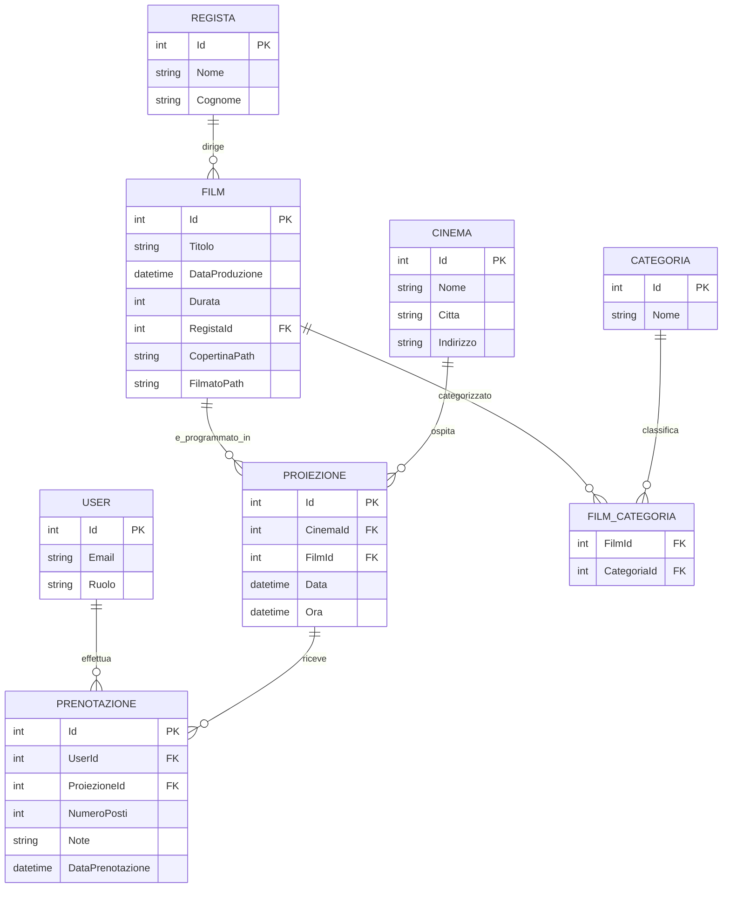

### 2.2 Cosa manca nel modello legacy

Il modello legacy non riesce a rappresentare correttamente:

- più sale per lo stesso cinema
- tipologie sala diverse nello stesso cinema
- posti reali e piantine prenotabili
- prezzi differenziati per show o tipologia sala
- lock temporanei per evitare doppio acquisto dello stesso posto
- ordine di pagamento con split credito/carta
- ticket digitali con validazione

---

## 3. Quali funzionalità introduce l'iterazione 4

L'iterazione 4 trasforma CineBase da sistema di discovery con prenotazione virtuale a piattaforma più vicina a un sistema di ticketing cinema reale.

### 3.1 Funzionalità lato utente finale

- nuova `programmazione.html` film-centric
- selezione del cinema preferito
- `scheda-film.html` con dettagli film e show per data
- `my-cinemas.html` con elenco cinema e relativa programmazione
- `acquista.html` con piantina posti e countdown hold
- `pagamento.html` con carta, credito o pagamento misto
- `esito-acquisto.html`
- evoluzione di `profilo.html` con biglietti, ordini, credito e cinema preferito

### 3.2 Funzionalità lato operatore/staff

- gestione sale e piantina posti
- gestione show multisala
- ricarica credito utenti
- validazione ticket via codice, barcode o QR

### 3.3 Funzionalità backend introdotte

- nuovo dominio `Sala`, `SalaPosto`, `Show`, `Ordine`, `Biglietto`
- seat hold con TTL e protezione concorrenza
- checkout reale con Stripe e credito piattaforma
- ticket PDF multipagina
- invio email con allegato
- compat layer temporaneo per non rompere il dominio legacy subito

---

## 4. perché il modello precedente non basta più

### 4.1 Limite principale: una proiezione vale come un cinema intero

Nel modello legacy una `Proiezione` ha la forma concettuale:

```text
Cinema + Film + Data + Ora
```

Questo implica tacitamente che:

- il cinema abbia una sola sala implicita
- non esista una tipologia sala
- non esistano posti distinti

### 4.2 Esempio concreto del problema

Supponiamo il cinema `Lissone` con 4 sale:

- Sala 1 - 2D
- Sala 2 - XL
- Sala 3 - 3D
- Sala 4 - ISENSE

Con il modello legacy non si riesce a distinguere:

- se due show partono alle 21:00 in due sale diverse
- se un certo film è in XL o in 2D
- quanti posti restano disponibili sala per sala
- come evitare che due utenti selezionino lo stesso posto

### 4.3 Nuovo obiettivo del dominio

Il nuovo dominio deve rappresentare esplicitamente:

- il cinema come contenitore di sale
- la sala come contenitore di posti
- lo show come evento proiettato in una sala specifica
- l'ordine come transazione economica
- il biglietto come diritto di accesso per un posto preciso

---

## 5. Panoramica architetturale della nuova soluzione

### 5.1 Vista d'insieme

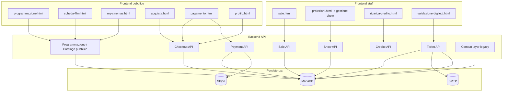

### 5.2 Suddivisione per responsibility

| Area | Responsabilita principale |
| --- | --- |
| Catalogo pubblico | film, cinema, show aggregati per le pagine pubbliche |
| Sale | struttura fisica del cinema e piantina posti |
| Show | programmazione effettiva per sala e orario |
| Checkout | seat map, hold, ordine pendente |
| Payment | finalizzazione economica |
| Ticketing | biglietti, PDF, email, validazione |
| Credito | saldo utente e ricariche |
| Compat layer | adattamento transitorio tra vecchio e nuovo dominio |

---

## 6. Evoluzione del data model

## 6.1 Modello target: nuove entità principali

L'iterazione 4 introduce le seguenti entità di dominio:

- `Sala`
- `SalaPosto`
- `Show`
- `ShowPostoStato`
- `Ordine`
- `Biglietto`
- `MovimentoCredito`

In più estende:

- `Film`
- `Cinema`
- `User`

### 6.2 Diagramma ER del nuovo modello target

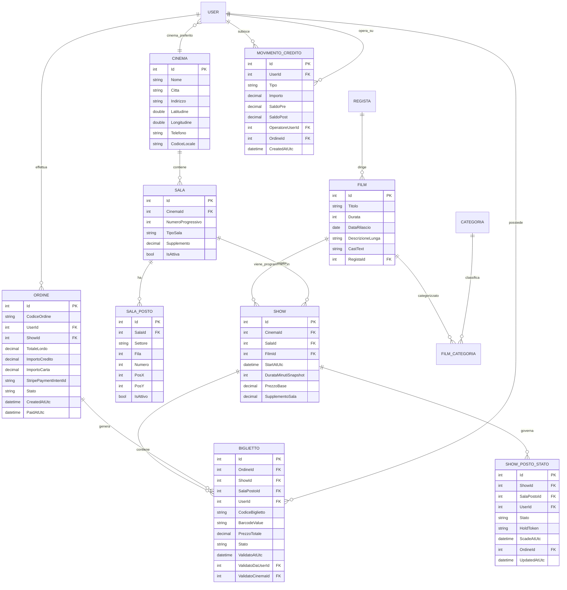

### 6.3 Tabella di mapping tra vecchio e nuovo dominio

| Dominio legacy | Dominio nuovo | Note |
| --- | --- | --- |
| `Proiezione` | `Show` | `Show` introduce `Sala`, `PrezzoBase`, `SupplementoSala`, `DurataMinutiSnapshot` |
| `Prenotazione` | `Ordine` + `Biglietto` | non esiste mapping 1:1 automatico perché la prenotazione legacy non ha il posto reale |
| `Cinema` monosala implicito | `Cinema` + `Sala[]` | il cinema diventa contenitore di sale esplicite |
| `NumeroPosti` prenotati | `SalaPosto[]` + `Biglietto` | il posto diventa entità reale |
| Nessun lock | `ShowPostoStato(Hold)` | protegge da race condition |
| Nessun pagamento | `Ordine` + `PaymentIntent` + `MovimentoCredito` | introduce flusso economico reale |

### 6.4 Perché `SalaPosto` normalizzata è meglio di una `Pianta` JSON unica

In alcuni piani iniziali era stata considerata una soluzione con piantina serializzata in JSON nella tabella `Sala`.

La versione target preferisce invece una persistenza normalizzata `SalaPosto`, perché permette:

- query dirette sui posti
- vincoli di unicità reali
- collegamento robusto tra posto fisico e biglietto
- gestione più chiara di settore/fila/posto
- rendering frontend comunque semplice, ricostruendo la griglia da `PosX/PosY`

Il JSON può restare eventualmente come formato temporaneo lato UI, ma non deve essere la source of truth finale.

### 6.5 Scelta progettuale su `Cast`

Il piano finale usa `CastText` o rappresentazione testuale equivalente invece di introdurre subito una tabella `FilmCastMember` obbligatoria.

Motivazione:

- il requisito funzionale chiede la presenza del cast in scheda film, non una gestione CRUD analitica dei singoli attori
- una soluzione testuale è sufficiente in questa iterazione
- il data model resta più leggero e meno invasivo

In futuro si potrà normalizzare il cast in tabella dedicata se emergono use case reali.

---

## 7. Compat layer: cos'è, perché serve, come funziona

## 7.1 Definizione

Il `compat layer` è uno strato transitorio che permette al sistema nuovo di convivere per un certo periodo con il sistema legacy.

Serve a evitare un refactor "big bang" che romperebbe contemporaneamente:

- backend
- frontend pubblico
- frontend admin
- test esistenti
- dati già presenti nel database

## 7.2 Cosa resta temporaneamente legacy

Durante la transizione restano temporaneamente presenti:

- entità `Proiezione`
- entità `Prenotazione`
- endpoint `proiezioni`
- alcuni flussi di `profilo.html` ancora centrati su prenotazioni fino alla migrazione completa

## 7.3 Cosa fa il compat layer in pratica

Il compat layer:

- mappa il nuovo dominio `Show` nei DTO legacy `ProiezioneDTO` quando ancora necessari
- mantiene temporaneamente il path `proiezioni.html`, anche se la pagina viene ridefinita semanticamente come gestione show
- permette di introdurre `ShowService` senza cancellare subito `ProiezioneService`

## 7.4 Diagramma del compat layer

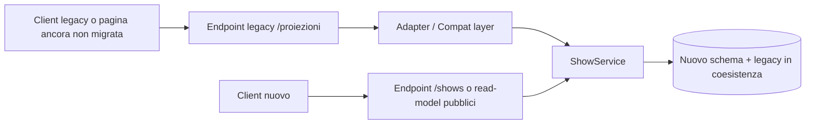

## 7.5 Sequenza di una chiamata legacy appoggiata al nuovo dominio

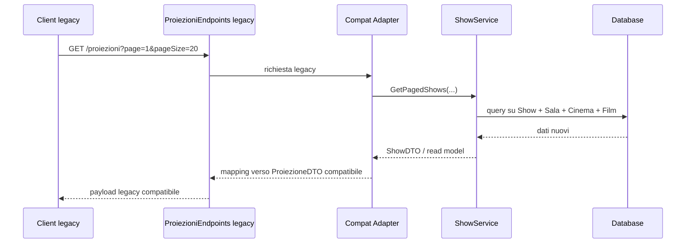

## 7.6 Regola fondamentale del compat layer

Il compat layer è **temporaneo**.

Non deve diventare un secondo dominio permanente.

Le regole corrette sono:

- nuova logica business -> solo sul dominio nuovo
- il legacy può leggere o adattare, non deve ricevere nuova logica complessa
- appena tutte le pagine e gli endpoint sono migrati, il compat layer va eliminato

---

## 8. Flusso pubblico: programmazione, scheda film, cinema preferito

## 8.1 Obiettivo UX

L'utente finale non deve più ragionare in termini di "n card per n show".

Deve invece vedere:

- il film come unità di discovery
- il cinema preferito come contesto personale
- gli show come dettaglio consultabile in un secondo livello

## 8.2 Sequenza: caricamento programmazione con cinema preferito

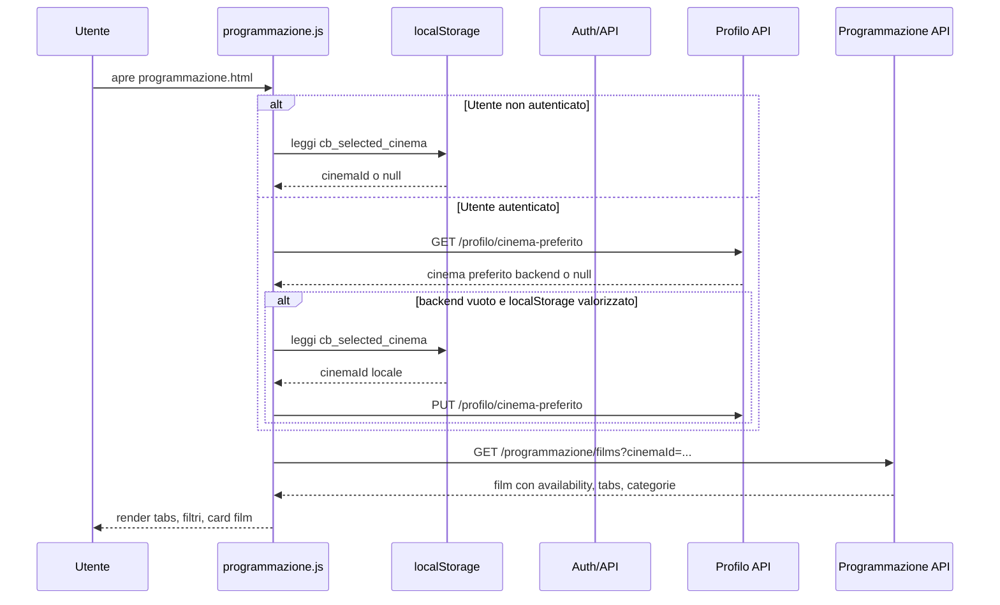

## 8.3 Cosa cambia nella logica di `programmazione.html`

Prima:

- una card = una proiezione

Dopo:

- una card = un film
- la disponibilità nel cinema selezionato è un attributo della card
- i tabs operano sul catalogo filmico, non sulla lista show grezza

## 8.4 Sequenza: dalla card film alla scheda film

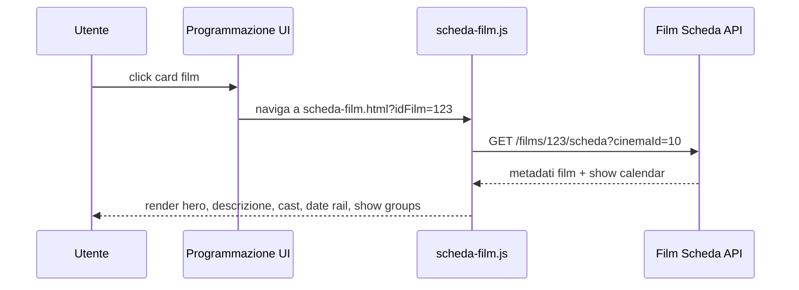

## 8.5 Perché il cinema preferito è importante

Il cinema preferito cambia il significato di quasi tutte le pagine pubbliche:

- `programmazione.html` mostra disponibilità sì/no per quel cinema
- `scheda-film.html` mostra gli show di quel cinema
- `my-cinemas.html` consente di consultare anche altri cinema, ma il profilo utente resta allineato a quello preferito

---

## 9. Flusso di acquisto e protezione dalla race condition

## 9.1 Il problema reale da risolvere

Se due utenti provano a selezionare lo stesso posto nello stesso momento, il sistema deve garantire che:

- al massimo uno dei due ottenga il posto
- nessuno riesca a pagare due volte lo stesso posto

Ma il problema reale non è solo tecnico: è anche di UX.

Se il sistema aspettasse il momento finale del pagamento per scoprire che il posto non è più disponibile, l'utente passerebbe attraverso:

- scelta posti
- compilazione pagamento
- conferma carta
- errore finale

con un'esperienza molto frustrante.

Per questo il progetto non blocca il posto solo all'ultimo millisecondo, ma introduce un meccanismo di `hold` temporaneo prima del pagamento.

## 9.1.1 Strategia ottimista vs strategia pessimista

In sistemi concorrenti esistono due famiglie principali di strategie.

### Strategia ottimista

Idea:

- si assume che i conflitti siano rari
- non si blocca subito la risorsa
- si verifica solo alla fine se qualcun altro ha già modificato lo stesso dato

Nel caso dei posti cinema, una strategia ottimista pura sarebbe:

1. il frontend mostra il posto come disponibile
2. più utenti possono selezionarlo in parallelo senza lock reale
3. il controllo avviene solo al momento della conferma finale dell'ordine

Vantaggi:

- implementazione concettualmente più semplice
- niente lock lunghi nel sistema

Svantaggi:

- alta probabilità di fallimento tardivo
- UX peggiore
- maggiore rischio di contese proprio nel momento finale del checkout

### Strategia pessimista

Idea:

- si assume che il conflitto sia importante e debba essere prevenuto prima
- quando un utente inizia ad acquisire una risorsa, il sistema la blocca subito

Nel caso dei posti cinema, una strategia pessimista pura potrebbe essere:

- appena l'utente seleziona il posto, il sistema lo rende temporaneamente non disponibile agli altri

Vantaggi:

- riduce molto i conflitti tardivi
- esperienza utente più coerente

Svantaggi:

- bisogna gestire scadenza lock, abbandoni, refresh pagina e rilascio posti

## 9.1.2 Quale strategia usa CineBase

`CineBase` usa una strategia **pessimista applicativa con hold temporaneo a TTL**, non una strategia ottimista pura.

Detto in modo più preciso:

- non viene aperta una transazione database lunga minuti con lock fisici sul record
- viene invece registrato un **lock logico temporaneo** nella tabella `ShowPostoStato`
- questo lock ha una scadenza (`ScadeAtUtc`) e può essere esteso con keep-alive

Questa scelta è didatticamente importante, perché mostra una soluzione intermedia molto usata nei sistemi reali:

- **non** pessimistica hard con transaction aperta per minuti
- **non** ottimistica pura che controlla solo alla fine
- **si** pessimistica logica con lease temporaneo

Si può chiamare anche:

- `soft lock`
- `lease lock`
- `temporary hold`

## 9.1.3 Perché non è stata scelta la strategia ottimista pura

Per un e-commerce generico la strategia ottimista può essere accettabile in più contesti.

Per i posti numerati di un cinema, invece, il conflitto è strutturale:

- il posto è unico
- è visuale
- l'utente lo ha scelto intenzionalmente
- perdere quel posto all'ultimo secondo peggiora molto l'esperienza

Per questo `CineBase` preferisce acquisire il posto prima del pagamento, con una protezione temporanea ma reale.

## 9.2 Stati concettuali di un posto per uno show

Un posto per uno show può trovarsi in quattro stati concettuali:

- `Available`
- `HeldByMe`
- `HeldByOther`
- `Sold`

Nel database lo stato persistito è modellato principalmente da `ShowPostoStato`:

- assenza di record attivo -> `Available`
- record `Hold` dell'utente corrente -> `HeldByMe`
- record `Hold` di altro utente -> `HeldByOther`
- record `Sold` -> `Sold`

Osservazione importante:

- `HeldByMe` e `HeldByOther` sono stati di presentazione frontend
- `Hold` e `Sold` sono gli stati persistiti lato backend
- `Available` non è un record esplicito: è l'assenza di un lock attivo o di una vendita

## 9.3 Diagramma di stato dei posti

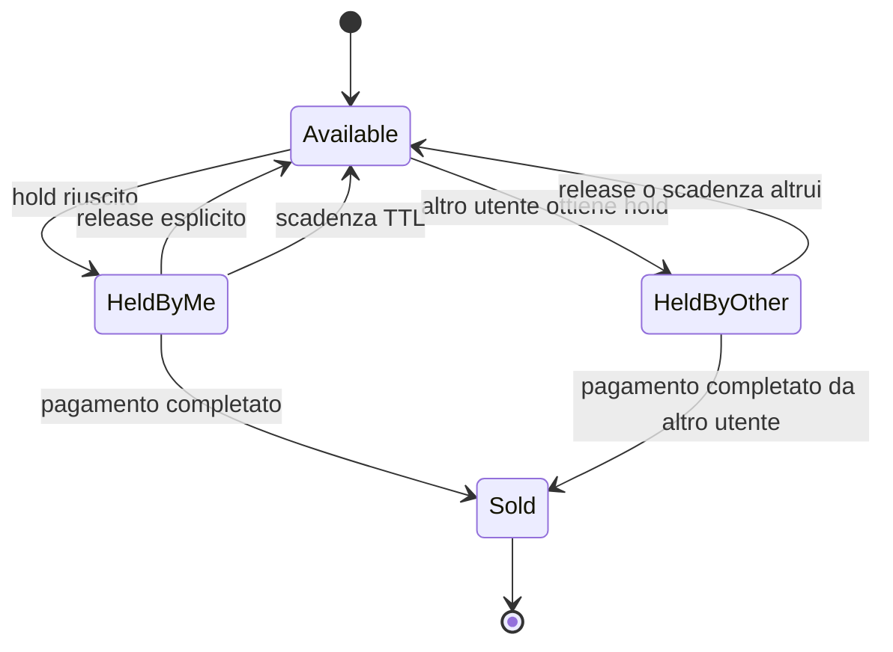

## 9.4 Sequenza: hold posti con TTL e keep-alive

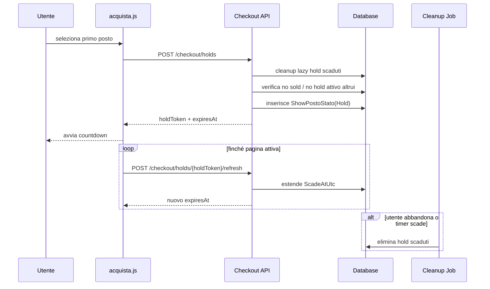

## 9.4.1 Responsabilita del frontend in `acquista.html`

Il frontend non decide mai da solo che un posto è realmente suo.

Il frontend ha invece queste responsabilita:

1. leggere periodicamente o inizialmente la `seat-map`
2. mostrare i quattro stati utente:
   - disponibile
   - selezionato da me
   - in hold da altro utente
   - venduto
3. quando l'utente seleziona posti, chiedere un hold al backend
4. mostrare un countdown visibile basato su `ScadeAtUtc`
5. inviare richieste di `refresh` mentre la pagina è attiva
6. se l'utente lascia la pagina, tentare il `release` esplicito
7. se il hold scade, rimuovere la selezione locale e richiedere una nuova `seat-map`

Regola didattica fondamentale:

- il frontend può essere **ottimista nella UX**
- ma non può essere **autorevole nello stato business**

Esempio corretto:

- al click su un posto, il bottone può illuminarsi subito per reattività visiva
- ma il posto è davvero acquisito solo quando il backend risponde con hold riuscito

## 9.4.2 Responsabilita del backend nel meccanismo di hold

Il backend è la source of truth della concorrenza.

Quando arriva `POST /checkout/holds`, il backend deve fare tutto in modo atomico:

1. pulire gli hold scaduti per quello show
2. verificare che i posti richiesti appartengano davvero alla sala dello show
3. verificare che non siano già `Sold`
4. verificare che non siano in `Hold` attivo di altri utenti
5. creare o aggiornare i record `ShowPostoStato`
6. restituire `holdToken` e `ScadeAtUtc`

Il punto cruciale è che la race condition non viene risolta da un semplice timer frontend, ma da:

- tabella dedicata `ShowPostoStato`
- unique su `(ShowId, SalaPostoId)`
- transazione applicativa nel service

## 9.4.3 Perché il TTL è indispensabile

Se il sistema fosse solo pessimista senza scadenza, un utente potrebbe bloccare posti e poi:

- chiudere il browser
- perdere la connessione
- abbandonare la pagina

lasciando i posti inutilmente indisponibili.

Il TTL risolve proprio questo problema:

- finché l'utente è attivo, il frontend rinnova il hold
- se l'utente sparisce, il hold scade
- il cleanup lazy o background rimette i posti in disponibilita

## 9.5 Sequenza: da hold a ordine pendente

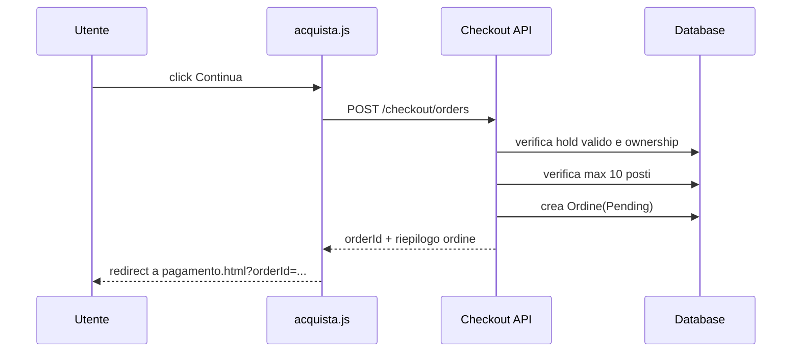

## 9.5.1 Punto esatto in cui si passa al pagamento

Il passaggio corretto al pagamento avviene **solo dopo** che esiste un `Ordine` in stato `Pending` costruito a partire da un hold valido.

Quindi l'ordine logico corretto è:

1. l'utente sceglie i posti
2. il backend li mette in `Hold`
3. il frontend mostra countdown e riepilogo
4. il backend crea `Ordine(Pending)` usando quel `holdToken`
5. solo ora il frontend passa a `pagamento.html`

Questo è importante perché `pagamento.html` non parte da una selezione volatile del browser, ma da un ordine backend già esistente.

## 9.5.2 Cosa deve fare il frontend in `pagamento.html`

Nel flusso corretto, `pagamento.html` non ragiona su posti grezzi, ma su un ordine pendente già creato.

Il frontend dovrebbe:

1. leggere `orderId` dalla route o query string
2. chiamare `GET /checkout/orders/{orderId}`
3. mostrare il riepilogo economico e i posti collegati
4. continuare a tenere vivo il hold finché il pagamento non è concluso o abbandonato
5. scegliere il metodo di pagamento:
   - carta
   - credito
   - misto
6. chiamare `POST /checkout/orders/{orderId}/pay`

Questa divisione rende molto chiara la separazione di responsabilita:

- `acquista.html` gestisce i posti
- `pagamento.html` gestisce la finalizzazione economica

## 9.6 Perché il sistema usa `ShowPostoStato` e non solo `Biglietto`

`Biglietto` da solo non basta, perché nasce **dopo** il pagamento.

Il problema di concorrenza nasce **prima** del pagamento, cioè durante la selezione posti.

Per questo serve una tabella intermedia che modelli l'occupazione temporanea del posto:

- `Hold` finché l'utente sta concludendo l'acquisto
- `Sold` quando l'ordine è completato

## 9.7 Perché non si usa un lock database tenuto aperto fino al pagamento

Questa è una distinzione molto importante dal punto di vista architetturale.

Una vera strategia pessimista hard con lock database terrebbe una transazione aperta dall'inizio della selezione fino alla fine del pagamento.

In pratica sarebbe molto problematica, perché:

- un pagamento può durare minuti
- gli utenti possono ricaricare la pagina
- la connessione può interrompersi
- i lock lunghi peggiorano scalabilita e affidabilita

Per questo `CineBase` usa una forma più realistica:

- persistenza dello stato di hold nel database
- nessuna transazione lunga aperta per tutta la sessione utente
- finalizzazione atomica solo nel momento conclusivo

Questa è la vera idea generale del progetto:

- **lock logico lungo con TTL**
- **transazione breve e atomica al momento critico**

## 9.8 Riassunto concettuale della race condition e della soluzione scelta

La race condition nasce perché due utenti possono vedere lo stesso posto come disponibile quasi nello stesso istante.

La soluzione di `CineBase` è:

1. lettura iniziale della `seat-map`
2. primo utente che chiede hold valido ottiene il posto
3. altri utenti vedono `HeldByOther` oppure ricevono conflitto
4. il posto non diventa `Sold` subito
5. il posto diventa `Sold` solo nella finalizzazione valida dell'ordine
6. se l'ordine non viene pagato, il posto non resta bloccato per sempre: torna disponibile tramite release o scadenza TTL

---

## 10. Pagamento: carta, credito piattaforma, pagamento misto

## 10.1 Obiettivo del dominio pagamento

Il sistema deve supportare tre scenari reali:

1. pagamento intero con carta
2. pagamento intero con credito piattaforma
3. pagamento misto credito + carta

## 10.2 Regola chiave

Il backend è la source of truth del totale da pagare.

Il frontend può mostrare una stima, ma il backend deve sempre ricalcolare:

- numero posti
- prezzo base dello show
- supplemento sala
- totale lordo
- quota credito
- quota carta

## 10.3 Diagramma di stato dell'ordine

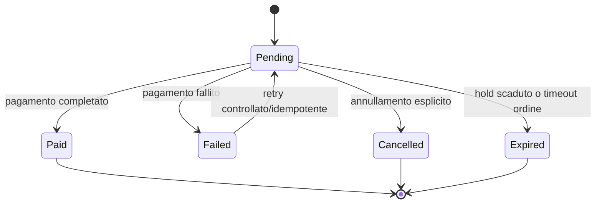

## 10.4 Sequenza: pagamento misto credito + carta

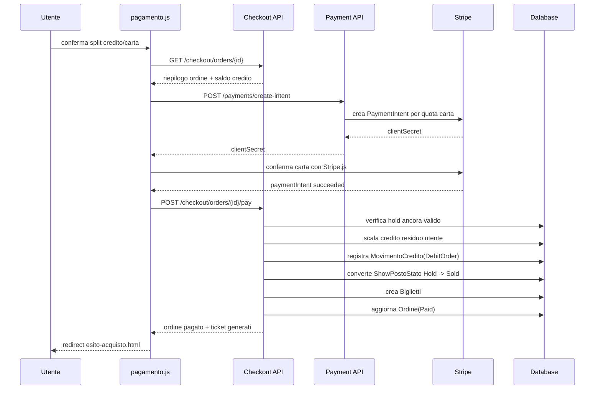

## 10.4.1 Cosa succede esattamente quando il pagamento va bene

Quando il pagamento è coerente e il backend finalizza correttamente, accade questa sequenza logica:

1. il backend ricalcola il totale reale
2. valida split credito/carta
3. verifica che il `PaymentIntent` sia in stato coerente, se la carta è coinvolta
4. registra eventuale `MovimentoCredito`
5. converte `ShowPostoStato` da `Hold` a `Sold`
6. aggiorna `Ordine` a `Paid`
7. genera i `Biglietti`

Il punto chiave è che la vendita reale del posto non avviene al click iniziale né durante il solo hold, ma nel punto finale di commit business.

## 10.4.2 Cosa succede se il pagamento non va a buon fine

Questa è una parte che spesso gli studenti fraintendono.

Se il pagamento non viene finalizzato correttamente:

- l'ordine **non** viene marcato `Paid`
- i posti **non** vengono convertiti a `Sold`
- i biglietti **non** vengono generati

Quindi i posti non risultano venduti.

Nel modello di `CineBase`, i posti non pagati tornano disponibili agli altri utenti in uno di questi modi:

1. `release` esplicito del hold
2. scadenza del TTL del hold
3. cleanup lazy o background che rimuove i lock scaduti

Questo significa che, dopo un pagamento fallito, i posti possono rimanere ancora per poco tempo in `Hold` se il TTL non è ancora scaduto, ma **non** restano occupati definitivamente.

In altre parole:

- pagamento fallito -> nessuna vendita definitiva
- scadenza o rilascio hold -> posti di nuovo `Available`

## 10.4.3 Differenza didattica tra `Hold` e `Sold`

Molto importante:

- `Hold` = protezione temporanea per permettere all'utente di completare il pagamento
- `Sold` = esito definitivo della competizione sul posto

Confondere questi due livelli porta a errori architetturali seri, ad esempio:

- emettere biglietti troppo presto
- segnare posti come venduti prima della conferma reale del pagamento
- non sapere come recuperare da un fallimento Stripe

## 10.4.4 Dove c'è la parte ottimista e dove c'è la parte pessimista nel flusso completo

Il progetto usa un mix controllato di idee:

- **pessimista** nella protezione dei posti, tramite `Hold`
- **ottimista** solo nella UX locale del frontend, che può reagire visivamente subito
- **atomico** nella finalizzazione finale backend

Questa combinazione è il vero compromesso corretto per un sistema di ticketing numerato:

- evitare conflitti tardivi
- evitare lock database lunghissimi
- mantenere una UX reattiva

## 10.5 Ruolo di `MovimentoCredito`

`MovimentoCredito` esiste perché il saldo utente da solo non è sufficiente.

Serve a tenere traccia di:

- chi ha ricaricato il credito
- quando è stato usato il credito
- quale saldo c'era prima e dopo il movimento
- quale ordine o operatore è collegato al movimento

Questo è fondamentale sia per audit interno sia per debug di contestazioni.

---

## 11. Ticket digitale: emissione PDF, email, QR e barcode

## 11.1 Quando nasce un biglietto

Il biglietto nasce **solo** dopo che l'ordine è stato portato con successo in stato `Paid`.

Non esiste biglietto valido in stato `Pending`.

## 11.2 Sequenza: emissione ticket e invio email

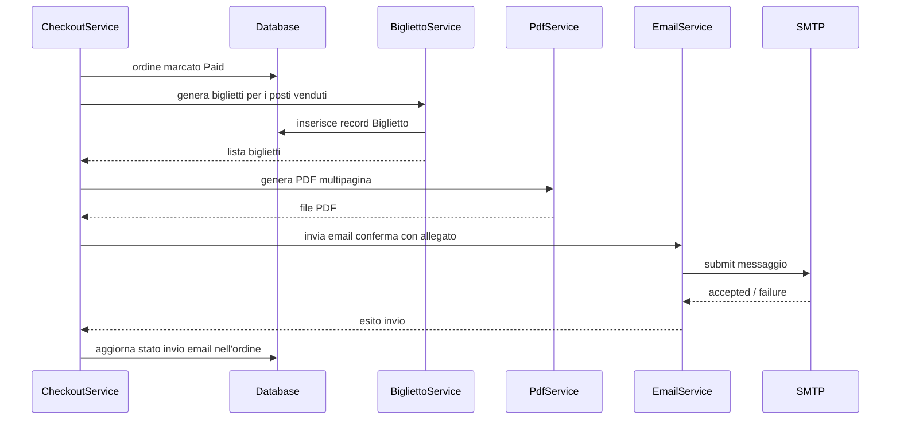

## 11.3 Contenuto minimo del ticket

Ogni ticket deve contenere almeno:

- titolo film
- data e ora show
- sala, settore, fila, posto
- cinema, città, indirizzo, codice locale
- prezzo base, supplemento, totale
- barcode
- codice ticket in chiaro
- QR code verso `validazione-biglietti.html?codice=...`

## 11.4 perché PDF ed email sono post-processing e non parte atomica del pagamento

Se un ordine è stato correttamente pagato e i posti sono stati venduti, l'utente ha già acquisito il diritto al biglietto.

Quindi:

- un errore SMTP non deve annullare l'ordine
- un errore temporaneo di generazione PDF non deve liberare i posti

La source of truth resta il database:

- ordine `Paid`
- biglietti `Issued`

Il PDF e l'email sono meccanismi di consegna, non l'esistenza stessa del titolo di accesso.

---

## 12. Validazione biglietti lato staff

## 12.1 Obiettivo

Permettere a `PowerUser` e `Admin` di validare un ticket all'ingresso del cinema, evitando che un ticket acquistato per un cinema venga usato in un altro.

## 12.2 Stato del ticket

Il ticket ha un proprio ciclo di vita.

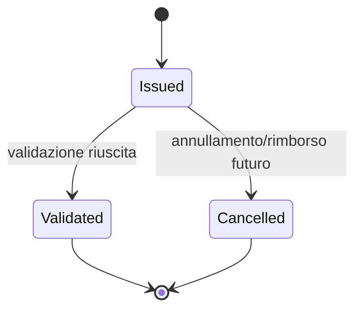

## 12.3 Sequenza: validazione tramite QR code da smartphone

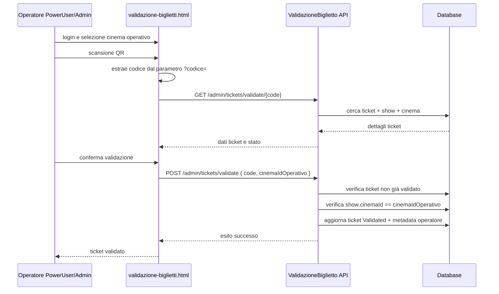

## 12.4 Perché serve il `cinemaIdOperativo`

Senza il cinema operativo, un operatore autenticato potrebbe validare un ticket corretto ma appartenente a un cinema diverso.

Il controllo corretto è:

```text
ticket.Show.CinemaId == cinemaIdOperativo della sessione staff
```

## 12.5 Perché la validazione deve essere idempotente in lettura ma non in scrittura

- la lookup del ticket può essere ripetuta infinite volte senza problemi
- la validazione vera e propria deve riuscire una sola volta

Se il ticket è già validato, la seconda richiesta deve restituire un errore coerente con i dati della prima validazione.

---

## 13. Workflow amministrativi introdotti dall'iterazione 4

## 13.1 Gestione sale

L'area admin introduce `sale.html`, che permette di:

- creare sale per un cinema
- modificare tipologia e supplemento
- definire la piantina dei posti
- visualizzare l'anteprima della sala come la vedra l'utente finale in acquisto

### Flow di gestione sale

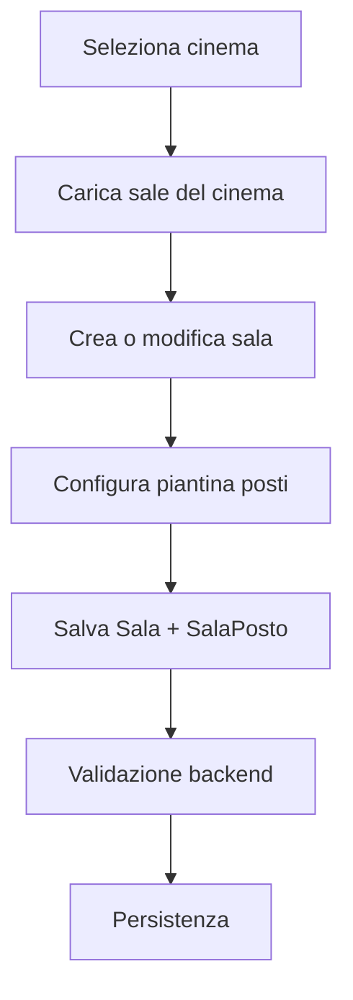

## 13.2 Gestione show

`proiezioni.html` evolve concettualmente in workspace show:

- filtro per cinema, film, sala, data
- form con dropdown cinema -> sala
- validazione anti-overlap

## 13.3 Ricarica credito utente

Workflow:

- ricerca utente per email
- visualizzazione saldo
- ricarica
- registrazione audit operatore

### Sequenza: ricarica credito

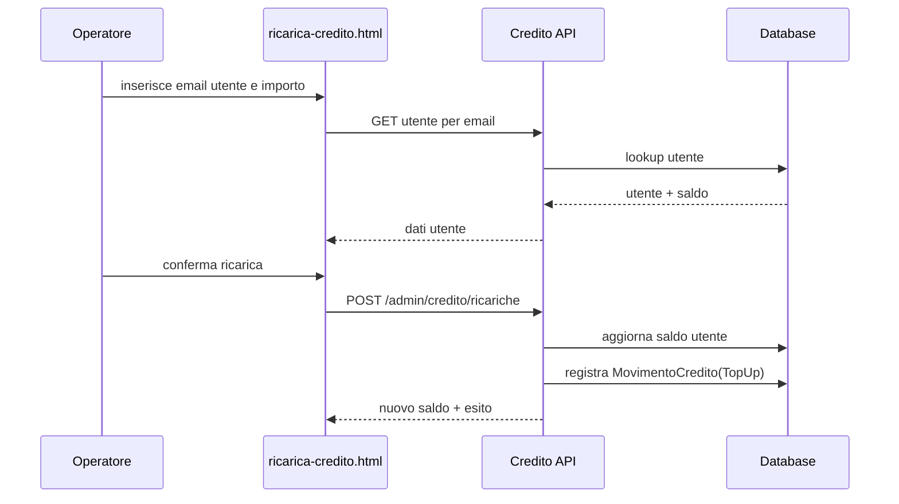

---

## 14. Strategia di migrazione dal dominio legacy al dominio nuovo

La migrazione non deve essere una sostituzione brutale. Deve essere un percorso in più stadi.

## 14.1 Stadio A - Coesistenza

Si aggiungono le nuove tabelle senza rimuovere quelle vecchie.

In questa fase:

- il sistema può ancora leggere `Proiezione`
- il nuovo codice inizia a lavorare anche con `Show`
- i test devono verificare che nessuna pagina esistente si rompa

## 14.2 Stadio B - Data migration

Per ogni `Cinema` esistente si crea almeno una sala default. Poi si migrano le vecchie `Proiezione` in `Show`.

### Diagramma della migrazione dati

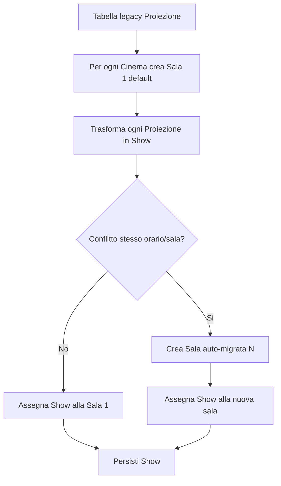

## 14.3 Stadio C - Compat layer attivo

Il backend nuovo inizia a essere la source of truth, ma alcuni entry point legacy esistono ancora.

Esempi:

- endpoint `proiezioni` ancora pubblicati ma appoggiati a `ShowService`
- `profilo.html` può ancora mostrare prenotazioni legacy finché non è completata la nuova UI biglietti/ordini

## 14.4 Stadio D - Refactor frontend completo

Quando le nuove pagine pubbliche e admin sono operative:

- `programmazione.html` usa solo i nuovi read model
- `scheda-film.html` usa solo show
- `acquista.html` e `pagamento.html` usano solo `Checkout/Ordine/Biglietto`
- `sale.html` e `proiezioni.html` usano solo `Sala` e `Show`

## 14.5 Stadio E - Cleanup finale

Solo a questo punto si può rimuovere in sicurezza:

- `Proiezione`
- `Prenotazione`
- endpoint legacy non più usati
- DTO legacy non più usati
- service legacy non più usati

---

## 15. Rimozione finale delle entità transitorie

## 15.1 Quali sono le entità transitorie

Le entità transitorie non sono il nuovo dominio. Sono gli elementi mantenuti solo per non rompere il sistema durante la migrazione.

### Entità e componenti transitori principali

| Elemento | Stato durante la migrazione | Destino finale |
| --- | --- | --- |
| `Proiezione` | legacy mantenuto | rimozione |
| `Prenotazione` | legacy mantenuto o sola lettura | rimozione o archiviazione documentata |
| `ProiezioneDTO` | adattatore legacy | rimozione |
| `ProiezioniEndpoints` legacy | compat layer | rimozione |
| `PrenotazioniEndpoints` | temporanei finché il profilo non è migrato | rimozione |
| logica UI prenotazioni in `profilo.html` | transitoria | sostituzione con ordini/biglietti |

## 15.2 Criteri obbligatori prima della rimozione

Prima di rimuovere il legacy devono essere vere tutte le seguenti condizioni:

1. tutti i dati di programmazione correnti sono disponibili in `Show`
2. `programmazione.html` non interroga più `proiezioni`
3. `scheda-film.html` e `my-cinemas.html` usano solo i nuovi endpoint
4. `proiezioni.html` admin gestisce solo `Show`
5. `profilo.html` non dipende più da `Prenotazione`
6. le suite test nuove sono verdi
7. i test legacy eventualmente rimasti sono stati dismessi o migrati
8. i flussi e2e principali sono verificati manualmente

## 15.3 Diagramma decisionale per il cleanup finale

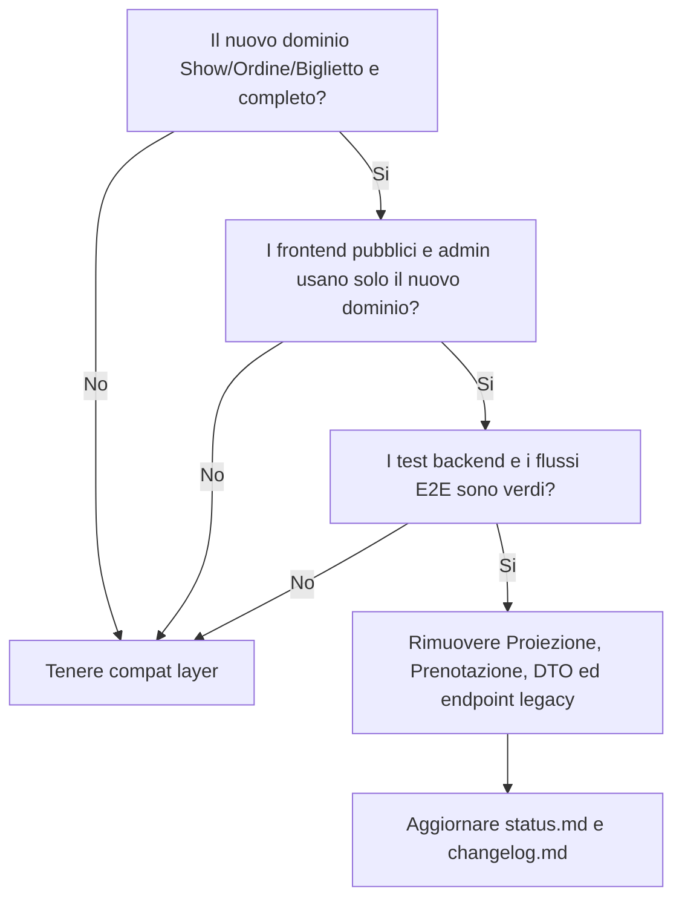

## 15.4 perché `Prenotazione` e particolarmente delicata

`Prenotazione` non può essere trasformata automaticamente in `Biglietto` perché mancano informazioni essenziali:

- posto reale
- prezzo reale pagato
- metodo di pagamento
- ticket code

Per questo il suo ciclo corretto è:

- tenerla per un periodo solo come storico legacy o feature temporanea
- sostituirla completamente appena `Ordine` + `Biglietto` + `Profilo` nuovo sono stabili

---

## 16. Invarianti architetturali e regole da non violare

Queste regole devono restare vere in tutto il codice dell'iterazione 4.

1. uno show appartiene a una sola sala e a un solo cinema coerente con la sala
2. una sala è identificata univocamente nel cinema dal progressivo interno
3. un posto non può essere venduto due volte nello stesso show
4. un hold non può scavalcare un posto già venduto
5. un ordine `Paid` non può esistere senza biglietti emessi o emitibili
6. il frontend non decide il totale definitivo dell'ordine
7. il credito utente cambia solo tramite movimenti tracciati
8. un ticket validato una volta non può essere validato di nuovo
9. il ticket può essere validato solo nel cinema coerente
10. il compat layer non deve introdurre nuova business logic autonoma

---

## 17. Piano test consigliato per validare la nuova architettura

## 17.1 Test di dominio dati

- creazione sale con progressivo univoco
- salvataggio piantina e vincoli `SalaPosto`
- migrazione `Proiezione -> Show`
- coerenza `Show.CinemaId == Sala.CinemaId`

## 17.2 Test di programmazione pubblica

- `In evidenza`
- `In uscita`
- `Tutti i film`
- filtro categoria
- search titolo
- disponibilità nel cinema selezionato

## 17.3 Test di concorrenza e checkout

- due richieste parallele sullo stesso posto
- scadenza TTL
- refresh hold
- ordine pendente da hold valido
- ordine rifiutato da hold scaduto

## 17.4 Test economici

- pagamento solo carta
- pagamento solo credito
- pagamento misto
- saldo insufficiente
- idempotenza sul retry
- webhook Stripe replay-safe

## 17.5 Test ticketing

- biglietti generati una sola volta
- PDF multipagina valido
- email inviata o errore registrato senza rollback dell'ordine
- validazione manuale e via QR
- blocco doppia validazione
- blocco validazione su cinema errato

## 17.6 Test end-to-end da eseguire manualmente

1. anonimo -> selezione cinema -> scheda film -> login -> acquisto -> pagamento carta
2. utente con credito -> acquisto tutto con credito
3. utente con credito parziale -> acquisto misto
4. PowerUser -> ricarica credito utente
5. PowerUser -> validazione ticket da smartphone/tablet
6. admin -> gestione sale e show con casi di overlap

---

## 18. Glossario del dominio

| Termine | Significato |
| --- | --- |
| `Cinema preferito` | cinema personale usato come contesto principale nella UX pubblica |
| `Sala` | spazio fisico interno a un cinema dove si svolgono gli show |
| `SalaPosto` | posto fisico persistito come record individuale |
| `Show` | spettacolo/proiezione di un film in una sala a una certa data/ora |
| `Hold` | blocco temporaneo di uno o più posti prima del pagamento |
| `Ordine` | contenitore economico dell'acquisto |
| `Biglietto` | titolo di accesso per un posto specifico |
| `MovimentoCredito` | variazione auditata del saldo credito utente |
| `Compat layer` | strato transitorio che permette coesistenza tra dominio legacy e nuovo dominio |
| `Cleanup legacy` | rimozione finale degli elementi transitori una volta conclusa la migrazione |

---

## 19. Conclusione

L'iterazione 4 è la trasformazione più importante di CineBase dopo l'introduzione di auth e RBAC.

Il salto non è solo funzionale ma concettuale:

- da catalogo di proiezioni a piattaforma multisala
- da prenotazione virtuale a ticketing reale
- da semplice CRUD a dominio con concorrenza, pagamento, audit e validazione in ingresso

Il punto più delicato non è la UI, ma la corretta gestione della transizione:

- nuovo data model introdotto senza rompere subito il sistema esistente
- `compat layer` usato come ponte, non come soluzione definitiva
- rimozione finale del legacy eseguita solo dopo test e verifica end-to-end

Se queste regole vengono rispettate, l'iterazione 4 non aggiunge solo nuove pagine: introduce una base di dominio molto più solida e realistica per tutte le evoluzioni successive del progetto.
