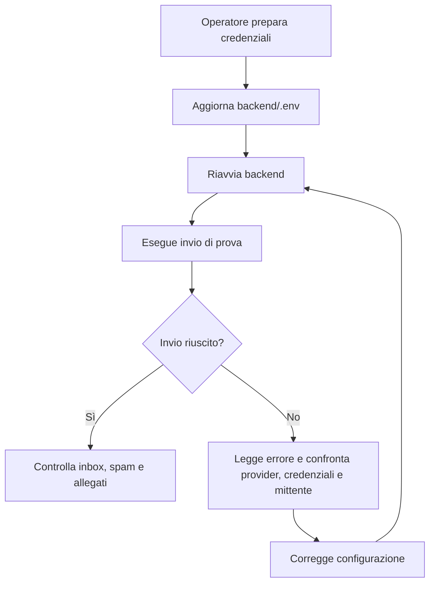

# Tutorial operativo: configurazione SMTP Google e Twilio SendGrid per CineBase

**Autore:** OpenCode  
**Progetto di riferimento:** CineBase  
**Ambito:** guida tutoriale operativa per predisporre, configurare e collaudare l'invio email SMTP in ambiente didattico e in scenari più professionali  

---

## Indice

1. [Obiettivo del documento](#1-obiettivo-del-documento)
2. [Quando usare questo tutorial](#2-quando-usare-questo-tutorial)
3. [Premessa architetturale su CineBase](#3-premessa-architetturale-su-cinebase)
4. [Variabili d'ambiente ufficiali del progetto](#4-variabili-dambiente-ufficiali-del-progetto)
5. [Scelta operativa raccomandata per la Fase 8](#5-scelta-operativa-raccomandata-per-la-fase-8)
6. [Scenario A: configurazione SMTP con account Google personale](#6-scenario-a-configurazione-smtp-con-account-google-personale)
7. [Scenario B: configurazione SMTP con Twilio SendGrid](#7-scenario-b-configurazione-smtp-con-twilio-sendgrid)
8. [Confronto pratico tra Google SMTP e Twilio SendGrid SMTP](#8-confronto-pratico-tra-google-smtp-e-twilio-sendgrid-smtp)
9. [Procedura di collaudo operativo nel repository](#9-procedura-di-collaudo-operativo-nel-repository)
10. [Errori tipici e troubleshooting](#10-errori-tipici-e-troubleshooting)
11. [Checklist finale per l'operatore umano](#11-checklist-finale-per-loperatore-umano)
12. [Conclusione operativa](#12-conclusione-operativa)

---

## 1. Obiettivo del documento

Questo tutorial descrive in modo operativo come predisporre il sottosistema email SMTP del progetto `CineBase` in due scenari distinti:

- scenario didattico o locale con server SMTP di Google
- scenario più professionale o quasi-produzione con `Twilio SendGrid`

L'obiettivo è fornire una guida concreta per l'operatore umano che deve:

- recuperare le credenziali corrette
- compilare il file `.env`
- verificare che il backend sia in grado di inviare email
- capire rapidamente le cause dei problemi più comuni

---

## 2. Quando usare questo tutorial

Questo documento va usato quando il progetto entra nella parte di `FASE 8` che riguarda:

- invio email di conferma ordine
- allegato PDF dei biglietti
- predisposizione del provider SMTP reale o di test

Questo tutorial non spiega solo come impostare i parametri: spiega anche quale scenario conviene usare in base al contesto.

---

## 3. Premessa architetturale su CineBase

Il backend di `CineBase` legge le variabili d'ambiente dal file `backend/.env` all'avvio, perché in `backend/FilmAPI/Program.cs` è presente:

```csharp
Env.Load();
```

Conseguenza pratica:

- ogni modifica alle variabili SMTP richiede il riavvio del backend

L'architettura attuale è orientata a un provider SMTP configurabile tramite variabili d'ambiente.

Questo significa che:

- è perfettamente compatibile con Google SMTP personale
- è pronta ad adattarsi bene anche a `Twilio SendGrid` via SMTP relay
- non è ancora progettata, in questa fase, per imporre un'integrazione OAuth2 complessa come caso primario

---

## 4. Variabili d'ambiente ufficiali del progetto

Nel repository, i nomi ufficiali già previsti sono i seguenti:

```dotenv
SMTP_HOST=<smtp_host>
SMTP_PORT=587
SMTP_USER=<smtp_user>
SMTP_PASSWORD=<smtp_password>
SMTP_FROM_EMAIL=noreply@cinebase.it
SMTP_FROM_NAME=CineBase
```

Significato pratico:

- `SMTP_HOST`: nome del server SMTP
- `SMTP_PORT`: porta del server SMTP
- `SMTP_USER`: credenziale usata per autenticarsi
- `SMTP_PASSWORD`: segreto usato per autenticarsi
- `SMTP_FROM_EMAIL`: indirizzo mittente mostrato ai destinatari
- `SMTP_FROM_NAME`: nome visualizzato del mittente

Osservazione importante:

- `SMTP_USER` e `SMTP_FROM_EMAIL` non devono coincidere per forza
- questa separazione è particolarmente utile con `Twilio SendGrid`

---

## 5. Scelta operativa raccomandata per la Fase 8

La scelta raccomandata per l'implementazione della fase è la seguente:

1. usare i server SMTP di Google come baseline didattica e di collaudo iniziale
2. mantenere però l'implementazione pronta a funzionare anche con `Twilio SendGrid`
3. predisporre già in configurazione i parametri necessari per entrambi gli scenari

Motivazione:

- Google SMTP è più rapido da attivare per un test locale
- `Twilio SendGrid` rappresenta meglio il caso professionale
- l'architettura SMTP del progetto è già abbastanza generica da supportare entrambi

---

## 6. Scenario A: configurazione SMTP con account Google personale

## 6.1 Quando scegliere questo scenario

Questo scenario è consigliato quando serve:

- vedere rapidamente email reali in uscita
- testare il flusso ticketing in locale
- evitare configurazioni DNS o console provider più complesse

## 6.2 Riferimenti ufficiali Google

- Verifica in due passaggi: `https://support.google.com/accounts/answer/185839?hl=en`
- Password per app: `https://support.google.com/accounts/answer/185833?hl=en`
- IMAP, POP e SMTP Gmail: `https://developers.google.com/workspace/gmail/imap/imap-smtp`
- Gmail su client esterni: `https://support.google.com/mail/answer/7126229?hl=en`
- Invio da alias o altri indirizzi: `https://support.google.com/mail/answer/22370?hl=en`

## 6.3 Procedura passo passo per l'operatore umano

1. L'operatore umano sceglie un account Google personale da usare come mittente tecnico, ad esempio `cinebase.demo@gmail.com`.
2. Apre la guida ufficiale della verifica in due passaggi e attiva `2-Step Verification` sull'account.
3. Completata la verifica in due passaggi, apre la pagina ufficiale delle password per app.
4. Crea una nuova password per app, con un nome esplicito come `CineBase SMTP`.
5. Copia il valore generato da Google e lo conserva in modo sicuro.
6. Apre `backend/.env.example` per verificare i nomi delle variabili richieste dal progetto.
7. Crea oppure aggiorna `backend/.env`.
8. Inserisce nel file i valori Gmail.
9. Riavvia il backend.
10. Esegue un invio di prova.

## 6.4 Blocco `.env` pronto per Google

```dotenv
# Provider attivo: Google SMTP
SMTP_HOST=smtp.gmail.com
SMTP_PORT=587
SMTP_USER=cinebase.demo@gmail.com
SMTP_PASSWORD=<password_per_app_google>
SMTP_FROM_EMAIL=cinebase.demo@gmail.com
SMTP_FROM_NAME=CineBase
```

## 6.5 Note operative importanti per Google

- `SMTP_PORT=587` va usata con `STARTTLS`
- `SMTP_PASSWORD` non è la password normale dell'account Google
- `SMTP_PASSWORD` deve essere la password per app
- nei primi test conviene mantenere `SMTP_FROM_EMAIL` uguale a `SMTP_USER`

## 6.6 Limiti di questo scenario

- soglie di invio non adatte a carichi elevati
- possibili challenge o controlli di sicurezza dell'account
- scenario corretto per test e laboratorio, non ideale per invio massivo applicativo

---

## 7. Scenario B: configurazione SMTP con Twilio SendGrid

## 7.1 Quando scegliere questo scenario

Questo scenario è consigliato quando serve:

- simulare una configurazione più vicina alla produzione
- usare un provider transazionale specializzato
- preparare il progetto a volumi più seri e deliverability migliore

## 7.2 Riferimenti ufficiali Twilio SendGrid

- SMTP getting started: `https://www.twilio.com/docs/sendgrid/for-developers/sending-email/getting-started-smtp`
- API Keys: `https://www.twilio.com/docs/sendgrid/ui/account-and-settings/api-keys`
- Sender Identity overview: `https://www.twilio.com/docs/sendgrid/for-developers/sending-email/sender-identity`
- Single Sender Verification: `https://www.twilio.com/docs/sendgrid/ui/sending-email/sender-verification`
- Domain Authentication: `https://www.twilio.com/docs/sendgrid/ui/account-and-settings/how-to-set-up-domain-authentication`
- Web API vs SMTP: `https://www.twilio.com/docs/sendgrid/for-developers/sending-email/web-api-vs-smtp`
- SMTP errors and troubleshooting: `https://www.twilio.com/docs/sendgrid/for-developers/sending-email/smtp-errors-and-troubleshooting`

## 7.3 Percorso rapido: Single Sender Verification

Questo percorso è adatto a:

- proof of concept
- staging leggero
- verifica iniziale del flusso di invio

Procedura:

1. L'operatore umano crea un account `Twilio SendGrid`.
2. Accede alla console `Twilio SendGrid`.
3. Va in `Settings > API Keys`.
4. Crea una nuova API key con permessi coerenti con l'invio email.
5. Copia la chiave e la conserva in modo sicuro. La chiave viene mostrata una sola volta.
6. Va in `Settings > Sender Authentication`.
7. Seleziona `Single Sender Verification`.
8. Compila il form con nome mittente, email mittente, indirizzo aziendale e metadati richiesti dalla console.
9. Conferma il mittente cliccando il link ricevuto via email.
10. Aggiorna `backend/.env` con i parametri SMTP di `Twilio SendGrid`.
11. Riavvia il backend.
12. Esegue un invio di prova.

## 7.4 Blocco `.env` pronto per Twilio SendGrid

```dotenv
# Provider attivo: Twilio SendGrid SMTP relay
SMTP_HOST=smtp.sendgrid.net
SMTP_PORT=587
SMTP_USER=apikey
SMTP_PASSWORD=<twilio_sendgrid_api_key>
SMTP_FROM_EMAIL=<indirizzo_verificato>
SMTP_FROM_NAME=CineBase
```

## 7.5 Note operative importanti per Twilio SendGrid

- `SMTP_USER` non è la mailbox dell'account
- `SMTP_USER` è il valore letterale `apikey`
- `SMTP_PASSWORD` è la API key
- `SMTP_FROM_EMAIL` deve essere un indirizzo verificato oppure un indirizzo appartenente a un dominio autenticato

## 7.6 Percorso professionale: Domain Authentication

Questo percorso è il più corretto per scenari seri o quasi-produzione.

Procedura:

1. L'operatore umano identifica il dominio che verrà usato per le email transazionali, ad esempio `example.com`.
2. Verifica chi ha accesso al DNS del dominio.
3. Apre `Settings > Sender Authentication > Domain Authentication` nella console `Twilio SendGrid`.
4. Seleziona il provider DNS corretto oppure `Other Host`.
5. Inserisce il solo dominio root, ad esempio `example.com`.
6. Mantiene attiva `Automated Security` se il provider DNS lo supporta.
7. Copia i record DNS generati e li inserisce nella console DNS del dominio.
8. Torna in `Twilio SendGrid` e avvia la verifica.
9. Attende la propagazione DNS. La documentazione ufficiale considera possibili fino a `48` ore.
10. Dopo la verifica, usa in `SMTP_FROM_EMAIL` un indirizzo del dominio autenticato, ad esempio `tickets@example.com`.

## 7.7 Blocco `.env` per dominio autenticato

```dotenv
# Provider attivo: Twilio SendGrid con dominio autenticato
SMTP_HOST=smtp.sendgrid.net
SMTP_PORT=587
SMTP_USER=apikey
SMTP_PASSWORD=<twilio_sendgrid_api_key>
SMTP_FROM_EMAIL=tickets@example.com
SMTP_FROM_NAME=CineBase
```

---

## 8. Confronto pratico tra Google SMTP e Twilio SendGrid SMTP

| Aspetto | Google SMTP personale | Twilio SendGrid SMTP |
| --- | --- | --- |
| Rapidità di attivazione | molto alta | alta |
| Adatto a test locali | sì | sì |
| Adatto a volumi elevati | no | molto più sì |
| Richiede DNS | no | non nel caso single sender, sì nel caso domain authentication |
| Credenziale principale | password per app | API key |
| Valore `SMTP_USER` | email completa | `apikey` |
| Allineamento con l'architettura attuale | ottimo | ottimo |

Conclusione pratica:

- per partire conviene Google SMTP
- per preparare il progetto a uno scenario più serio conviene `Twilio SendGrid`

---

## 9. Procedura di collaudo operativo nel repository

Procedura raccomandata:

1. L'operatore umano aggiorna `backend/.env` con uno dei due blocchi documentati.
2. Riavvia il backend.
3. Verifica che il processo parta senza eccezioni di configurazione.
4. Esegue un test di invio con un destinatario reale di laboratorio.
5. Controlla:
   - presenza del messaggio in inbox o spam
   - correttezza del mittente visualizzato
   - correttezza degli allegati
   - correttezza dell'HTML email
6. Se il provider è `Twilio SendGrid`, verifica anche che il mittente sia veramente verificato o appartenente a dominio autenticato.



---

## 10. Errori tipici e troubleshooting

## 10.1 Errori tipici con Google SMTP

### Credenziali rifiutate

Cause frequenti:

- uso della password normale invece della password per app
- verifica in due passaggi non attiva
- copia incompleta della password per app

Controlli da fare:

1. verificare che l'account abbia davvero `2-Step Verification`
2. rigenerare la password per app
3. reinserire il valore in `SMTP_PASSWORD`

### Mittente non coerente

Cause frequenti:

- `SMTP_FROM_EMAIL` diverso da `SMTP_USER` senza corretta configurazione alias lato Gmail

Controlli da fare:

1. riportare temporaneamente `SMTP_FROM_EMAIL` uguale a `SMTP_USER`
2. verificare la procedura ufficiale `Send mail as` se si vuole usare un alias

## 10.2 Errori tipici con Twilio SendGrid

### `403 You are not authorized to send from that email address`

La documentazione ufficiale indica che questo errore compare quando il mittente non corrisponde a una `Sender Identity` verificata.

Controlli da fare:

1. verificare `Single Sender Verification`
2. verificare `Domain Authentication`
3. controllare che `SMTP_FROM_EMAIL` coincida con un indirizzo effettivamente autorizzato

### `550 Unauthenticated Senders Not Allowed`

La documentazione ufficiale collega questo errore a problemi di autenticazione SMTP o a un uso scorretto delle credenziali.

Controlli da fare:

1. verificare che `SMTP_HOST=smtp.sendgrid.net`
2. verificare che `SMTP_USER=apikey`
3. verificare che `SMTP_PASSWORD` contenga la API key corretta
4. verificare che il client SMTP autentichi davvero la sessione prima dell'invio

### Certificate verification failed

Questo errore segnala di solito un problema nella catena di certificati della macchina client o del server che invia.

Controlli da fare:

1. verificare che la macchina abbia certificati CA aggiornati
2. evitare workaround che disattivano la validazione TLS

## 10.3 Errori generici SMTP

### Errori `4xx`

Interpretazione generale:

- errore temporaneo
- spesso il provider o il server destinatario ritenta o richiede una riduzione del carico

### Errori `5xx`

Interpretazione generale:

- errore permanente
- tipicamente dovuto a credenziali, mittente non autorizzato o destinatario invalido

### Porta o TLS errati

Controlli da fare:

1. usare `587`
2. usare `STARTTLS`
3. non usare parametri casuali copiati da esempi non ufficiali

---

## 11. Checklist finale per l'operatore umano

- il provider SMTP scelto è noto
- le credenziali reali sono state recuperate da fonti ufficiali
- `backend/.env` è stato aggiornato correttamente
- il backend è stato riavviato dopo la modifica del file `.env`
- il mittente è coerente con il provider scelto
- nel caso Google è stata generata una password per app
- nel caso `Twilio SendGrid` è stata creata una API key
- nel caso `Twilio SendGrid` il mittente è stato verificato oppure il dominio è autenticato
- è stato eseguito almeno un invio di prova reale
- eventuali errori SMTP sono stati letti e corretti prima di proseguire con la fase

---

## 12. Conclusione operativa

La strategia più equilibrata per `CineBase` consiste nell'avviare la `FASE 8` con Google SMTP come baseline didattica, mantenendo però l'implementazione e la configurazione già pronte per funzionare anche con `Twilio SendGrid`.

In questo modo il progetto resta:

- facile da collaudare in locale
- realistico dal punto di vista architetturale
- pronto a una successiva evoluzione verso un provider transazionale più robusto
