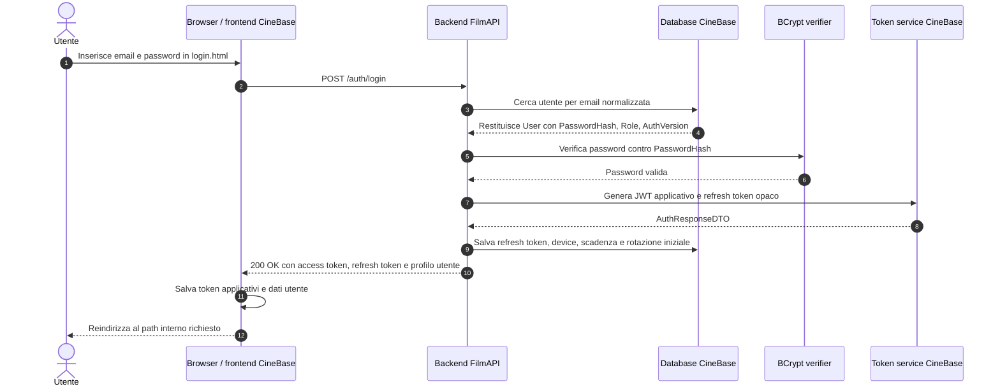
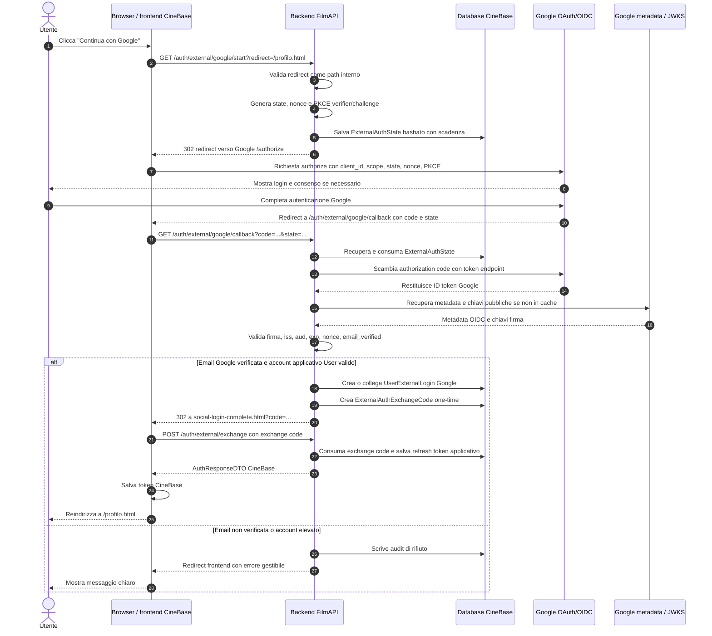
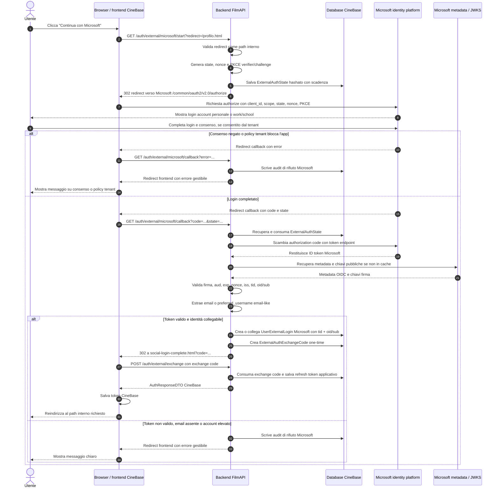
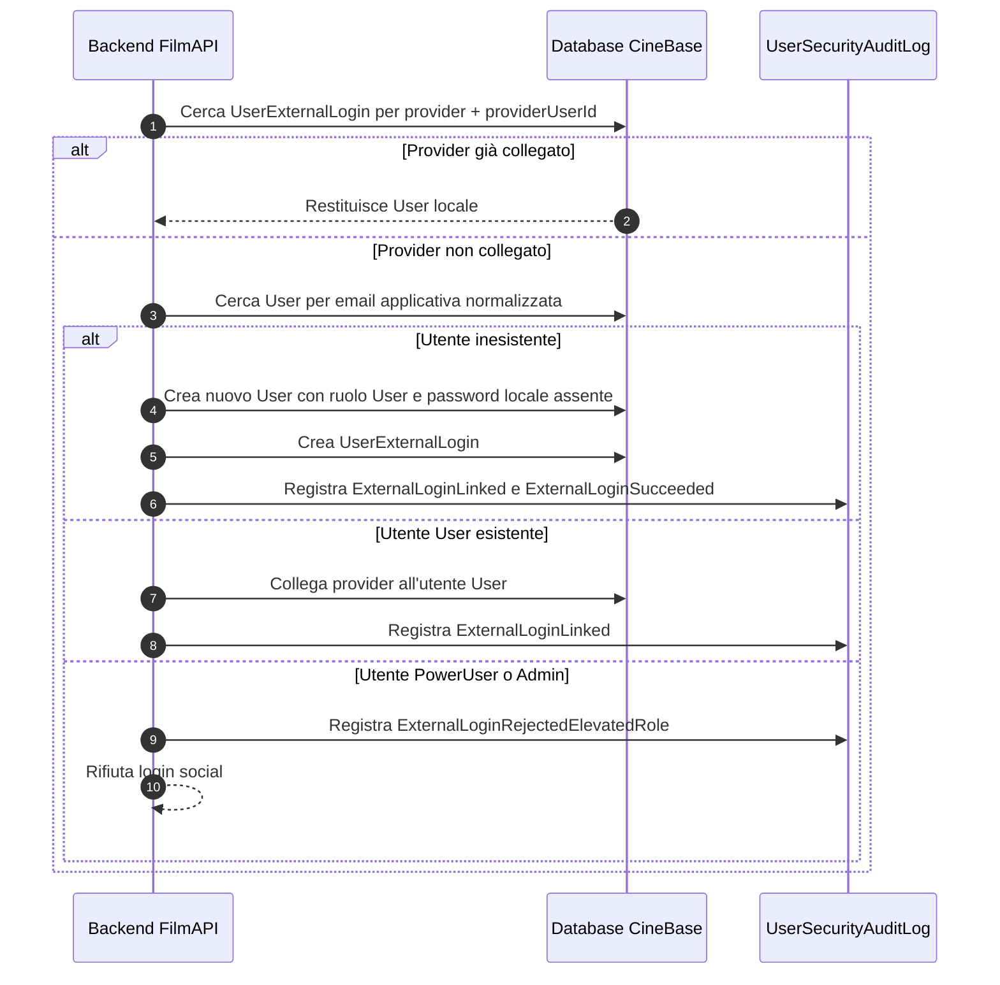

# Tutorial: social login Google e Microsoft in CineBase

**Autore:** OpenCode
**Progetto di riferimento:** CineBase
**Ambito:** configurazione provider OAuth/OIDC, flussi di autenticazione, confronto con login locale

---

## Indice

1. [Obiettivo del tutorial](#1-obiettivo-del-tutorial)
2. [Contesto architetturale di CineBase](#2-contesto-architetturale-di-cinebase)
3. [Dati di configurazione da recuperare](#3-dati-di-configurazione-da-recuperare)
4. [Configurazione Google](#4-configurazione-google)
5. [Configurazione Microsoft](#5-configurazione-microsoft)
6. [Variabili ambiente consigliate](#6-variabili-ambiente-consigliate)
7. [Flusso login locale con credenziali CineBase](#7-flusso-login-locale-con-credenziali-cinebase)
8. [Flusso social login Google](#8-flusso-social-login-google)
9. [Flusso social login Microsoft](#9-flusso-social-login-microsoft)
10. [Creazione, collegamento e blocco account elevati](#10-creazione-collegamento-e-blocco-account-elevati)
11. [Confronto tra login locale e social login](#11-confronto-tra-login-locale-e-social-login)
12. [Controlli tecnici obbligatori](#12-controlli-tecnici-obbligatori)
13. [Errori tipici e troubleshooting](#13-errori-tipici-e-troubleshooting)
14. [Checklist operativa](#14-checklist-operativa)
15. [Riferimenti ufficiali](#15-riferimenti-ufficiali)

---

## 1. Obiettivo del tutorial

Questo tutorial spiega come deve funzionare l'accesso con Google e Microsoft in CineBase e dove il developer deve recuperare i parametri essenziali per configurare i provider OAuth/OpenID Connect.

Il documento ha tre obiettivi:

1. guidare il recupero di `client_id`, `client_secret`, redirect URI e impostazioni essenziali per Google e Microsoft;
2. spiegare in modo accessibile ma preciso i flussi di autenticazione locale e social;
3. chiarire quali controlli devono restare nel backend per evitare account takeover, open redirect, token replay e assegnazione impropria di ruoli elevati.

Il testo è scritto in terza persona perché il documento è pensato come guida tecnica consultabile dal team.

---

## 2. Contesto architetturale di CineBase

CineBase usa una separazione netta tra frontend e backend.

Componenti principali:

- **Browser**: esegue le pagine HTML e il JavaScript del frontend.
- **Frontend CineBase**: applicazione web statica servita da `frontend/CineBase.Web`, con pagine come `login.html`, `registrazione.html`, `profilo.html` e `social-login-complete.html`.
- **Backend FilmAPI**: API ASP.NET Minimal API in `backend/FilmAPI`, responsabile di autenticazione, token applicativi, ruoli e accesso al database.
- **Database CineBase**: conserva utenti, refresh token, external login, state OAuth, exchange code e audit log.
- **Provider esterni**: Google Identity Platform e Microsoft identity platform.

In questa architettura il provider esterno non diventa il sistema di autorizzazione applicativo. Google e Microsoft verificano l'identità dell'utente, mentre CineBase continua a decidere ruolo, sessione applicativa e permessi.

Regola fondamentale:

- il social login può creare o collegare solo account `User`;
- `PowerUser` e `Admin` devono accedere con credenziali locali CineBase;
- un account social-only non può essere promosso finché non imposta una password locale.

---

## 3. Dati di configurazione da recuperare

Per entrambi i provider servono alcuni dati comuni.

| Parametro | Dove viene usato | Significato |
| --- | --- | --- |
| `client_id` | Backend | Identifica l'app CineBase registrata presso il provider. |
| `client_secret` | Backend | Segreto applicativo usato dal backend per scambiare l'authorization code. |
| `redirect_uri` | Provider e backend | URL callback backend autorizzato a ricevere il ritorno del provider. |
| `authority`/metadata OIDC | Backend | Endpoint da cui leggere configurazione OIDC, issuer e chiavi pubbliche. |
| Scope | Richiesta OAuth/OIDC | Informazioni richieste al provider, in CineBase limitate al profilo base. |

Il developer non deve salvare `client_secret` nel repository. Il valore deve stare in `.env`, in variabili d'ambiente locali o in un secret manager dell'ambiente di deploy.

Redirect URI locali consigliati:

```text
Google:    http://localhost:5000/auth/external/google/callback
Microsoft: http://localhost:5000/auth/external/microsoft/callback
```

In produzione questi valori devono diventare HTTPS e devono puntare al backend pubblico reale.

---

## 4. Configurazione Google

## 4.1 Dove recuperare i parametri Google

Il developer deve usare Google Cloud Console.

Percorso operativo:

1. accedere a `https://console.cloud.google.com/`;
2. selezionare o creare un progetto Google Cloud dedicato a CineBase;
3. aprire `APIs & Services`;
4. configurare `OAuth consent screen`;
5. aprire `Credentials`;
6. creare una credenziale `OAuth client ID` di tipo `Web application`;
7. inserire tra gli `Authorized redirect URIs` il callback backend di CineBase;
8. copiare `Client ID` e `Client secret`.

Parametri da copiare nel backend:

```dotenv
GOOGLE_OAUTH_CLIENT_ID=<client_id_google>
GOOGLE_OAUTH_CLIENT_SECRET=<client_secret_google>
GOOGLE_OAUTH_REDIRECT_URI=http://localhost:5000/auth/external/google/callback
GOOGLE_REQUIRE_EMAIL_VERIFIED=true
```

## 4.2 OAuth consent screen Google

La schermata di consenso Google serve a dichiarare all'utente quale applicazione sta chiedendo l'accesso.

Per CineBase il developer deve mantenere una configurazione minima:

- nome applicazione riconoscibile, ad esempio `CineBase`;
- email di supporto;
- dominio autorizzato, se la pubblicazione non è solo locale;
- scope OIDC minimi.

Scope consigliati:

```text
openid profile email
```

Google deve restituire un ID token valido e una email con `email_verified = true`. CineBase non deve applicare filtri sul dominio email Google. Sono ammessi account Google con `gmail.com`, `issgreppi.it` o qualunque altro dominio, purché Google dichiari verificato quell'indirizzo.

## 4.3 Controlli backend specifici per Google

Il backend deve validare:

- firma del token tramite metadata/JWKS Google;
- `iss` atteso Google;
- `aud` uguale al `GOOGLE_OAUTH_CLIENT_ID`;
- `exp` non scaduto;
- `nonce` coerente con lo state salvato;
- claim `email` presente;
- claim `email_verified == true`.

Il claim `hd`, se presente, può essere registrato a scopo diagnostico, ma non deve diventare requisito di accesso.

---

## 5. Configurazione Microsoft

## 5.1 Dove recuperare i parametri Microsoft

Il developer deve usare Microsoft Entra admin center.

Percorso operativo:

1. accedere a `https://entra.microsoft.com/`;
2. aprire `Entra ID`;
3. aprire `App registrations`;
4. selezionare `New registration`;
5. inserire un nome riconoscibile, ad esempio `CineBase`;
6. scegliere come `Supported account types` l'opzione `Accounts in any organizational directory and personal Microsoft accounts`;
7. aggiungere una piattaforma `Web` nella sezione `Authentication`;
8. inserire il redirect URI backend `http://localhost:5000/auth/external/microsoft/callback`;
9. aprire `Certificates & secrets`;
10. creare un nuovo `Client secret`;
11. copiare subito il valore del segreto perché Microsoft lo mostra una sola volta;
12. aprire `Overview` e copiare `Application (client) ID`.

Parametri da copiare nel backend:

```dotenv
MICROSOFT_OAUTH_CLIENT_ID=<application_client_id>
MICROSOFT_OAUTH_CLIENT_SECRET=<client_secret_value>
MICROSOFT_OAUTH_REDIRECT_URI=http://localhost:5000/auth/external/microsoft/callback
MICROSOFT_AUTHORITY=common
MICROSOFT_ACCEPT_PERSONAL_ACCOUNTS=true
MICROSOFT_ACCEPT_WORK_SCHOOL_ACCOUNTS=true
MICROSOFT_REQUIRE_EMAIL_CLAIM=true
```

## 5.2 Supported account types Microsoft

CineBase deve supportare sia account personali Microsoft sia account work/school.

L'opzione corretta nella registrazione Microsoft è:

```text
Accounts in any organizational directory and personal Microsoft accounts
```

Nel manifest Microsoft questa opzione corrisponde a:

```text
signInAudience = AzureADandPersonalMicrosoftAccount
```

Questa impostazione consente il login con:

- account personali Microsoft, ad esempio `outlook.com`, `hotmail.com`, `live.com`, `live.it`;
- account work/school Microsoft Entra ID, incluso `issgreppi.it`;
- account work/school appartenenti ad altri tenant Microsoft Entra ID, salvo policy locali del tenant.

## 5.3 Authority Microsoft

Per accettare sia account personali sia account work/school, il backend deve usare l'authority:

```text
https://login.microsoftonline.com/common/v2.0
```

Nel piano operativo questa impostazione è rappresentata da:

```dotenv
MICROSOFT_AUTHORITY=common
```

Non deve essere usata un'authority fissata a `issgreppi.it` o a un tenant specifico, perché ciò trasformerebbe Microsoft in provider scolastico invece che generalista.

## 5.4 Scope Microsoft

Scope consigliati:

```text
openid profile email
```

CineBase non deve richiedere permessi Microsoft Graph estesi nell'Iterazione 5. Permessi come lettura utenti, gruppi o directory non sono necessari per il login e possono introdurre consenso amministrativo o vincoli organizzativi non desiderati.

## 5.5 Publisher verification e consenso

La documentazione Microsoft indica che la publisher verification è soprattutto rilevante per aumentare fiducia e ridurre attrito nelle app multitenant che chiedono permessi oltre il profilo base. Per un login OIDC minimo con `openid`, `profile` ed `email`, non emerge un obbligo generale di publisher verification.

Resta però un fatto operativo importante: un tenant work/school può applicare policy interne che impediscono agli utenti di dare consenso a una nuova applicazione. In quel caso il login Microsoft può fallire anche se CineBase è configurato correttamente.

Il backend e il frontend devono quindi distinguere:

- errore tecnico di configurazione CineBase;
- consenso negato dall'utente;
- blocco imposto dalla policy del tenant Microsoft;
- token valido ma privo di email-like utilizzabile.

## 5.6 Controlli backend specifici per Microsoft

Il backend deve validare:

- firma del token tramite metadata/JWKS Microsoft;
- `aud` uguale al `MICROSOFT_OAUTH_CLIENT_ID`;
- `iss` coerente con il tenant indicato da `tid`;
- `exp` non scaduto;
- `nonce` coerente con lo state salvato;
- `tid` presente e valido;
- `oid` presente quando disponibile;
- `sub` presente come fallback se `oid` manca;
- `email` oppure `preferred_username` disponibile in formato email se deve creare o collegare un account locale.

Il backend deve salvare l'identità provider in modo stabile:

```text
Provider = Microsoft
ProviderTenantId = tid
ProviderUserId = oid se presente, altrimenti sub
```

Il backend non deve usare `email` o `preferred_username` come identificatore primario Microsoft, perché Microsoft documenta questi claim come mutabili e non sempre presenti.

---

## 6. Variabili ambiente consigliate

Configurazione completa consigliata per lo sviluppo locale:

```dotenv
# Google OIDC
GOOGLE_OAUTH_CLIENT_ID=<google_client_id>
GOOGLE_OAUTH_CLIENT_SECRET=<google_client_secret>
GOOGLE_OAUTH_REDIRECT_URI=http://localhost:5000/auth/external/google/callback
GOOGLE_REQUIRE_EMAIL_VERIFIED=true

# Microsoft OIDC
MICROSOFT_OAUTH_CLIENT_ID=<microsoft_client_id>
MICROSOFT_OAUTH_CLIENT_SECRET=<microsoft_client_secret>
MICROSOFT_OAUTH_REDIRECT_URI=http://localhost:5000/auth/external/microsoft/callback
MICROSOFT_AUTHORITY=common
MICROSOFT_ACCEPT_PERSONAL_ACCOUNTS=true
MICROSOFT_ACCEPT_WORK_SCHOOL_ACCOUNTS=true
MICROSOFT_REQUIRE_EMAIL_CLAIM=true

# Frontend
FRONTEND_BASE_URL=http://localhost:5001
```

Regole operative:

1. `.env.example` può contenere solo placeholder.
2. `.env` locale può contenere valori reali ma non deve essere committato.
3. i redirect URI devono corrispondere esattamente a quelli registrati nei provider.
4. in produzione i redirect URI devono usare HTTPS.
5. non devono essere introdotte allowlist Microsoft di tenant o domini nell'Iterazione 5, perché il requisito è Microsoft generalista.

---

## 7. Flusso login locale con credenziali CineBase

Il login locale è il caso in cui l'utente inserisce email e password direttamente nella piattaforma CineBase.

Caratteristiche principali:

- l'identità viene verificata dal backend CineBase;
- la password viene confrontata con l'hash BCrypt salvato nel database;
- il backend genera access token JWT e refresh token applicativo;
- il provider esterno non interviene.



Il login locale resta obbligatorio per `PowerUser` e `Admin`, perché i ruoli elevati non devono dipendere da provider social.

---

## 8. Flusso social login Google

Nel login Google il frontend non riceve direttamente i token Google. Il browser viene mandato al backend, il backend gestisce il flusso OIDC, valida il token Google e poi rilascia token applicativi CineBase.

Questo modello è detto backend-mediated perché il backend è il punto di controllo centrale.



Punti importanti:

- Google conferma che l'indirizzo email è verificato tramite `email_verified = true`.
- CineBase non filtra il dominio email Google.
- CineBase assegna sempre ruolo `User` agli account creati via social.
- Se l'email corrisponde a un account `PowerUser` o `Admin`, il social login viene rifiutato.

---

## 9. Flusso social login Microsoft

Il flusso Microsoft è simile al flusso Google, ma i claim da validare sono diversi. Microsoft supporta account personali e account work/school attraverso l'authority `common`.



Punti importanti:

- Microsoft deve essere configurato con `AzureADandPersonalMicrosoftAccount`.
- L'authority deve essere `common`.
- Un account personale Microsoft ha `tid` consumer Microsoft.
- Un account work/school ha `tid` del tenant organizzativo.
- Il backend deve usare `tid + oid` oppure `tid + sub` come identità stabile provider.
- `email` e `preferred_username` non devono essere usati come identificatore primario.
- Se l'utente appartiene a un tenant work/school che blocca il consenso, CineBase deve mostrare un errore comprensibile.

---

## 10. Creazione, collegamento e blocco account elevati

Quando il provider esterno restituisce un'identità valida, CineBase deve decidere cosa fare con l'account locale.

Casi possibili:

| Caso | Comportamento |
| --- | --- |
| Provider già collegato | Il backend autentica lo stesso utente locale, se è ancora `User` e non disabilitato. |
| Email non presente nel database | Il backend crea un nuovo account `User` social-only. |
| Email presente e ruolo `User` | Il backend può collegare il provider all'account esistente, secondo le regole provider-specifiche. |
| Email presente e ruolo `PowerUser` o `Admin` | Il backend rifiuta il social login e richiede login locale. |
| Utente social-only da promuovere | L'admin deve prima far impostare una password locale tramite link email. |



Questa logica impedisce che un provider esterno diventi una scorciatoia per entrare come amministratore.

---

## 11. Confronto tra login locale e social login

| Aspetto | Login locale CineBase | Social login Google/Microsoft |
| --- | --- | --- |
| Chi verifica l'identità iniziale | Backend CineBase tramite password BCrypt | Provider esterno tramite OIDC |
| Chi assegna il ruolo applicativo | Backend CineBase | Backend CineBase |
| Dove nasce la sessione CineBase | Backend CineBase | Backend CineBase dopo validazione provider |
| Token usati dal frontend | Token applicativi CineBase | Solo token applicativi CineBase dopo exchange |
| Token provider salvati | Non applicabile | Non devono essere salvati |
| Account `PowerUser`/`Admin` | Ammessi | Rifiutati |
| Rischio principale | Password debole o rubata | Linking errato, token non validato, open redirect |
| Controllo critico | BCrypt, rate limit, revoca refresh token | State, nonce, PKCE, validazione ID token, exchange code single-use |

La differenza più importante è che il social login non sostituisce la sicurezza applicativa. Google e Microsoft dicono chi è l'utente presso il provider, ma CineBase deve ancora decidere se quell'identità può entrare, quale utente locale rappresenta e quale ruolo possiede.

---

## 12. Controlli tecnici obbligatori

## 12.1 Controlli comuni a Google e Microsoft

Il backend deve controllare:

- `state` presente, valido, non scaduto e non riutilizzato;
- `nonce` coerente con quello salvato nello state;
- PKCE `code_verifier` coerente con il `code_challenge` inviato al provider;
- redirect iniziale limitato a path relativi interni;
- authorization code scambiato solo dal backend;
- ID token validato con metadata OIDC ufficiali;
- `aud` uguale al client ID configurato;
- `exp` non scaduto;
- provider access token e provider refresh token non persistiti;
- exchange code CineBase hashato o comunque non riutilizzabile, breve e single-use;
- refresh token applicativo salvato e ruotato secondo il modello CineBase;
- audit per successi, linking e rifiuti.

## 12.2 Controlli Google

Il backend deve controllare:

- `email` presente;
- `email_verified == true`;
- nessun vincolo su dominio email;
- eventuale `hd` solo diagnostico.

## 12.3 Controlli Microsoft

Il backend deve controllare:

- app registration con `signInAudience = AzureADandPersonalMicrosoftAccount`;
- authority `common`;
- `tid` presente;
- issuer coerente con `tid`;
- `oid` o `sub` presente;
- identità provider salvata come `tid + oid/sub`;
- `email` o `preferred_username` email-like disponibile se serve creare o collegare account;
- nessun filtro hard-coded o configurabile su `issgreppi.it`, tenant specifici o altri domini nell'Iterazione 5;
- gestione esplicita di consenso negato e blocchi policy tenant.

## 12.4 Controlli RBAC

Il backend deve controllare:

- social login rifiutato se l'account locale collegato è `PowerUser`;
- social login rifiutato se l'account locale collegato è `Admin`;
- account creati via social sempre con ruolo `User`;
- promozione a `PowerUser` o `Admin` consentita solo ad admin;
- promozione di social-only bloccata finché non esiste password locale.

---

## 13. Errori tipici e troubleshooting

| Sintomo | Causa probabile | Controllo consigliato |
| --- | --- | --- |
| Redirect provider rifiutato | Redirect URI non registrato o diverso | Confrontare esattamente provider e `.env`. |
| `invalid_client` | `client_secret` errato o scaduto | Rigenerare il secret e aggiornare `.env`. |
| `invalid_grant` | Code scaduto, state riusato o PKCE errato | Verificare TTL state, code verifier e consumo single-use. |
| Google rifiuta email | `email_verified` assente o `false` | Controllare claim ID token e test fake. |
| Microsoft non restituisce email | Claim `email` assente e `preferred_username` non email-like | Rifiutare autocreazione/linking o introdurre flusso futuro di verifica email. |
| Microsoft blocca il login work/school | Policy tenant o consenso utente disabilitato | Mostrare errore chiaro e auditare il rifiuto. |
| Utente admin non entra con Google/Microsoft | Comportamento previsto | Usare login locale con password CineBase. |
| Browser viene reindirizzato a sito esterno | Open redirect | Validare sempre redirect come path relativo interno. |

---

## 14. Checklist operativa

Configurazione Google:

- [ ] progetto Google Cloud creato o selezionato;
- [ ] OAuth consent screen configurata;
- [ ] OAuth client `Web application` creato;
- [ ] redirect URI backend registrato;
- [ ] `GOOGLE_OAUTH_CLIENT_ID` configurato;
- [ ] `GOOGLE_OAUTH_CLIENT_SECRET` configurato;
- [ ] `GOOGLE_REQUIRE_EMAIL_VERIFIED=true`.

Configurazione Microsoft:

- [ ] app registration creata in Microsoft Entra;
- [ ] supported account types impostato su account personali e work/school;
- [ ] redirect URI backend registrato come piattaforma Web;
- [ ] client secret creato e copiato;
- [ ] `MICROSOFT_OAUTH_CLIENT_ID` configurato;
- [ ] `MICROSOFT_OAUTH_CLIENT_SECRET` configurato;
- [ ] `MICROSOFT_AUTHORITY=common`;
- [ ] `MICROSOFT_ACCEPT_PERSONAL_ACCOUNTS=true`;
- [ ] `MICROSOFT_ACCEPT_WORK_SCHOOL_ACCOUNTS=true`;
- [ ] nessuna allowlist Microsoft di tenant o domini introdotta.

Implementazione backend:

- [ ] state, nonce e PKCE implementati;
- [ ] ID token Google validato server-side;
- [ ] ID token Microsoft validato server-side;
- [ ] exchange code CineBase single-use;
- [ ] ruoli elevati rifiutati da social login;
- [ ] provider token non persistiti;
- [ ] audit log per successi e rifiuti;
- [ ] redirect esterni rifiutati.

Verifica manuale:

- [ ] login locale User funziona;
- [ ] login locale PowerUser funziona;
- [ ] login locale Admin funziona;
- [ ] login Google con account `gmail.com` funziona;
- [ ] login Google con account Google su dominio esterno funziona;
- [ ] login Microsoft con account personale funziona;
- [ ] login Microsoft con account work/school funziona, se disponibile;
- [ ] social login su account `PowerUser` o `Admin` viene rifiutato;
- [ ] consenso Microsoft negato produce messaggio chiaro;
- [ ] redirect malevolo non viene accettato.

---

## 15. Riferimenti ufficiali

Google:

- `https://developers.google.com/identity/protocols/oauth2`
- `https://developers.google.com/identity/openid-connect/openid-connect`
- `https://support.google.com/cloud/answer/10311615`

Microsoft:

- `https://learn.microsoft.com/en-us/entra/identity-platform/quickstart-register-app`
- `https://learn.microsoft.com/en-us/entra/identity-platform/single-and-multi-tenant-apps`
- `https://learn.microsoft.com/en-us/entra/identity-platform/v2-protocols-oidc`
- `https://learn.microsoft.com/en-us/entra/identity-platform/v2-oauth2-auth-code-flow`
- `https://learn.microsoft.com/en-us/entra/identity-platform/id-token-claims-reference`
- `https://learn.microsoft.com/en-us/entra/identity-platform/scopes-oidc`
- `https://learn.microsoft.com/en-us/entra/identity-platform/publisher-verification-overview`

Documentazione CineBase collegata:

- `docs/tutorials/TUTORIAL_AUTENTICAZIONE_WEB.md`
- `docs/project/dev_iteration/5/PianoDiLavoro.md`
