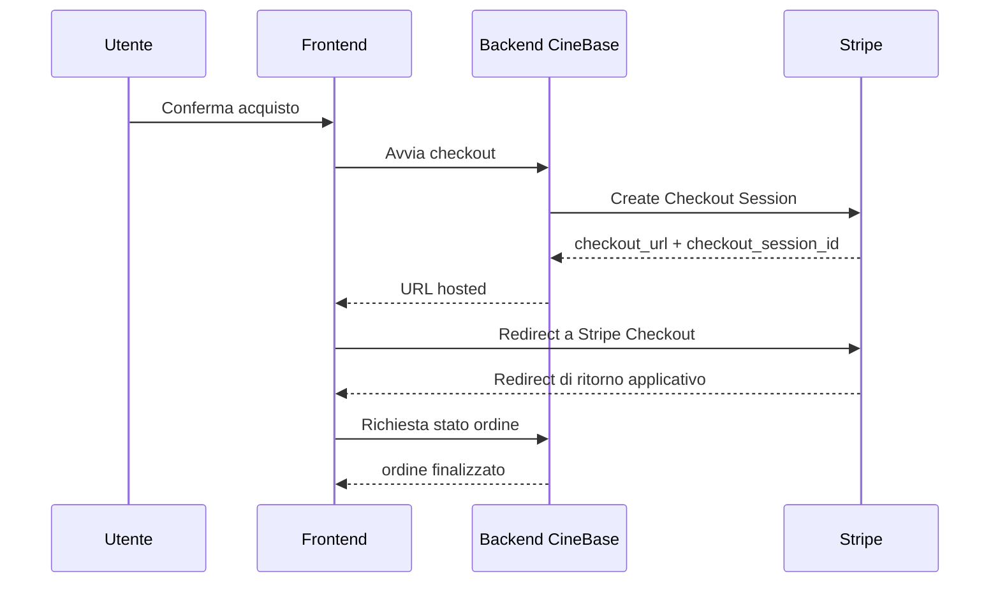
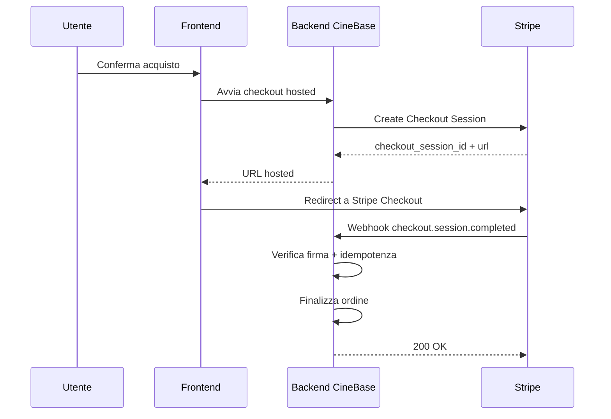

# Tutorial completo: come funziona Stripe come gateway di pagamento

**Autore:** OpenCode  
**Progetto di riferimento:** CineBase  
**Ambito:** comprensione del modello Stripe per integrazione applicativa backend/frontend  

---

## Indice

1. [Obiettivo del tutorial](#1-obiettivo-del-tutorial)
2. [Che cos'è Stripe nel contesto di un'applicazione web](#2-che-cose-stripe-nel-contesto-di-unapplicazione-web)
3. [Attori coinvolti nel flusso di pagamento](#3-attori-coinvolti-nel-flusso-di-pagamento)
4. [Chiavi e segreti: quali sono e a cosa servono](#4-chiavi-e-segreti-quali-sono-e-a-cosa-servono)
5. [Oggetti principali di Stripe da conoscere](#5-oggetti-principali-di-stripe-da-conoscere)
6. [Flusso sincrono: cosa significa e quando basta](#6-flusso-sincrono-cosa-significa-e-quando-basta)
7. [Flusso asincrono con webhook: cosa significa e perché serve](#7-flusso-asincrono-con-webhook-cosa-significa-e-perché-serve)
8. [Confronto tra modello sincrono e modello asincrono](#8-confronto-tra-modello-sincrono-e-modello-asincrono)
9. [Sviluppo locale: cosa cambia rispetto al deployment](#9-sviluppo-locale-cosa-cambia-rispetto-al-deployment)
10. [Deployment: requisiti minimi per una integrazione robusta](#10-deployment-requisiti-minimi-per-una-integrazione-robusta)
11. [Come applicare questi concetti al progetto CineBase](#11-come-applicare-questi-concetti-al-progetto-cinebase)
12. [Errori tipici da evitare](#12-errori-tipici-da-evitare)
13. [Conclusione](#13-conclusione)

---

## 1. Obiettivo del tutorial

Questo tutorial spiega in modo completo ma accessibile come funziona Stripe quando viene usato come gateway di pagamento in un'applicazione web moderna.

L'obiettivo non è solo mostrare alcuni passaggi pratici, ma chiarire il modello mentale corretto:

- quali componenti partecipano al pagamento
- quali chiavi servono davvero
- cosa accade nel browser e cosa accade nel backend
- perché esiste la distinzione tra gestione sincrona e gestione asincrona via webhook
- cosa è ragionevole fare in locale e cosa è necessario fare in produzione

---

## 2. Che cos'è Stripe nel contesto di un'applicazione web

Stripe non è soltanto una libreria per leggere i dati di una carta.

Stripe è un'infrastruttura di pagamento che mette a disposizione:

- API server-side per creare e gestire pagamenti
- componenti frontend sicuri per raccogliere i dati di carta senza farli transitare sul server applicativo
- pagine hosted di checkout gestite direttamente da Stripe
- dashboard operativa per consultare pagamenti, errori, eventi e webhook
- webhook per notificare eventi che avvengono fuori dal ciclo immediato della richiesta HTTP dell'applicazione

In termini architetturali, Stripe svolge il ruolo di sistema esterno affidabile che coordina il pagamento vero e proprio, mentre l'applicazione mantiene la propria logica di business.

Nel caso di `CineBase`, la logica di business resta interna all'applicazione:

- i posti si selezionano nel backend CineBase
- il totale viene calcolato nel backend CineBase
- l'ordine viene finalizzato nel backend CineBase
- Stripe viene usato solo per la parte di incasso con carta

---

## 3. Attori coinvolti nel flusso di pagamento

Nel flusso standard partecipano quattro attori principali.

### 3.1 Browser frontend

Il frontend:

- mostra il riepilogo del pagamento e la UX di acquisto
- inizializza Stripe.js con la `publishable key` quando il flusso lo richiede
- nel modello embedded usa Stripe Elements o Payment Element per raccogliere i dati carta
- nel modello hosted reindirizza l'utente a una `Checkout Session` creata dal backend
- riceve dal backend solo le informazioni strettamente necessarie per il flusso scelto

### 3.2 Backend applicativo

Il backend:

- calcola il totale reale dell'ordine
- crea il `PaymentIntent` oppure la `Checkout Session`, a seconda del flusso scelto
- salva gli identificativi Stripe rilevanti
- verifica lo stato del pagamento
- finalizza l'ordine solo quando il pagamento è valido

### 3.3 Stripe

Stripe:

- conserva e processa i dati di pagamento
- restituisce lo stato del pagamento e degli oggetti Stripe coinvolti
- invia webhook quando un evento cambia stato o deve essere notificato al backend

### 3.4 Dashboard Stripe

La dashboard:

- consente di configurare chiavi ed endpoint webhook
- mostra cronologia di pagamenti ed eventi
- aiuta a diagnosticare errori di integrazione

---

## 4. Chiavi e segreti: quali sono e a cosa servono

Una delle fonti più comuni di confusione riguarda le credenziali.

### 4.1 Publishable key

Formato tipico:

```text
pk_test_...
pk_live_...
```

Caratteristiche:

- è pensata per il frontend
- può essere esposta al browser
- serve a inizializzare Stripe.js
- non consente operazioni sensibili server-side

Nel progetto `CineBase`, questa chiave appartiene al frontend.

### 4.2 Secret key

Formato tipico:

```text
sk_test_...
sk_live_...
```

Caratteristiche:

- è riservata al backend
- non deve mai comparire nel frontend
- serve a creare `PaymentIntent`, leggere pagamenti, gestire rimborsi e altre operazioni sensibili

Nel progetto `CineBase`, questa chiave corrisponde al valore da mettere in `STRIPE_API_KEY`.

### 4.3 Webhook signing secret

Formato tipico:

```text
whsec_...
```

Caratteristiche:

- non è la stessa cosa della secret key
- serve solo per verificare la firma delle richieste webhook inviate da Stripe
- viene generata per ogni endpoint webhook configurato

Nel progetto `CineBase`, questa chiave corrisponde al valore da mettere in `STRIPE_WEBHOOK_SECRET`.

### 4.4 Client secret del PaymentIntent

Questo è il punto che più spesso genera confusione.

Formato tipico:

```text
pi_..._secret_...
```

Caratteristiche:

- non coincide con la `publishable key`
- non è una chiave generale dell'account Stripe
- non si copia dal dashboard nella sezione API keys
- viene generato da Stripe quando il backend crea un `PaymentIntent`
- serve al frontend per confermare uno specifico pagamento
- è legato a un solo `PaymentIntent`, non all'intera applicazione

Differenza pratica:

- la `publishable key` identifica l'applicazione frontend presso Stripe e inizializza `Stripe.js`
- il `client_secret` identifica uno specifico tentativo di pagamento e permette al frontend di completarlo

Nel progetto `CineBase`, il `client_secret` viene ottenuto così:

1. il backend usa la `secret key` `sk_test_...` per creare un `PaymentIntent`
2. Stripe restituisce nella risposta l'`id` del `PaymentIntent` e il suo `client_secret`
3. il backend invia quel `client_secret` al frontend
4. il frontend, che ha già inizializzato Stripe con la `publishable key`, usa il `client_secret` per confermare il pagamento

Conclusione importante:

- la `publishable key` è stabile e appartiene alla configurazione frontend
- il `client_secret` è dinamico e viene creato ogni volta che nasce un nuovo `PaymentIntent`

Nota di contesto per `CineBase`:

- nel flusso storico con `Stripe Elements`, il `client_secret` era centrale nel browser
- nella direzione hosted con `Stripe Checkout`, il `client_secret` non è il perno del flusso lato frontend, perché il browser riceve soprattutto una URL di checkout hosted

### 4.5 Test mode e live mode

Stripe separa rigorosamente i due mondi:

- `test mode` per sviluppo e collaudo
- `live mode` per produzione

Regola importante:

- le chiavi `test` funzionano solo in test mode
- le chiavi `live` funzionano solo in live mode
- anche i webhook hanno configurazioni separate tra test e live

---

## 5. Oggetti principali di Stripe da conoscere

Per comprendere correttamente Stripe, gli oggetti più utili da conoscere sono `PaymentIntent`, `Checkout Session` ed `Event`.

### 5.1 PaymentIntent

Un `PaymentIntent` rappresenta l'intenzione di effettuare un pagamento per un dato importo.

Contiene almeno:

- un `id`, ad esempio `pi_...`
- importo
- valuta
- stato del pagamento
- eventuali metadati applicativi
- `client_secret`, usato dal frontend per confermare il pagamento

Si può immaginare il `PaymentIntent` come la controparte Stripe di un tentativo di pagamento lato business.

Nel modello `Stripe Checkout`, il `PaymentIntent` continua a esistere dietro le quinte, ma l'oggetto applicativamente più visibile al frontend è la `Checkout Session`.

### 5.1.1 Come si collega a publishable key e client_secret

Il ciclo corretto è il seguente:

1. il backend crea un `PaymentIntent` usando la `secret key`
2. Stripe restituisce un oggetto che contiene almeno `id` e `client_secret`
3. il backend conserva in genere l'`id` del `PaymentIntent` e invia il `client_secret` al frontend
4. il frontend inizializza Stripe con la `publishable key`
5. il frontend usa poi il `client_secret` per confermare quello specifico pagamento

In forma sintetica:

- `publishable key` -> serve a inizializzare Stripe lato browser
- `client_secret` -> serve a completare un singolo `PaymentIntent`

Quindi non sono due nomi diversi per la stessa cosa: sono due elementi distinti, con ruoli diversi e con origine diversa.

### 5.2 Checkout Session

Una `Checkout Session` rappresenta una sessione di pagamento hosted da Stripe.

Contiene tipicamente:

- un `id`, ad esempio `cs_...`
- una URL di checkout hosted
- importo e descrizione coerenti con il pagamento
- metadati applicativi

Nel modello hosted:

- il backend crea la sessione
- il frontend reindirizza l'utente alla URL della sessione
- il backend usa webhook e riconciliazione per consolidare il risultato

### 5.3 Payment Method

Il `PaymentMethod` rappresenta il metodo di pagamento usato, ad esempio una carta.

Nella maggior parte dei casi moderni, il frontend non costruisce manualmente questo oggetto: Stripe Elements lo gestisce internamente durante la conferma del pagamento.

### 5.4 Event

Un `Event` è una notifica generata da Stripe quando qualcosa accade:

- `payment_intent.succeeded`
- `payment_intent.payment_failed`
- `payment_intent.canceled`
- `checkout.session.completed`
- `checkout.session.expired`

Questi eventi sono la base dei webhook.

---

## 6. Flusso sincrono: cosa significa e quando basta

Per flusso sincrono si intende un modello in cui l'applicazione conclude il proprio ragionamento subito dopo la risposta della chiamata corrente, senza dipendere obbligatoriamente da un evento webhook successivo.

### 6.1 Esempio semplificato



### 6.2 Vantaggi del modello sincrono

- aiuta a dare feedback rapido all'utente
- è utile anche in sviluppo locale per la parte applicativa del ritorno sul sito
- resta comprensibile anche quando il pagamento reale viene confermato tramite webhook

### 6.3 Limiti del modello sincrono

- non copre bene scenari in cui il frontend si chiude o perde la connessione
- non garantisce il recupero automatico degli eventi se la risposta finale non arriva al browser
- non è il modello ideale come unica strategia di produzione

### 6.4 Quando può andare bene

Il modello sincrono è adeguato quando:

- si vuole dare feedback rapido all'utente al ritorno sul sito
- si vuole mostrare uno stato applicativo immediato
- il progetto affianca comunque webhook e riconciliazione backend

---

## 7. Flusso asincrono con webhook: cosa significa e perché serve

Per flusso asincrono si intende un modello in cui l'applicazione non si fida solo della risposta immediata ricevuta dal browser o dal server, ma riceve da Stripe una notifica server-to-server firmata che conferma l'evento.

### 7.1 Esempio semplificato



### 7.2 Perché i webhook sono importanti

I webhook servono perché il backend deve poter ricevere conferme affidabili anche se:

- il browser viene chiuso subito dopo il pagamento
- la rete cade tra frontend e backend
- il redirect finale non viene completato
- il backend deve aggiornare in modo autonomo uno stato business

### 7.3 Perché i webhook sono asincroni

Sono asincroni perché arrivano in un momento separato rispetto alla richiesta che ha creato il pagamento o rispetto alla navigazione dell'utente.

Il backend deve quindi essere progettato per:

- ricevere eventi duplicati
- ricevere eventi in ritardo
- ignorare eventi già processati
- verificare sempre la firma e lo stato effettivo

---

## 8. Confronto tra modello sincrono e modello asincrono

### 8.1 Regola concettuale

Il modello corretto, in un sistema reale, non è scegliere uno dei due ma combinarli.

Buona architettura:

- il frontend usa il flusso sincrono per dare feedback immediato all'utente
- il backend usa i webhook come conferma robusta e meccanismo di recupero

### 8.2 Confronto pratico

| Aspetto | Sincrono | Asincrono con webhook |
| --- | --- | --- |
| Facilità iniziale | alta | media |
| Utilità in locale | molto alta | media, richiede URL pubblico o forwarding |
| Robustezza in produzione | discreta | alta |
| Recupero da errori frontend | limitato | forte |
| Complessità implementativa | bassa | media |

### 8.3 Conclusione operativa

Per un progetto didattico come `CineBase`, l'approccio più ragionevole è:

1. partire con il flusso sincrono verificato dal backend
2. implementare comunque il webhook endpoint lato codice
3. usare i webhook come meccanismo di consolidamento e allineamento al deployment

---

## 9. Sviluppo locale: cosa cambia rispetto al deployment

In locale il browser e il backend sono sulla macchina di sviluppo, tipicamente con URL come:

```text
Frontend: http://localhost:5001
Backend:  http://localhost:5000
```

### 9.1 Cosa funziona bene in locale

- creazione di `Checkout Session`
- redirect verso Stripe Checkout in `test mode`
- ritorno su URL applicativo CineBase
- verifica server-side dello stato dell'ordine e della sessione

### 9.2 Cosa non funziona da solo in locale

Stripe non può chiamare direttamente `http://localhost:5000/...` dai propri server pubblici, perché `localhost` è raggiungibile solo dalla macchina locale.

Quindi i webhook in locale richiedono una delle seguenti soluzioni:

- Stripe CLI
- ngrok o strumento equivalente
- Dev tunnel pubblico

### 9.3 Implicazione pratica

In locale si può sviluppare parte del flusso anche prima di collaudare i webhook, ma la strategia hosted di `CineBase` richiede comunque test reali di webhook e riconciliazione prima di poter essere considerata robusta.

---

## 10. Deployment: requisiti minimi per una integrazione robusta

Quando l'applicazione è deployata su un server pubblico, Stripe può raggiungere direttamente l'endpoint webhook.

### 10.1 Requisiti minimi

- backend raggiungibile via HTTPS pubblico
- endpoint webhook pubblico, ad esempio `/payments/stripe/webhook`
- `STRIPE_WEBHOOK_SECRET` corretto e configurato
- verifica firma abilitata
- idempotenza sul processing eventi

### 10.2 Modello consigliato in produzione

In produzione, il backend dovrebbe:

- creare il `PaymentIntent`
- associare l'ID Stripe all'ordine pendente
- finalizzare l'ordine solo una volta in modo idempotente
- accettare sia il ritorno sincrono del frontend sia il webhook come trigger di completamento o riconciliazione

### 10.3 Perché serve l'idempotenza

Stripe può ritentare i webhook. Anche il frontend può ripetere la richiesta di finalizzazione.

Senza idempotenza il sistema rischia:

- doppia emissione di ticket
- doppia transizione `Hold -> Sold`
- doppio addebito logico del credito interno

---

## 11. Come applicare questi concetti al progetto CineBase

Nel contesto di `CineBase`, la Fase 7 richiede una soluzione bilanciata tra semplicità didattica e buone pratiche.

### 11.1 Configurazione prevista

Backend `backend/.env`:

```text
STRIPE_SECRET_API_KEY=sk_test_...
STRIPE_WEBHOOK_SECRET=whsec_...
```

Frontend:

- la publishable key va esposta runtime dal backend
- non va duplicata in un `.env` dedicato del frontend

### 11.2 Flusso consigliato per la prima implementazione

1. L'utente crea o recupera un ordine a partire da un hold valido.
2. Il backend calcola il totale reale.
3. Se la quota carta è zero, il backend finalizza senza Stripe.
4. Se la quota carta è maggiore di zero, il backend crea una `Checkout Session` con metadati coerenti.
5. Il frontend reindirizza l'utente a Stripe Checkout.
6. Il backend usa webhook e riconciliazione per marcare l'ordine come `Paid` in modo idempotente.

### 11.3 Cosa non dovrebbe fare il frontend

Il frontend non dovrebbe:

- decidere il totale finale come source of truth
- marcare da solo l'ordine come pagato
- fidarsi esclusivamente di una variabile client-side senza ricontrollo backend

### 11.4 Cosa dovrebbe fare il backend

Il backend dovrebbe:

- ricalcolare il totale
- verificare che sessione ed eventi Stripe siano davvero compatibili con il completamento
- validare ownership tra ordine e utente
- completare la finalizzazione in transazione idempotente

---

## 12. Errori tipici da evitare

### 12.1 Confondere secret key e webhook secret

Sono due valori diversi e con scopi diversi.

### 12.2 Usare solo il frontend come fonte di verità

Il browser non è la fonte di verità del pagamento. Il backend deve sempre verificare.

### 12.3 Finalizzare l'ordine prima della verifica reale

`CineBase` non dovrebbe trasformare i posti in `Sold` solo perché il browser dice che il pagamento è riuscito.

### 12.4 Non gestire gli eventi duplicati

Webhook e chiamate utente possono ripetersi. La logica di completamento deve essere idempotente.

### 12.5 Mischiare test e live mode

Chiavi, dashboard, webhook ed eventi devono restare tutti coerenti nello stesso ambiente.

---

## 13. Conclusione

Il punto centrale da comprendere è il seguente:

- Stripe gestisce il pagamento
- l'applicazione gestisce il business
- il frontend aiuta l'utente a completare il flusso
- il backend decide se e quando un ordine può essere considerato davvero pagato

Nel lavoro locale, il modello sincrono con verifica backend è sufficiente per sviluppare con ordine e semplicità.

Nel deployment, i webhook diventano il tassello necessario per una integrazione completa, robusta e aderente alle pratiche consolidate.
